Curso Shiny
================
Michel Alves
19/05/2022

# Unidade 1 - Arquitetura de um aplicativo Shiny

## Introdução

Shiny é um pacote do R que facilita a criação de aplicativos interativos
para web diretamente do R. O primeiro passo para usar o pacote Shiny é
instalá-lo, caso ainda não o tenha feito.

    install.packages("shiny")

O pacote Shiny já vem com 11 exemplos que demonstram como o Shiny
funciona. Cada exemplo é um aplicativo auto contido.

O primeiro exemplo é chamado **Hello Shiny** e plota um histograma do
dataset do Geyser Faithful já contido no R. O usuário pode alterar o
número de barras do histograma com um *slide bar* e o aplicativo
imediatamente responde às mudanças. Iremos usar esse exemplo para
explorar a estrutura de um aplicativo Shiny.

Para executar o exemplo **Hello Shiny**, digite:

    library(shiny)
    runExample("01_hello")

## Estrutura de um aplicativo Shiny

Os aplicativos Shiny são contidos em um único script chamado `app.R`. O
script `app.R` fica em um diretório (por exemplo `novo_diretorio`) e o
aplicativo pode ser executado com `runApp("novo_diretorio")`.

O script `app.R` tem três componentes:

-   Um objeto interface de usuário (*user interface*);
-   Uma função server;
-   Uma chamada da função `shinyApp`.

O objeto interface de usuário (`ui`) controla o layout e a aparência do
aplicativo. A função `server` contém as instruções que o computador deve
executar para construir o aplicativo. Finalmente, a função `shinyApp`
cria o aplicativo Shiny usando o par `ui` e `server`.

### ui

Abaixo está o objeto `ui` do exemplo **Hello Shiny**.

    library(shiny)

    # Define UI for app that draws a histogram ----
    ui <- fluidPage(

      # App title ----
      titlePanel("Hello Shiny!"),

      # Sidebar layout with input and output definitions ----
      sidebarLayout(

        # Sidebar panel for inputs ----
        sidebarPanel(

          # Input: Slider for the number of bins ----
          sliderInput(inputId = "bins",
                      label = "Number of bins:",
                      min = 1,
                      max = 50,
                      value = 30)

        ),

        # Main panel for displaying outputs ----
        mainPanel(

          # Output: Histogram ----
          plotOutput(outputId = "distPlot")

        )
      )
    )

### server

Aqui está a função `server` do exemplo:

    # Define server logic required to draw a histogram ----
    server <- function(input, output) {

      # Histogram of the Old Faithful Geyser Data ----
      # with requested number of bins
      # This expression that generates a histogram is wrapped in a call
      # to renderPlot to indicate that:
      #
      # 1. It is "reactive" and therefore should be automatically
      #    re-executed when inputs (input$bins) change
      # 2. Its output type is a plot
      output$distPlot <- renderPlot({

        x    <- faithful$waiting
        bins <- seq(min(x), max(x), length.out = input$bins + 1)

        hist(x, breaks = bins, col = "#75AADB", border = "white",
             xlab = "Waiting time to next eruption (in mins)",
             main = "Histogram of waiting times")

        })

    }

A função `server` nesse caso é bem simples. O script realiza alguns
cálculos e então plota o histograma com o número de colunas escolhido
pelo usuário. Note que a maior parte do script está contida em uma
chamada para a função `renderPlot`. Mais detalhes sobre essa função
serão dados mais adiante no curso.

De um modo geral, o script `app.R` tem a seguinte forma:

    library(shiny)

    # Veja acima as definições de ui e server
    ui <- ...

    server <- ...

    shinyApp(ui = ui, server = server)

Note que enquanto o aplicativo está sendo executado, você não conseguirá
executar outros comandos em R, uma vez que ele está monitorando seu
aplicativo. Para parar a execução do aplicativo, feche-o ou clique no
botão stop, que aparece no canto superior direito.

## Criando um aplicativo

Depois de ter instalado o pacote Shiny, você pode criar um novo
aplicativo clicando em Arquivo &gt; Novo Arquivo &gt; Shiny Web App. Uma
janela irá aparecer, onde você dará o nome do seu aplicativo e indicará
onde o mesmo será salvo. É recomendável criar uma pasta exclusiva para o
seu aplicativo, onde será salvo o script `app.R`.

Perceba que o Rstudio reconhece o script do aplicativo e exibe o botão
Run App, no canto superior direito.

## Exemplos

Você pode criar aplicativos Shiny copiando e modificando aplicativos
Shiny existentes. Você pode usar um dos 11 exemplos incluídos no pacote
Shiny:

    runExample("01_hello")      # histograma
    runExample("02_text")       # tabelas e data frames
    runExample("03_reactivity") # expressão reativa
    runExample("04_mpg")        # variáveis globais
    runExample("05_sliders")    # slider bars
    runExample("06_tabsets")    # tabbed panels
    runExample("07_widgets")    # texto de ajuda e botão para enviar
    runExample("08_html")       # usando HTML para construir o aplicativo
    runExample("09_upload")     # upload de arquivo
    runExample("10_download")   # downlod de arquivo
    runExample("11_timer")      # temporizador automatizado

A [galeria do Shiny](https://shiny.rstudio.com/gallery) também provê
vários exemplos. Além disso, não se esqueça de consultar o [Cheatsheet
do
Shiny](https://raw.githubusercontent.com/rstudio/cheatsheets/main/shiny.pdf).

# Unidade 2 - Construindo a interface de usuário

Agora podemos construir o nosso primeiro aplicativo Shiny. Crie um novo
arquivo e edite-o de modo a ficar igual ao script a seguir:

    library(shiny)

    # Definição da Interface de usuário
    ui <- fluidPage(
      
    )

    # Definicação da lógica da função server
    server <- function(input, output) {
      
    }

    # Executa o aplicativos
    shinyApp(ui = ui, server = server)

Se você executar o código acima, o resultado será um aplicativo vazio.

## Layout

Shiny usa a função `fluidPage` para criar uma tela que se ajusta
automaticamente às dimensões da janela do navegador do usuário. Você
pode construir a interface de usuário adicionando outros elementos
dentro da função `fluidPage`. Por exemplo, a `ui` a seguir inclui um
painel lateral e um painel principal.

    ui <- fluidPage(
      titlePanel("title panel"),

      sidebarLayout(
        sidebarPanel("sidebar panel"),
        mainPanel("main panel")
      )
    )

Os elementos `titlePanel` e `sidebarLayout` são os elementos mais comuns
para se adicionar dentro da função `fluidPage`. Eles criam um aplicativo
básico com painel lateral. A função `sidebarLayout` recebe dois
argumentos:

-   função `sidebarPanel`
-   função `mainPanel`

O painel lateral será exibido do lado esquerdo por padrão. Você pode
movê-lo para a direita passando o argumento opcional
`position = "right"`.

    ui <- fluidPage(
      titlePanel("title panel"),
      
      sidebarLayout(position = "right",
                    sidebarPanel("sidebar panel"),
                    mainPanel("main panel")
      )
    )

Existem diversos outros layouts que podem ser usados. Consulte o [guia
de layouts do
Shiny](https://shiny.rstudio.com/articles/layout-guide.html) para mais
exemplos. Além disso, existem outras opções para a função `fluidPage`,
como a `fillPage` e `fixedPage`. Consulte a ajuda para mais detalhes.

Existe ainda outros layouts que não são nativos do Shiny. Para usá-los,
é necessário instalar pacotes adicionais. Um exemplo é um pacote
`shinydashboard`. Ele contém três elementos:

    library(shiny)
    library(shinydashboard)

    ui <-  dashboardPage(
        dashboardHeader(),
        dashboardSidebar(),
        dashboardBody(),
        title = "Dashboard example")

    server <- function(input, output) {
        
    }

    shinyApp(ui = ui, server = server)

## Conteúdo HTML

Você pode adicionar elementos na `ui` simplesmente adicionando elementos
dentro das funções `dashboardHeader`, `dashboardSidebar` e
`dashboardBody`.

    library(shiny)
    library(shinydashboard)

    ui <-  dashboardPage(
        dashboardHeader(title = "Título do dashboard"),
        dashboardSidebar("Barra lateral"),
        dashboardBody("Corpo "),
        
    )

    server <- function(input, output) {
        
    }

    shinyApp(ui = ui, server = server)

Para personilizar o conteúdo, pode-se utilizar as funções de tag HTML do
Shiny. As principais e suas equivalentes em HTML são exibidas a seguir:

-   `p`: cria um parágrafo de texto;
-   `h1`: título de nível 1
-   `h2`: título de nível 2
-   `h3`: título de nível 3
-   `h4`: título de nível 4
-   `h5`: título de nível 5
-   `h6`: título de nível 6
-   `a`: hyperlink
-   `br`: quebra de linha
-   `div`: Uma divisão de texto com estilo uniforme
-   `span`: Uma divisão in-line de texto com estilo uniforme
-   `pre` texto “as is” numa fonte de largura fixa
-   `code`: bloco de código formatado
-   `img`: uma imagem
-   `strong`: texto em negrito
-   `em`: texto em itálico
-   `HTML` passa uma cadeia de caracteres diretamente como código HTML.

Execute o código a seguir para ver o resultado do uso das tags:

    library(shiny)
    library(shinydashboard)

    ui <-  dashboardPage(
        dashboardHeader(title = "Título do dashboard"),
        dashboardSidebar("Barra lateral"),
        dashboardBody( h1("First level title"),
                       h2("Second level title", align = "center"),
                       h3("Third level title"),
                       h4("Fourth level title"),
                       h5("Fifth level title"),
                       h6("Sixth level title"),
                       p("p creates a paragraph of text."),
                       p("A new p() command starts a new paragraph. Supply a style attribute to change the format of the entire paragraph.", style = "font-family: 'times'; font-size: 16pt"),
                       strong("strong() makes bold text."),
                       em("em() creates italicized (i.e, emphasized) text."),
                       br(),
                       code("code displays your text similar to computer code"),
                       div("div creates segments of text with a similar style. This division of text is all blue because I passed the argument 'style = color:blue' to div", style = "color:blue"),
                       br(),
                       p("span does the same thing as div, but it works with",
                         span("groups of words", style = "color:blue"),
                         "that appear inside a paragraph.")
                       
                       ),
        
    )

    server <- function(input, output) {
        
    }

    shinyApp(ui = ui, server = server)

## Imagens

Para adicionar imagens à sua `ui`, use a função `img`. Para isso, você
deve passar o nome do arquivo da imagem como argumento do parâmetro
`src`, como a seguir:

    img(src = "logo_fjp.png")

Você também pode incluir outros parâmetros do HTML para modificar a
imagem, como altura e largura (os números referem-se aos pixels):

    img(src = "logo_fjp.png", height = 72, width = 72)

A função `img` procura pelos arquivos em local específico. Seu arquivo
tem que necessariamente estar dentro de uma pasta chamada `www` no mesmo
diretório do arquivo `app.R`. o Shiny trata essa pasta de um forma
especial, compartilhando qualquer arquivo colocado nela com o naegador
do usuário. Isso faz com que a pasta `www` seja um local ideal para
colocar arquivos de imagens, arquivos de estilo e outras coisas que o
navegador pode precisar.

## Exercício 1

Usando as funções apresentadas, crie um aplicativo com os seguintes
elementos:

Observe que você deve associar a palavra aqui com o endereço da
plataforma do IMRS. Além disso, associe o logo da FJP com o endereço do
site da Fundação. Assim, se o usuário clicar na imagem será
redirecionado para a página da Fundação.

## Adicionando um menu ao dashboard

O layout dashboard permite a criação de um menu na barra lateral. Para
isso, basta chamarmos a função `sidebarMenu` dentro da função
`dashboardSidebar`. É importante dar um nome para o menu, o que
possibilitará consultarmos qual das opções foi selecionada. Para isso,
atribua uma cadeia de caracteres ao parâmetro `id`.

Para criar cada uma das opções do menu, usa-se a função `menuItem`
dentro da função `sidebarMenu`, como a seguir. É importante dar um nome
único para cada uma das opções criadas, usando o parâmetro `tabName`.

    library(shiny)
    library(shinydashboard)

    ui <-  dashboardPage(
        dashboardHeader(title = "IMRS Demografia"),
        
        dashboardSidebar(sidebarMenu(id = 'barra_lateral',
                                     menuItem("Opção 1", tabName = 'opcao1'),
                                     menuItem("Opção 2", tabName = 'opcao2')
                                     )
                         ),
        
        dashboardBody()
        
    )

    server <- function(input, output) {
        
    }

    shinyApp(ui = ui, server = server)

Depois de criarmos as opções do menu, iremos criar uma área dentro do
dashboard com o conteúdo de cada opção do menu. Isso é feito dentro da
função `dashboardBody`, usando a função `tabItems`. Para cada opção do
menu, usa-se função `tabItem` cujo parâmetro `tabName` tem o mesmo valor
atribuído ao criar as opções do menu. Observe no exemplo:

    library(shiny)
    library(shinydashboard)

    ui <-  dashboardPage(
        dashboardHeader(title = "IMRS Demografia"),
        
        dashboardSidebar(sidebarMenu(id = 'barra_lateral',
                                     menuItem("Opção 1", tabName = 'opcao1'),
                                     menuItem("Opção 2", tabName = 'opcao2')
                                     )
                         ),
        
        dashboardBody(tabItems(tabItem(tabName = 'opcao1', "Conteúdo da opção 1"),
                               tabItem(tabName = 'opcao2', "Conteúdo da opção 2")
                               )
                      )
        
    )

    server <- function(input, output) {
        
    }

    shinyApp(ui = ui, server = server)

## Exercício 2

Continuando o aplicativo do exercício 1, crie um menu com 3 opções
conforme as imagens a seguir:

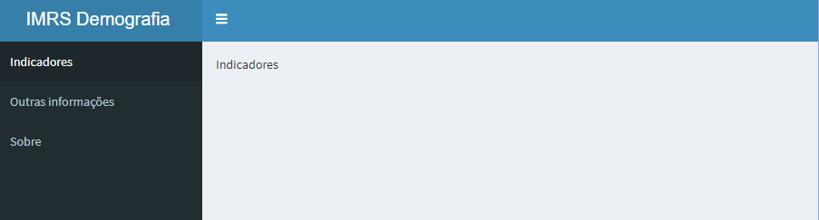

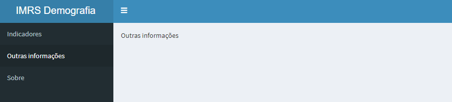

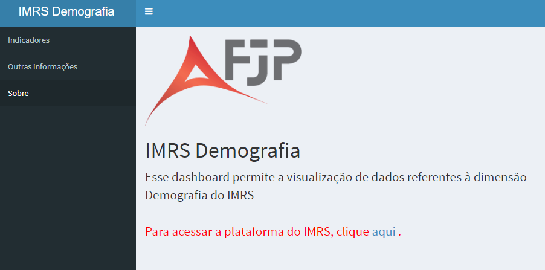

# Unidade 3 - Adicionando ferramentas de controle

As ferramentas de controle, conhecidas como *widgets*, são elementos web
com os quais o usuário pode interagir. Os *widgets* são um meio para que
os usuários enviem informações para o aplicativo Shiny.

## Widgets de controle

O pacote Shiny vem com uma família de widgets, cada um criado com uma
função em R. Por exemplo, a função `actionButton` cria um Botão e uma
função chamada de `sliderInput` cria uma barra deslizante. Os widgets
padrão são:

-   `actionButton`
-   `checkboxGroupInput`  
-   `checkboxInput`
-   `dateInput`  
-   `dateRangeInput`
-   `fileInput`  
-   `helpText`  
-   `numericInput`  
-   `radioButtons`  
-   `selectInput`
-   `sliderInput`
-   `submitButton`  
-   `textInput`

Lembre-se de consultar a [Cheatsheet do
Shiny](https://raw.githubusercontent.com/rstudio/cheatsheets/main/shiny.pdf).

## Adicionando os widgets

Os widgets são adicionados da mesma forma que os elementos HTML. Basta
adicionar uma função que define um widget dentro de um dos elementos do
dashboard. Cada função de widget requer vários argumentos. Os dois
primeiros pra cada widget são:

-   **name**: o usuário não verá esse nome, mas você usa-o para ter
    acesso o valor do widget. O nome é uma cadeia de caracteres;
-   **label**: o rótulo que aparece junto ao widget no seu aplicativo.
    Pode ser uma cadeia vazia `""` ou uma cadeia de caracteres.

Os demais argumentos variam de widget para widget, dependendo do que é
necessário para que o widget realize sua função. Você pode obter mais
informações sobre os parâmetros de cada widget usando a ajuda do
RStudio.

Abaixo você um exemplo de utilização da maioria dos widgets. Você também
pode consultar a [galeria de widgets do
Shiny](https://shiny.rstudio.com/gallery/widget-gallery.html).

    library(shiny)
    library(shinydashboard)

    ui <-  dashboardPage(
        dashboardHeader(title = "Widgets"),
        
        dashboardSidebar(),
        
        dashboardBody(selectInput(inputId = 'input1', 
                                           label = "selectInput", 
                                           choices = c("a", "b", "c"), 
                                           selected = "b", 
                                           multiple = TRUE
                                           ),
                      checkboxInput(inputId = 'input2',
                                    label = "checkbox",
                                    value = TRUE),
                      checkboxGroupInput(inputId = 'input3',
                                         label = "checkboxGroup",
                                         choices = c("Opção 1", "Opção 2")
                                         ),
                      radioButtons(inputId = 'input4',
                                   label = "radioButtons",
                                   choices = c("Opção 1", "Opção 2")
                                   ),
                      dateInput(inputId = 'input5',
                                label = "dateInput",
                                format = "yyyy-mm-dd"
                                ),
                      dateRangeInput(inputId = 'input6',
                                     label = "dateRangeInput",
                                     min = "2022-01-01", 
                                     format = "dd-mm-yyyy"),
                      fileInput(inputId = 'input7',
                                label = "fileInput"
                                ),
                      helpText("Nota para dar alguma informação adicional."),
                      numericInput(inputId = 'input8',
                                   label = "numericInput",
                                   value = 0,
                                   min = -10,
                                   max = 10),
                      sliderInput(inputId = 'input9',
                                  label = "sliderInput",
                                  min = 1,
                                  max = 100,
                                  value = 5
                                  ),
                      textInput(inputId = 'input10',
                                label = "textInput", value = "Digite uma palavra"),
                      actionButton(inputId = 'input11',
                                   label = "actionButton")
                      
                      
                               
                      )
                      
       
        
    )

    server <- function(input, output) {
        
    }

    shinyApp(ui = ui, server = server)

## Mais configurações de layout

Existem três funções que ao combiná-las permitem elaborar `ui` mais
complexas. Suponha que desejamos acrescentar dois widgets lado a lado na
`ui`. Para isso usamos as seguintes funções:

-   `fluidRow`: Cria uma linha dentro de uma página. Essa linha é
    ajustável de acordo com a largura da janela do aplicativo.
-   `column`: Cria uma coluna para ser usada dentro de um `fluiRow`.
    Essa função tem um parâmetro obrigatório `width`, que deve ser um
    número entre 1 e 12. Note que a largura de uma linha é 12. Assim, a
    soma das larguras de todas as colunas na linha não deve exceder
    a 12.
-   `box`: Cria uma caixa que é usada para se colocar o conteúdo da
    interface de usuário.

Observe como essas funções são utilizadas para se colocar dois widgets
lado a lado:

    library(shiny)
    library(shinydashboard)

    ui <-  dashboardPage(
        dashboardHeader(title = "Widgets"),
        
        dashboardSidebar(),
        
        dashboardBody(fluidRow(
           
            column(width = 6,
                   numericInput(inputId = 'input1', 
                                label = "Selecione:",
                                value = 0,
                                min = 0,
                                max = 10)),
            column(width = 6,
                   sliderInput(inputId = 'input2',
                               label = "Escolha:",
                               min = 0,
                               max = 100,
                               value = 5))
        )
        )
    )

    server <- function(input, output) {
        
    }

    shinyApp(ui = ui, server = server)

A função `box` possibilita que tenhamos mais controle sobre os elementos
da interface:

    library(shiny)
    library(shinydashboard)

    ui <-  dashboardPage(
        dashboardHeader(title = "Widgets"),
        
        dashboardSidebar(),
        
        dashboardBody(fluidRow(
            box(width = 12,
                title = "Controles",
                solidHeader = TRUE,
                collapsible = TRUE, 
                status = 'danger',
                column(width = 6,
                       numericInput(inputId = 'input1', 
                                    label = "Selecione:",
                                    value = 0,
                                    min = 0,
                                    max = 10)),
                column(width = 6,
                       sliderInput(inputId = 'input2',
                                   label = "Escolha:",
                                   min = 0,
                                   max = 100,
                                   value = 5)))
        )
        )
    )

    server <- function(input, output) {
        
    }

    shinyApp(ui = ui, server = server)

## Exercício 3

A partir do aplicativo desenvolvido no Exercício 2, faça as seguintes
modificações:

1.  Crie um menu adicional, de modo que o aplicativo fique com a
    seguinte aparência:

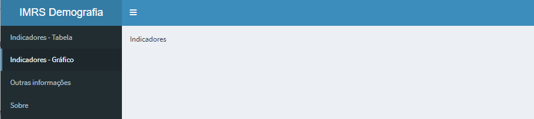

2.  Coloque dois widgets `selectInput`, de acordo com as figuras abaixo:

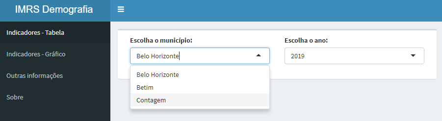

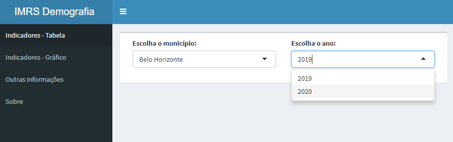

# Unidade 4 - Exibindo saídas reativas

O Shiny provê uma família de funções que transformam objetos em R em uma
saída para a interface de usuário. Cada função cria um tipo de saída
específico. Alguns exemplos:

-   dataTableOutput: DataTable
-   htmlOutput: HTML puro
-   imageOutput: imagens
-   plotOutput: gráficos
-   tableOutput: tabela
-   textOutput: texto
-   uiOutput: HTML puro
-   verbatimTextOutput: texto

As saídas são adicionadas na `ui` da mesma forma em que adicionamos os
elementos HTML e widgets. Observe o exemplo a seguir:

    library(shiny)
    library(shinydashboard)

    ui <-  dashboardPage(
        dashboardHeader(title = "Teste"),
        
        dashboardSidebar(),
        
        
        dashboardBody(selectInput(inputId = 'seletor1', choices = c("A", "B", "C"), label = "Selecione"),
                      textOutput(outputId = 'texto'))
        
    )

    server <- function(input, output) {
        
    }

    shinyApp(ui = ui, server = server)

O código acima ainda não é reativo à seleção do usuário. Observe que a
função `textOutput` recebe um argumento, uma cadeia de caracteres. Cada
uma das funções de saída requerem um único argumento, uma cadeia de
caracteres que o Shiny usará como nome do seu elemento reativo. Os
usuários não verão esse nome, mas você irá usá-lo a seguir. Ao adicionar
uma função de saída na `ui`, estamos indicando onde queremos exibir a
saída na interface.

Agora temos que prover o código em R que irá construir o objeto. Faremos
isso adicionando o código na função `server`. A função `server` tem um
papel especial dentro do Shiny: ela constrói uma lista de objetos
chamados de `output` que contem todo o código necessário para atualizar
os objetos em R do seu aplicativo.

Para criar um elemento nessa lista, basta definir um elemento `output`
dentro da função `server` como mostrado a seguir. O nome do elemento
deve ser igual ao nome da função de saída que você criou na `ui`.

    server <- function(input, output) {
        
        output$texto <- renderText({
            "Variável selecionada: "
        })
        
    }

Cada elemento da lista `output` deve conter uma das funções `render` do
Shiny. Essas funções capturam um expressão em R e realizam algum
processamento. Você deve usar a função `render` que corresponde ao tipo
de objeto de saída que você está construindo:

-   renderDataTable: DataTable
-   renderImage: imagens (arquivos ou link)
-   renderPlot: gráficos
-   renderPrint: qualquer saída gerada por uma função `print`
-   renderTable: data frame, matriz ou outra estrutura de tabela
-   renderText: cadeias de caracteres
-   renderUI: HTML ou tag do Shiny

Cada função `render` recebe um único argumento: uma expressão em R
delimitada por `{}`. A expressão pode ser um simples linha de texto ou
ela pode conter várias linhas de código.

Pense nessa expressão em R como um conjunto de instruções que você dá ao
Shiny que será armazenado para depois. O Shiny irá executar todas essas
funções ao iniciar a execução do aplicativo e depois sempre que for
necessário para atualizar algum elemento.

Para que isso funcione, sua expressão deve retornar o tipo de objeto
correspondente ao tipo de saída que você deseja.

Executando o código a seguir, você verá que o texto “Variável
selecionada:” será exibido no painel principal. Entretanto, o texto não
será reativo. Ou seja, ele não irá mudar mesmo se você alterar o valor
dos widgets de controle.

Podemos fazer o texto ser reativo dizendo o Shiny para usar o valor de
um widget quando construir o texto.

    library(shiny)
    library(shinydashboard)

    ui <-  dashboardPage(
        dashboardHeader(title = "Teste"),
        
        dashboardSidebar(),
        
        
        dashboardBody(selectInput(inputId = 'seletor1', choices = c("A", "B", "C"), label = "Selecione"),
                      textOutput(outputId = 'texto'))
        
    )

    server <- function(input, output) {
        output$texto <- renderText({
            "Variável selecionada: "
        })
    }

    shinyApp(ui = ui, server = server)

Perceba que a função `server` recebe dois argumentos: `input` e
`output`. Já vimos que `output` é uma espécie de lista que armazena
instruções para construir os elementos em R no aplicativo. `input`
também é um objeto tipo lista. Ele armazena os valores atuais de todos
os widgets do seu aplicativo. Esses valores são salvos com o nome que
você deu aos widgets na sua `ui`.

Por exemplo, nosso último aplicativo tem um widget chamado de
`seletor1`. O valor desse widget está salvo com o nome `input$seletor1`.

O Shiny fará um objeto ser reativo se o objeto usa um valor da lista
`input`. Por exemplo, a função `server` a seguir cria um objeto de texto
reativo ao chamar o valor do widget `selectInput` para construir o
texto.

    library(shiny)
    library(shinydashboard)

    ui <-  dashboardPage(
        dashboardHeader(title = "Teste"),
        
        dashboardSidebar(),
        
        
        dashboardBody(selectInput(inputId = 'seletor1', choices = c("A", "B", "C"), label = "Selecione"),
                      textOutput(outputId = "texto"))
        
    )

    server <- function(input, output) {
        
        output$texto <- renderText({
            paste("Variável selecionada: ", input$seletor1)
        })
        
    }

    shinyApp(ui = ui, server = server)

O Shiny irá identificar quais saídas dependem de qual widget. Quando o
usuário alterar o valor de um widget, o Shiny irá reconstruir todas as
saídas que dependem daquele widget, usando o novo valor. Essa é forma de
criar reatividade no Shiny, conectando valores de `input` aos objetos em
`output`. O Shiny irá cuidar de todos os outros detalhes.

## Adicionando uma tabela ao dashboard

Para adicionar uma tabela ao dashboard, primeiro temos que obter os
dados. No momento, iremos ler os dados a partir de um arquivo excel, que
está disponível no
[github](https://github.com/FundacaoJoaoPinheiro/R/blob/main/Curso%20Shiny/dados_curso1.xlsx).
Baixe o arquivo e salve-o na mesma pasta onde está o arquivo `app.R`.

Para usar os dados disponíveis no arquivo dentro do aplicativo, vamos
colocar as funções relativas à importação fora da função `server`. Desse
forma, o arquivo será importado apenas uma vez, quando for inicializado.

Em seguida, podemos exibir os dados em uma tabela. Isso é feito
colocando a função `tableOutput` na `ui`.

    library(shiny)
    library(shinydashboard)
    library(readxl)
    library(tidyverse)

    #dir <- dirname(rstudioapi::getActiveDocumentContext()$path)
    #setwd(dir)

    dados <- read_excel("dados_curso1.xlsx") 
    dados <- dados |> subset(ANO %in% c(2019, 2020))

    ui <-  dashboardPage(
        dashboardHeader(title = "Teste"),
        
        dashboardSidebar(),
        
        
        dashboardBody(tableOutput("tabela"))
        
    )

    server <- function(input, output) {
        
        output$tabela <- renderTable({
            dados
        })
        
    }

    shinyApp(ui = ui, server = server)

A forma em que essa tabela é exibida, usando as funções `tableOutput` e
`renderTable` não é a mais amigável, principalmente para tabelas
grandes. Existem outras opções que possibilitam exibir tabelas com uma
interface mais amigável. Dentre elas está `dataTableOutput`.

    library(shiny)
    library(shinydashboard)
    library(readxl)
    library(tidyverse)

    dados <- read_excel("dados_curso1.xlsx") 
    dados <- dados |> subset(ANO %in% c(2019, 2020))

    ui <-  dashboardPage(
        dashboardHeader(title = "Teste"),
        
        dashboardSidebar(),
        
        
        dashboardBody(dataTableOutput("tabela"))
        
    )

    server <- function(input, output) {
        
        output$tabela <- renderDataTable({
            dados
        })
        
    }

    shinyApp(ui = ui, server = server)

Podemos escolher os dados que serão exibidos na tabela usando widgets.
Por exemplo, o código a seguir permite que o usuário escolha quais
colunas serão exibidas.

    library(shiny)
    library(shinydashboard)
    library(readxl)
    library(tidyverse)

    dados <- read_excel("dados_curso1.xlsx") 
    dados <- dados |> subset(ANO %in% c(2019, 2020)) |> select(-1)

    ui <-  dashboardPage(
        dashboardHeader(title = "Teste"),
        
        dashboardSidebar(),
        
        
        dashboardBody(selectInput(inputId = 'colunas', label = "Escolha as colunas", choices = colnames(dados)),
            dataTableOutput("tabela"))
        
    )

    server <- function(input, output) {
        
        output$tabela <- renderDataTable({
            dados |> select(input$colunas)
        })
    }

    shinyApp(ui = ui, server = server)

Podemos ainda pedir para o usuário escolher as colunas a serem exibidas
e para quais municípios os dados serão exibidos. Observe o uso da função
`req`. Essa função verifica se os valores estão disponíveis para serem
usados em alguma expressão. Caso estejam, as expressões são avaliadas
normalmente. Caso contrário, o expressão não é avaliada.

    library(shiny)
    library(shinydashboard)
    library(readxl)
    library(tidyverse)

    dados <- read_excel("dados_curso1.xlsx") 
    dados <- dados |> subset(ANO %in% c(2019, 2020)) |> select(-1)

    ui <-  dashboardPage(
        dashboardHeader(title = "Teste"),
        
        dashboardSidebar(),
        
        
        dashboardBody(selectInput(inputId = 'municipios', 
                                  label = "Escolha os municípios", 
                                  choices = unique(dados$MUNICÍPIO),
                                  multiple = TRUE),
            selectInput(inputId = 'colunas', 
                        label = "Escolha as colunas", 
                        choices = colnames(dados[-1])),
            dataTableOutput("tabela"))
        
    )

    server <- function(input, output) {
        
        output$tabela <- renderDataTable({
            req(input$municipios)
            dados |> select(c("MUNICÍPIO", input$colunas)) |> subset(MUNICÍPIO %in% input$municipios)
        })
        
    }

    shinyApp(ui = ui, server = server)

## Exercício 4

Agora iremos adicionar uma tabela ao aplicativo que fizemos no exercício
3. Para isso, faça as seguintes modificações:

1 - Leia o arquivo “dados\_curso1.xlsx” no seu aplicativo. Lembre-se de
carregar as bibliotecas necessárias.

2 - Coloque um `dataTableOutput` no menu correspondente à tabela.

3 - Atualize o `selectInput` dos municípios de modo que as opções sejam
todos os municípios de Minas Gerais. Permita que o usuário selecione
vários municípios. Configure a seleção inicial para vazio.

4 - Crie um `selectInput` ao lado do anterior, que permita ao usuário
selecionar quais indicadores ele deseja visualizar. As opções serão:
AREA, D\_POPTA, HOMEMTOT, MULHERTOT. Permita que o usuário selecione
mais de uma opção.

5 - Atualize o `selectInput` dos anos de modo que as opções sejam todos
os anos disponíveis na tabela dados. Permita que o usuário escolha mais
de um ano.

6 - Na função `server`, adicione um elemento `renderDataTable` e escreva
uma expressão de modo que a tabela a ser exibida no dashboard tenha as
colunas **Municípios** e **Ano** fixas e as demais serão exibidas de
acordo com a seleção do indicador. As linhas devem ser exibidas para os
municípios e anos selecionados.

Ao final, seu dashboard deve ser parecido com o da figura a seguir.

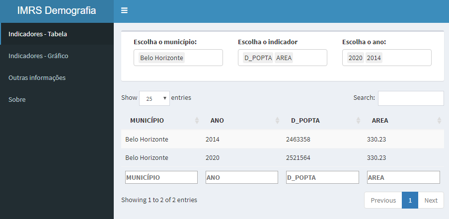

## Adicionando um gráfico

Para adicionar um gráfico ao aplicativo, usamos a função `plotOutput` na
interface e a função `renderPlot` dentro da função `server`. A função
`renderPlot` é capaz de plotar gráficos simples e gráficos do pacote
`ggplot2`. Para ver exemplos de gráficos usando o ggplot, consulte a
[galeria de exemplos de gráfico do R](https://r-graph-gallery.com/).

Outra opção para plotar gráficos que tem uma aparência mais amigável é o
pacote `highcharter`. No entanto, antes de plotar o gráfico, temos que
preparar os dados. Suponha que desejamos visualizar no gráfico a
evolução ano a ano de um determinado indicador, para um ou mais
municípios. Nesse caso podemos ter os anos no eixo x, o valor do
indicador no eixo y e uma linha para cada município. Para fazer esse
tipo de gráfico, o pacote `highcharter` precisa que os dados estejam
organizados da seguinte forma: os dados de cada município devem compor
uma tabela com duas colunas, x e y. Esses dados são chamados de séries.
Se tivermos mais de uma série, ou seja, mais de um município, teremos
então uma tabela com as colunas x e y para cada município.

Para facilitar o entendimento de como construir as séries, vamos começar
a partir do seguinte trecho de código:

    dados_selecionados <- dados |>  
                        subset(MUNICÍPIO %in% input$municipios & (ANO >= input$ano_grafico[1]) & (ANO <= input$ano_grafico[2])) |>  
                        select(c(MUNICÍPIO, ANO, input$indicadores)) 

Os trechos de código a seguir criam uma lista de séries, ou seja, uma
lista em que cada elemento é uma tabela com colunas x e y. Cada elemento
corresponde a um dos municípios selecionados.

Usando o `for`:

    dados_final <- list()
            for(i in c(1:length(input$municipios))){
                dados_selecionados <- dados |>  
                    subset(MUNICÍPIO %in% input$municipios[i] & (ANO >= input$ano_grafico[1]) & (ANO <= input$ano_grafico[2])) |>  
                    select(c(MUNICÍPIO, ANO, input$indicadores)) 
                colnames(dados_selecionados) <- c("MUNICÍPIO", "ANO", "INDICADOR")
                
                
                dados_final[[i]] <- data.frame(x = dados_selecionados$ANO, 
                                                y = dados_selecionados$INDICADOR)
            }

Usando a função `lapply`:

     dados_final <- lapply(input$municipios, function(x){
                dados_selecionados <- dados |>  
                    subset(MUNICÍPIO %in% x & (ANO >= input$ano_grafico[1]) & (ANO <= input$ano_grafico[2])) |>  
                    select(c(MUNICÍPIO, ANO, input$indicadores)) 
                colnames(dados_selecionados) <- c("MUNICÍPIO", "ANO", "INDICADOR")
                
                dados <- data.frame(x = dados_selecionados$ANO, 
                                    y = dados_selecionados$INDICADOR)
                
                

Depois de prapararmos os dados, podemos montar o gráfico. Observe o
exemplo a seguir:

    library(shiny)
    library(shinydashboard)
    library(readxl)
    library(highcharter)

    dados <- read_excel("dados_curso1.xlsx") 
    dados <- dados |> select(-1)

    #função para exportação de imagens
    export <- list(
      list(text="PNG",
           onclick=JS("function () {
                    this.exportChartLocal(); }")),
      list(text="JPEG",
           onclick=JS("function () {
                    this.exportChartLocal({ type: 'image/jpeg' }); }"))
      
    )

    ui <-  dashboardPage(
        dashboardHeader(title = "IMRS Demografia"),
        
        dashboardSidebar(),
        
        
        
        dashboardBody(fluidRow(
            box(width = 12,
                column(width = 4,
                       selectInput(inputId = 'municipios',
                                   label = "Escolha o município:",
                                   choices = unique(dados$MUNICÍPIO),
                                   multiple = TRUE,
                                   selected = NULL)),
                column(width = 4,
                       selectInput(inputId = 'indicadores',
                                   label = "Escolha o indicador",
                                   choices = c("AREA", "D_POPTA", "HOMEMTOT", "MULHERTOT"),
                                   multiple = FALSE,
                                   selected = NULL)),
                column(width = 4,
                       sliderInput(inputId = 'ano_grafico',
                                   label = "Escolha o ano:",
                                   min = 2000,
                                   max = 2020,
                                   value = c(2000, 2020)
                                   )))),
            
            highchartOutput(outputId ='grafico'))
        
    )

    server <- function(input, output) {
        
        output$grafico <- renderHighchart({
            
            req(input$municipios)
            req(input$indicadores)
            
            dados_final <- lapply(input$municipios, function(x){
                dados_selecionados <- dados |>  
                    subset(MUNICÍPIO %in% x & (ANO >= input$ano_grafico[1]) & (ANO <= input$ano_grafico[2])) |>  
                    select(c(MUNICÍPIO, ANO, input$indicadores)) 
                colnames(dados_selecionados) <- c("MUNICÍPIO", "ANO", "INDICADOR")
                
                dados <- data.frame(x = dados_selecionados$ANO, 
                                    y = dados_selecionados$INDICADOR)
           
            })  
            
            h <- highchart() |>
                hc_size(width = 600, height = 400) |>
                hc_xAxis(title = list(text = "Ano"), allowDecimals = FALSE) |>
                hc_exporting(enabled = T, fallbackToExportServer = F, 
                             menuItems = export)  |>
                hc_chart(type = "line") |>
                hc_yAxis(title = list(text = "Valor do indicador ")) |>
                hc_title(text = paste("Indicador: ", input$indicadores))
            
            
            for (k in 1:length(dados_final)) {
                h <- h |> 
                    hc_add_series(data = dados_final[[k]], name = input$municipios[k])
            }
            
            h
            
        })
        
    }

    shinyApp(ui = ui, server = server)

Mais detalhes sobre o uso de gráficos com o pacote highchart em R podem
ser encontrado
[aqui](https://www.highcharts.com/blog/tutorials/highcharts-for-r-users/).
Outros exemplos de gráficos com o pacote `highchart` podem ser
encontrados [aqui](https://www.highcharts.com/demo) .

## Exercício 5

Agora iremos adicionar um gráfico ao aplicativo que fizemos no exercício
4. Para isso, faça as seguintes modificações:

1 - Assim como foi feito para o menu Tabela, coloque os 3 widgets lado a
lado, como mostrado a seguir. Observe que agora a seleção do ano é feita
por um `sliderInput`. Não se esqueça de atribuir nomes (`inputId`)
diferentes para os widgets do menu Tabela e do menu Gráfico. Faça com
que o usuário só consiga selecionar um único indicador para ser exibido.
Faça com que a seleção inicial do indicador seja D\_POPTA.

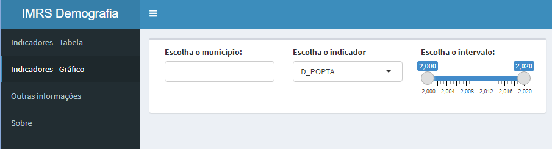

2 - Coloque um `highchartOutput` abaixo dos widgets. Coloque o gráfico
dentro de um `box`

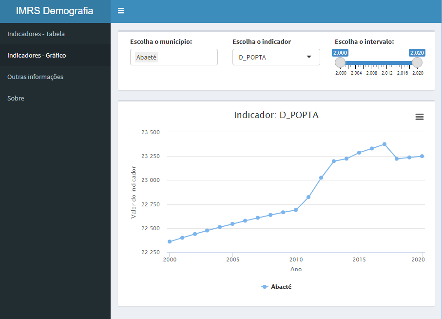

## Adicionando abas

Além de criar um menu com diferentes opções, ainda é possível criar uma
caixa com abas dentro de cada uma das opções do menu. Essas abas podem
ser usadas para exibir diferentes informações. Para isso, basta usa-se a
função `tabBox` dentro da função `tabItem`, como mostrado a seguir. Para
criar cada aba, usa-se a função `tabPanel`.

    library(shiny)
    library(shinydashboard)

    ui <-  dashboardPage(
        dashboardHeader(title = "IMRS Demografia"),
        
        dashboardSidebar(sidebarMenu(id = 'barra_lateral',
                                     menuItem("Opção 1", tabName = 'opcao1'),
                                     menuItem("Opção 2", tabName = 'opcao2')
        )
        ),
        
        dashboardBody(tabItems(tabItem(tabName = 'opcao1', 
                                       tabBox(id = 'tab_aba1_aba2',
                                              tabPanel(title = "Aba 1", "Conteúdo da aba 1 da primeira opção do menu"),
                                              tabPanel(title = "Aba 2", "Conteúdo da aba 2 da primeira opção do menu")
                                              )
                                        ),
                               tabItem(tabName = 'opcao2', "Conteúdo da opção 2")
                               )
                     )
        
        )

    server <- function(input, output) {
        
    }

    shinyApp(ui = ui, server = server)

Observe que a largura do `tabBox` pode ser ajustada com o parâmetro
`width`, dentro da função `tabBox`. Lembre-se que 12 é o número que
representa a largura máxima.

## Exercício 3

Continuando o exercício 2, crie um `tabBox` dentro do menu Indicadores,
como mostrado nas imagens a seguir:

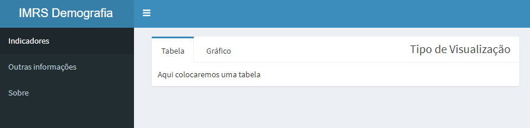

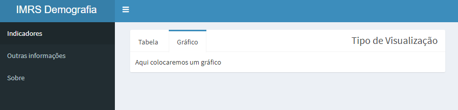

## Painel condicional

O painel condicional, criado pela função `conditionalPanel`, exibe um
conteúdo ou não, dependendo do valor de uma expressão. Observe o
exemplo:

    library(shiny)
    library(shinydashboard)

    ui <-  dashboardPage(
        dashboardHeader(title = "IMRS Demografia"),
        
        dashboardSidebar(sidebarMenu(id = 'barra_lateral',
                                     menuItem("Opção 1", tabName = 'opcao1'),
                                     menuItem("Opção 2", tabName = 'opcao2')
        )
        ),
        
    dashboardBody(radioButtons(inputId = 'input1',
                                choices = c("A", "B"),
                                label = "Escolha uma das opções:",
                                selected = "A"),
                   conditionalPanel(condition = "input.input1 == 'A'",
                                    dateRangeInput(inputId = 'input6',
                                                   label = "dateRangeInput",
                                                   min = "2022-01-01", 
                                                   format = "dd-mm-yyyy")
                                    )
                )
                                
        
    )

    server <- function(input, output) {
        
    }

    shinyApp(ui = ui, server = server)

A condição do `conditionalPanel` deve ser uma cadeia de caracteres e tem
a seguinte forma: `"input.inputid_de_algum_elemento == valor"`. Seguido
da condição vem os elementos que você deseja exibir caso a condição seja
verdadeira. É possível realizar váras combinações com o
`conditionalPanel`. A seguir temos um exemplo um pouco mais complexo:

    library(shiny)
    library(shinydashboard)

    ui <-  dashboardPage(
        dashboardHeader(title = "IMRS Demografia"),
        
        dashboardSidebar(sidebarMenu(id = 'barra_lateral',
                                     menuItem("Opção 1", tabName = 'opcao1'),
                                     menuItem("Opção 2", tabName = 'opcao2'),
                                     conditionalPanel(condition = "input.barra_lateral == 'opcao2'",
                                                      selectInput(inputId = 'seletor1', 
                                                                  label = "Escolha uma opção",
                                                                  choices = c("A", "B", "C"))),
                                     conditionalPanel(condition = "input.tab_aba1_aba2 == 'Aba 2'",
                                                      radioButtons(inputId = 'seletor2', 
                                                                  label = "Escolha uma opção",
                                                                  choices = c("A", "B", "C")))
        )
        ),
        
        dashboardBody(radioButtons(inputId = 'input1',
                                   choices = c("A", "B"),
                                   label = "Escolha uma das opções:",
                                   selected = "A"),
                      conditionalPanel(condition = "input.input1 == 'A'",
                                       dateRangeInput(inputId = 'input6',
                                                      label = "dateRangeInput",
                                                      min = "2022-01-01", 
                                                      format = "dd-mm-yyyy")
                      ),
                      tabBox(id = 'tab_aba1_aba2',
                             tabPanel(title = "Aba 1", "Conteúdo da aba 1 da primeira opção do menu"),
                             tabPanel(title = "Aba 2", "Conteúdo da aba 2 da primeira opção do menu")
                      )
        )
        
        
    )

    server <- function(input, output) {
        
    }

    shinyApp(ui = ui, server = server)
