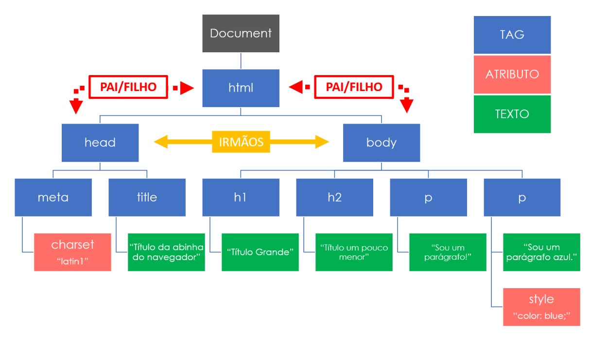

Mini-curso de Web scraping
================
Michel Alves
Junho de 2022

-   [Unidade 1](#unidade-1)
    -   [O que é web scraping?](#o-que-é-web-scraping)
    -   [Quando é preciso realizar web
        scraping?](#quando-é-preciso-realizar-web-scraping)
    -   [Estrutura de uma página web](#estrutura-de-uma-página-web)
    -   [XML](#xml)
    -   [Como visualizar o HTML de uma
        página](#como-visualizar-o-html-de-uma-página)
    -   [Bibliotecas no R para web
        scraping](#bibliotecas-no-r-para-web-scraping)
-   [Unidade 2](#unidade-2)
    -   [Extraindo dados](#extraindo-dados)
    -   [Exercício](#exercício)
-   [Unidade 3](#unidade-3)
    -   [Navegação em páginas e preenchimento de
        formulários](#navegação-em-páginas-e-preenchimento-de-formulários)
    -   [Exercício](#exercício-1)
    -   [Referências](#referências)

[Clique
aqui](https://github.com/FundacaoJoaoPinheiro/R/blob/main/Curso%20Webscrapping/material_completo.pdf)
para acessar esse guia de aula em PDF.

# Unidade 1

## O que é web scraping?

O *web scraping* (raspagem de rede, em tradução livre), também conhecido
como extração de dados da web, é o nome dado ao processo de coleta de
dados estruturados da web de maneira automatizada. Os dados são então
exportados para um formato mais útil ao usuário.

Em geral, esse método é usado por pessoas, empresas e, preocupantemente,
criminosos, que desejam usar a vasta quantidade de dados da web
disponíveis publicamente para tomar decisões mais inteligentes ou
cometer crimes. Quando usado para o bem, pode ser aplicado em
monitoramento de preços, monitoramento de notícias e pesquisa de
marketing, entre outros.

O processo básico de raspagem, na verdade, é realizado diariamente por
boa parte da população mundial, no ato de copiar e colar informações de
um site para outro meio, a diferença é que a raspagem de rede faz isso
em uma escala macroscópica e com automação inteligente, para extrair
milhões de dados de páginas da internet.

No entanto, o processo de web scraping não é uma tarefa simples. Os
websites se apresentam em muitas formas e, como resultado, os web
scrapers variam em funcionalidades e características. Também pode
acontecer de encontrarmos captchas (aquele teste para verificar se você
é humano) quando tentando realizar a raspagem de dados. Esses casos,
infelizmente, não serão tratados nesse curso.

Para realizar a raspagem de dados, existem duas abordagens diferentes,
que dependem de como o site estrutura suas informações

**Abordagem 1**: Se o site armazena todas as suas informações no *front
end* do HTML, você pode baixar o conteúdo do HTML diretamente e extrair
as informações úteis. São basicamente 5 passos:

1.  Identificar o website desejado;
2.  Coletar as URLs das páginas das quais você deseja extrair os dados;
3.  Fazer uma requisição para essas URLs para obter o HTML da página;
4.  Usar os localizadores para encontrar os dados no HTML;
5.  Salvar os dados em formato CSV ou XLSX, entre outros.

**Abordagem 2**: Se o site armazena os dados em um API e o site faz uma
requisição para a API a cada vez que o usuário deseja obter os dados,
então você pode simular a requisição e fazer o pedido diretamente pela
API. Os passos são:

1.  Inspecionar o seção de rede da URL da qual você deseja obter os
    dados;
2.  Descobrir a forma da requisição-resposta da URL da qual você deseja
    obter os dados;
3.  Dependendo do tipo de requisição (POST ou GET) e também do *header*
    e *payload*, simular a requisição no seu código para obter os dados;
4.  Extrair as informações desejadas;
5.  Salvar os dados em formato CSV ou XLSX, entre outros.

## Quando é preciso realizar web scraping?

O processo de web scraping é necessário quando os dados desejados estão
disponíveis dentro de um código HTML. Em outros casos, pode ser usado
para obter arquivos que contém os dados desejados.

## Estrutura de uma página web

Páginas são criadas usando HTML (HyperText Markup Language). O HTML
descreve os elementos de uma página por meio de *tags* marcadas por
`< >`. Exemplo:

    <html>
    <head>
    <body>
    <h1>Minha página</h1>
    <h2>Segundo título</h2>
    <h3>Terceiro Título</h3>
    </body>
    </head>
    </html>

No código HTML acima, os principais elementos são:

-   O documento sempre inicia e termina usando `<html>` e `</html>`;
-   A parte visível do documento pe marcada por `<body></body>`;
-   As tags `<h1>` até `<h3>` são usadas para títulos.

Podemos também adicionar um parágrafo abaixo do segundo título, usando a
tag `
`:

    <html>
    <head>
    <body>
    <h1>Minha página</h1>
    <h2>Segundo título</h2>
    
"Duas coisas são infinitas. O universo e a estupidez humana." Albert Einstein

    <h3>Terceiro Título</h3>
    </body>
    </head>
    </html>

Podemos adicionar um link na palavra “Albert Einstein” para direcionar
os usuários para uma página da wikipédia, por exemplo, Para isso, usamos
a tag `<a>`. Ela tem o atributo `href` que especifica o link:

    <html>
    <head>
    <body>
    <h1>Minha página</h1>
    <h2>Segundo título</h2>
    
"Duas coisas são infinitas. O universo e a estupidez humana." <a href="https://it.wikipedia.org/wiki/Albert_Einstein">Albert Einstein</a>

    <h3>Terceiro Título</h3>
    </body>
    </head>
    </html>

Para melhorarmos ainda mais a nossa página, podemos adicionar uma imagem
de Albert Einstein. Para isso usamos a tag ``, que por sua vez tem
o atributo `src` para especificarmos a URL da imagem.

    <html>
    <head>
    <body>
    <h1>Minha página</h1>
    <h2>Segundo título</h2>
    
"Duas coisas são infinitas. O universo e a estupidez humana." <a href="https://it.wikipedia.org/wiki/Albert_Einstein">Albert Einstein</a>

    
    <h3>Terceiro Título</h3>
    </body>
    </head>
    </html>

### Classes e ID

-   O **id** é um atributo para especificar um único elemento e dar
    características específicas a ele;
-   A **class** é um atributo para definir diferentes elementos com o
    mesmo nome class. Isso é útil quando queremos dar as mesmas
    características, como fonte, cor e tamanho, para vários elementos de
    uma página.

Ambos são definidos na tag `
    <body>
    <h1 id="mytitle">Minha página</h1>
    <h2>Segundo título</h2>
    
<i>"Duas coisas são infinitas. O universo e a estupidez humana.<i>" <a href="https://it.wikipedia.org/wiki/Albert_Einstein">Albert Einstein</a>

    
"<i>Imaginação é mais importante do que conhecimento<i>." <b>Albert Einstein</b>

    </body>
    </head>
    </html>

### Tabelas

Outro recurso importante do HTML são as tabelas, que são definidas pela
tag `<table>`. Dentro de `<table>`, existem três principais tags que são
utilizadas:

-   A tag `<tr>` é usada para construir cada linha da tabela;
-   A tag `<th>` é usada para definir o cabeçalho;
-   A tag `<td>` é usada para definir a célula dentro da linha.

Exemplo:

    <html>
    <head>
    
    <body>
    <h1 id="mytitle">Minha página</h1>
    <h2>Segundo título</h2>
    
<i>"Duas coisas são infinitas. O universo e a estupidez humana.<i>" <a href="https://it.wikipedia.org/wiki/Albert_Einstein">Albert Einstein</a>

    <table>
    <tr><th>Descobertas</th><tr>
    <tr><td>Relatividade Especial</td></tr>
    <tr><td>Relatividade Geral</td></tr>
    </table>
    </body>
    </head>
    </html>

Na tag `
    <body>

    <h2>Glossário</h2>

    

      

        <h2>Relatividade Geral</h2>
        
A relatividade geral, também conhecida como a teoria geral da relatividade, é a teoria geométrica da gravitação publicada por Albert Einstein em 1915 e é a descrição atual da gravitação na física moderna.

      

      

        <h2>Relatividade Especial</h2>
        
Na física, a teoria da relatividade especial, ou relatividade especial, é uma teoria científica sobre a relação entre espaço e tempo.

      

    

    </body>
    </head>
    </html>

### Hierarquia

Os elementos HTML possuem uma hierarquia entre si. Conhecer a relação
entre os elementos pode ser útil para realizar a busca de um elemento
dentro do HTML.

## XML

XML é uma ferramenta para armazenar e transporta informações. Algumas
características

-   XML é a sigla de *eXtensible Markup Language*
-   XML é parecido com HTML
-   XML foi desenvolvido para armazenar e transportar dados
-   XML foi desenvolvido de forma a ser auto-descritivo

Abaixo temos um exemplo do uso do XML:

    <note>
      <to>João</to>
      <from>Maria</from>
      <heading>Lembrete</heading>
      <body>Não me esqueça nesse fim de semana!</body>
    </note>

Apesar de conter informações, o conteúdo em XML não faz nada por si só.
É necessário que alguém escreva algum software para receber, enviar,
armazenar or exibir.

## Como visualizar o HTML de uma página

A maioria dos navegadores atuais possuem um recurso conhecido como
**Ferramentas para Desenvolvedores**. Embora a maioria de suas
funcionalidades sejam úteis para desenvolvedores da web, algumas delas
são essenciais para realizar o web scraping. Para abrir a ferramenta,
basta clicar com o botão direito do mouse em algum elemento da página e
em seguida escolher a opção Inspecionar. Outra opção é apertar a tecla
F12 no teclado ou o atalho CTRL+SHIFT+I.

### Algumas Dicas

#### Edição de uma página

Ir na guia Console e digitar o seguinte comando:

    document.body.contentEditable = true

Isso torna a página completamente editável. No entanto, as modificações
desaparecem quando a página é atualizada.

#### Visualização de senhas

Se você se esqueceu de alguma senha e ela está salva no navegador, basta
clicar com o botão direito no campo de senha e escolha “Inspecionar
item”. Isso abrirá a janela Inspecionar documento e tudo o que você
precisa fazer é substituir “senha” por “texto” no campo de entrada do
tipo de senha. Isso deve revelar a senha oculta com asteriscos.

## Bibliotecas no R para web scraping

Existem várias possibilidades de usos de ferramentas para web scraping
em R. Veremos algumas delas.

    library("xml2")

    url <- "http://www.fjp.mg.gov.br"

    pagina <- xml2::read_html(url)

# Unidade 2

## Extraindo dados

A primeira etapa ao realizar o web scraping é obter o HTML. Considere a
seguinte URL:

    library("xml2")
    library("rvest")

    url <- "https://www.imdb.com/search/title/?count=10&release_date=2021,2021&title_type=feature"

    pagina <- read_html(url)

Existem várias formas de se extrair as informações a partir do HTML. O
primeiro passo é localizar os nós desejados usando a função
`html_element()` ou `html_elements()`.

    pagina |> html_element("h3")
    pagina |> html_elements("h3")

### Texto

Para extrair texto, usa-se a função `html_text()` ou `html_text2()`.
Para mostrar o uso dessas funções, iremos obter os números relativos ao
rank do filme.

    pagina |> html_elements(xpath = "//h3") |> html_text2()

Para uma descrição mais completa sobre a sintaxe do xpath, clique
[aqui](https://www.w3schools.com/xml/xpath_syntax.asp).

Uma ferramenta que nos ajuda a analisar o seletor xpath que estamos
desenvolvendo está disponível [aqui](https://try.jsoup.org/)

As duas barras no xpath `"//h3"` seleciona todos os elementos `h3` no
HTML, não importando sua posição no HTML.

Para obter somente o número correspondente ao rank de cada filme, temos
que especificar isso no xpath.

    pagina |> html_elements(xpath = "//span") |> html_text2()
    pagina |> html_elements(xpath = "//h3/span") |> html_text2()
    pagina |> html_elements(xpath = "//h3/span[1]") |> html_text2()
    rank <- as.numeric(pagina |> html_elements(xpath = "//h3/span[1]") |> html_text2())

Outra opção para os ranks é mostrada a seguir:

    pagina |> html_elements(xpath = "//span[@class='lister-item-index unbold text-primary']") |> html_text2()

Agora vamos obter os títulos dos filmes e seus respectivos anos de
lançamento.

    pagina |> html_elements(xpath = "//h3/a") |> html_text2()
    nomes <- pagina |> html_elements(xpath = "//h3/a") |> html_text2()

    ano <- pagina |> html_elements(xpath = "//h3/span[2]") |> html_text2()
    ano <- as.numeric(unlist(regmatches(ano, gregexpr("[[:digit:]]+", ano))))

Agora vamos obter o(s) gênero(s) e duração dos filmes.

    pagina |> html_elements(xpath = "//span[@class='genre']") |> html_text2()
    pagina |> html_elements(xpath = "//*[@class='genre']") |> html_text2()
    generos <- pagina |> html_elements(xpath = "//*[@class='genre']") |> html_text2()
    generos <- strsplit(generos, ", ")

    pagina |> html_elements(xpath = "//*[@class='runtime']") |> html_text2()
    duracao <- pagina |> html_elements(xpath = "//*[@class='runtime']") |> html_text2()
    duracao <- as.numeric(unlist(regmatches(duracao, gregexpr("[[:digit:]]+", duracao))))

E se quisermos obter a duração de um filme específico? Suponha que
desajamos obter a duração do filme Encanto.

    pagina |> html_element(xpath = "//h3/a[contains(text(), 'Encanto')]") |> html_text2()
    pagina |> html_element(xpath = "//h3/a[contains(text(), 'Encanto')]/..") |> html_text2()
    pagina |> html_element(xpath = "//h3/a[contains(text(), 'Encanto')]/../..") |> html_text2()
    pagina |> html_element(xpath = "//h3/a[contains(text(), 'Encanto')]/../../*/*[@class='runtime']") |> html_text2()

### Atributos

Agora vamos obter o link para cada um dos filmes

    pagina |> html_elements(xpath = "//h3/a") |> html_attr('href')
    links <- pagina |> html_elements(xpath = "//h3/a") |> html_attr('href')

Finalmente vamos juntar as informações em uma tabela.

    filmes <- cbind(rank, ano, nomes, duracao, generos, links)

*Desafio*

Acesse a seguinte URL:

    url <- "https://www.imdb.com/search/title/?count=20&title_type=feature&release_date=2015-12-31,2021-01-01&sort=user_rating,desc"

    pagina <- read_html(url)

Coloque em uma tabela as notas, os nomes e as durações de cada filme.
Observe que nem todos os filmes apresentam a duração.

### Tabelas

Para extrair uma tabela de um HTML, basta usar a função `html_table()`.

    url <- "https://pt.wikipedia.org/wiki/Lista_de_prefeitos_de_Belo_Horizonte"
    pagina <- read_html(url)

    pagina |> html_table()
    pagina |> html_element(xpath = "//table[@class='wikitable']") |> html_table(header = FALSE, trim = FALSE)

### Arquivos

Para importar um arquivo, primeiro deve-se obter a URL onde o mesmo está
disponível. Para isso, pode-se usar a função `html_attr()`.

    library("rio")
    url <- "https://www.anac.gov.br/acesso-a-informacao/dados-abertos/areas-de-atuacao/voos-e-operacoes-aereas/percentuais-de-atrasos-e-cancelamentos"

    pagina <- read_html(url)

    pagina |> html_elements(xpath = "//h2/a") 

    link <- pagina |> html_elements(xpath = "//h2/a") |> html_attr('href')

    arquivo <- rio::import(link[2])

## Exercício

Acesse a seguinte página do DATASUS e obter as opções disponíveis para

-   Linha
-   Coluna
-   Conteúdo
-   Períodos disponíveis
-   Idade da mãe
-   Sexo

<!-- -->

    url <- "http://tabnet.datasus.gov.br/cgi/deftohtm.exe?sinasc/cnv/nvmg.def"
    pagina <- read_html(url)

Em seguida, obtenha os valores para as seguintes seleções:

-   Linha: Município
-   Coluna: Ano do nascimento
-   Conteúdo: Nascim p/ ocorrência
-   Períodos disponíveis: 2019
-   Idade da mãe: 20 a 24 anos
-   Sexo: Masc

# Unidade 3

## Navegação em páginas e preenchimento de formulários

O pacote Rvest permite a simulação de um usuário interagindo com um
website, usando formulários e navegando de página em página.

Para mostrar essas funcionalidades, iremos fazer uma busca pelo Google
Acadêmico. O primeiro é carregar o pacote que iremos utilizar, o Rvest.
Em seguida, definimos a URL a partir da qual começaremos a navegar e
então criamos uma sessão.

    library("rvest")

    url <-"http://www.google.com.br"

    s <- session(url)

Uma sessão representa um usuário que está acessando uma página. Para
encontrarmos a URL do Google Acadêmico, podemos usar o próprio Google
para fazer a pesquisa. Para isso temos que encontrar e preencher o
formulário de busca.

    s |> html_form()
    formulario <- s |> html_form()
    formulario <- formulario[[1]]

    formulario <- html_form(s)[[1]]

    formulario <- formulario |> html_form_set(q="google academico")

Agora temos que enviar o formulário e obter a resposta. A resposta
consiste em uma página as respostas obtidas para a pesquisa que fizemos.
Podemos usar as técnicas vistas nas aulas anteriores para encontrar
algum texto específico.

    resp <- formulario |> html_form_submit()

    p <- read_html(resp)
    p |> html_element(xpath = "//div[contains(text(), 'Google Acad')]/../..")

Depois de encontrarmos o texto desejado, podemos simular o usuário
clicando no link relacionado. Assim, finalmente chegamos à página do
Google Acadêmico.

    nova_url <- p |> html_element(xpath = "//div[contains(text(), 'Google Acad')]/../..") |> html_attr('href')

    s <- s |> session_jump_to(nova_url)

    s |> session_history()

Agora iremos pesquisar pelo termo *produto interno bruto*. Inicialmente
temos que selecionar o formulário adequado, preenchê-lo e submetê-lo.

    s |> html_form()
    formulario <- s |> html_form()
    formulario <- formulario[[2]]

    formulario <- formulario |> html_form_set(q="produto interno bruto")

    resp <- formulario |> html_form_submit()

Agora podemos ler a página obtida como resposta e extrair algumas
informações, como os nomes dos trabalhos encontrados.

    p <- read_html(resp)

    p |> html_elements(xpath = "//h3/a") |> html_text2()

E se quisermos alterar os filtros da busca? Por exemplo, se quisermos
buscar trabalhos no período entre 2015 a 2018, temos que preencher o
formulário correspondente.

    s <- s |> session_jump_to(resp$url)

    s |> html_form()
    formulario <- s |> html_form()
    formulario <- formulario[[4]]

    formulario <- formulario |> html_form_set(as_ylo ="2015", as_yhi = "2018")

    resp <- formulario |> html_form_submit()

    p <- read_html(resp)

    p |> html_elements(xpath = "//h3/a") |> html_text2()

E se quisermos navegar até a segunda página de resultados?

    p |> html_elements(xpath = "//a[contains(text(), '2')]/span[@class= 'gs_ico gs_ico_nav_page']") 

    s <- s |> session_follow_link(xpath = "//a[contains(text(), '2')]/span[@class= 'gs_ico gs_ico_nav_page']/..")

    p <- read_html(s$url)

    p |> html_elements(xpath = "//h3/a") |> html_text2()

Alguns sites proibem o uso de ferramentas automatizadas, ou **robôs**,
tal como o web scraping. Para descobrir se um site permite ou não o uso
de web scraping, é só procurar pelo arquivo `robots.txt`. Exemplo:

    http://fjp.mg.gov.br/robots.txt

## Exercício

A partir do página inicial da FJP, ir em Biblioteca e em seguida
Repositório Institucional, realizar uma pesquisa pelo termo *Produto
Interno Bruto* e armazenar os 20 primeiros resultados numa tabela.

    library(rvest)

    url <- "http://fjp.mg.gov.br/"
    s <- session(url)

    p <- read_html(s)
    p |> html_elements(xpath = "//span[contains(text(), 'Biblioteca')]/..")
    s <- s |> session_follow_link(xpath = "//span[contains(text(), 'Biblioteca')]/..")

    p <- read_html(s)
    p |> html_elements(xpath = "//figcaption[contains(text(), 'Institucional')]/../a")
    s <- s |> session_follow_link(xpath = "//figcaption[contains(text(), 'Institucional')]/../a")

    f <- s |> html_form()
    f <- f[[2]]

    f <- f |> html_form_set(query = "produto interno bruto")
    resp <- f |> html_form_submit()

    p <- read_html(resp)
    p |> html_elements(xpath = "//h3[contains(text(), 'Conjunto')]/../table")
    tabela <- p |> html_elements(xpath = "//h3[contains(text(), 'Conjunto')]/../table") |> html_table()
    tabela <- tabela[[5]]

## Referências

-   <https://canaltech.com.br/seguranca/o-que-e-web-scraping/>
-   <https://www.zyte.com/learn/what-is-web-scraping/>
-   <https://ubc-library-rc.github.io/intro-web-scraping/content/understanding-a-website.html>
-   <https://betterprogramming.pub/understanding-html-basics-for-web-scraping-ae351ee0b3f9>
-   <https://www.w3schools.com/xml/xml_whatis.asp>
-   <https://www.w3schools.com/css/css_intro.asp>
-   <https://lente.dev/webscraping.pdf>
