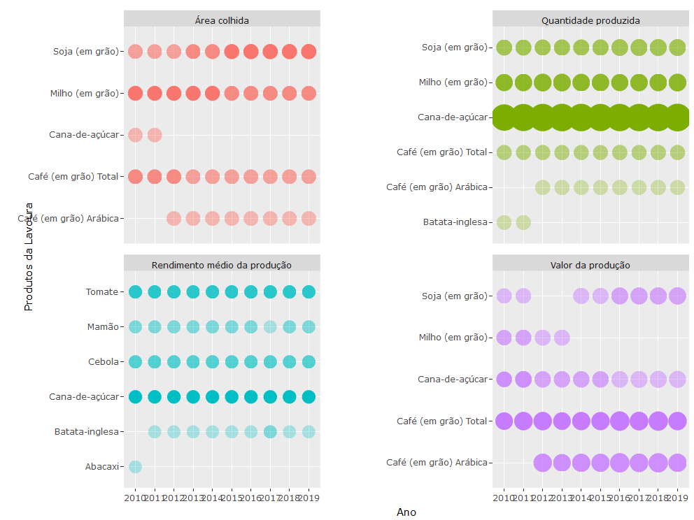

PAM SIDRA - Visualização
================
Michel Rodrigo - <michel.alves@fjp.mg.gov.br>
29 de junho de 2021

Esse script contém exemplos de visualização dos dados gerados no script
“PAM\_sidra\_importação”. Execute o referido script antes de executar
esse.

``` r
options(warn=-1)
```

# Estrutura do script

## Limpa a memória e console

``` r
cat("\014")  
```



``` r
#rm(list = ls())
```

## Configura o diretório de trabalho

Altera a pasta de trabalho para a mesma onde o script está salvo

``` r
dir <- dirname(rstudioapi::getActiveDocumentContext()$path)
setwd(dir)

load(".RData")
```

## Carrega as bibliotecas

``` r
pacotes <- c("tidyverse", "sidrar", "data.table", "openxlsx", "curl", "ggplot2", "plotly")
```

Verifica se alguma das bibliotecas necessárias ainda não foi instalada

``` r
pacotes_instalados <- pacotes %in% rownames(installed.packages())
if (any(pacotes_instalados == FALSE)) {
  install.packages(pacotes[!pacotes_instalados])
}
```

carrega as bibliotecas

``` r
lapply(pacotes, library, character.only=TRUE)
```

    ## -- Attaching packages --------------------------------------- tidyverse 1.3.1 --

    ## v ggplot2 3.3.3     v purrr   0.3.4
    ## v tibble  3.1.1     v dplyr   1.0.6
    ## v tidyr   1.1.3     v stringr 1.4.0
    ## v readr   1.4.0     v forcats 0.5.1

    ## -- Conflicts ------------------------------------------ tidyverse_conflicts() --
    ## x dplyr::filter() masks stats::filter()
    ## x dplyr::lag()    masks stats::lag()

    ## 
    ## Attaching package: 'data.table'

    ## The following objects are masked from 'package:dplyr':
    ## 
    ##     between, first, last

    ## The following object is masked from 'package:purrr':
    ## 
    ##     transpose

    ## Using libcurl 7.64.1 with Schannel

    ## 
    ## Attaching package: 'curl'

    ## The following object is masked from 'package:readr':
    ## 
    ##     parse_date

    ## 
    ## Attaching package: 'plotly'

    ## The following object is masked from 'package:ggplot2':
    ## 
    ##     last_plot

    ## The following object is masked from 'package:stats':
    ## 
    ##     filter

    ## The following object is masked from 'package:graphics':
    ## 
    ##     layout

## Geração de gráficos

### “N” Maiores de Minas

Filtra os dados. Inicialmente os dados serão manipulados, selecionando
“n” maiores

``` r
t_maiores <- MG_agr %>%
  group_by(Variável,Ano) %>%                    # poderíamos fazer outros filtros, por exemplo da Variável
  slice_max(Valor, n = 5) %>%                  # seleciona as cinco maiores linhas por Ano e Variável (que foram agrupadas)
  filter(Ano >= 2010, Produto != "Total")       # de 2010 para frente para facilitar a visualização
```

Constrói o gráfico

``` r
g_maiores <-  t_maiores %>%
  ggplot(aes(x = Ano, y = factor(Produto), text = Rank)) +
  geom_point(
    mapping = aes(size = Valor, alpha = -Rank, color = Variável),
    show.legend = F
  ) +
  facet_wrap(~Variável, nrow = 2, scales = "free_y") +
  scale_size(range = c(4.5,10)) +
  scale_alpha(range = c(0.3,1)) +
  labs(y = "Produtos da Lavoura") 

# Visualizar o gráfico
g_maiores
```

<!-- -->

``` r
## visualizar o gráfico com o plotly (opcional)
p <- plotly::ggplotly(g_maiores, tooltip = c("text", "y", "size")) %>% plotly::hide_guides()
export(p, file = "n_maiores.png")
```

<!-- -->
