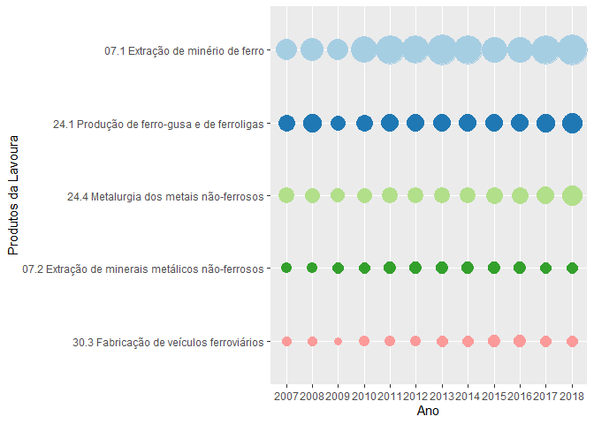
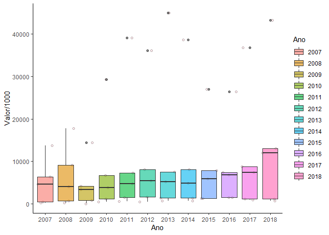
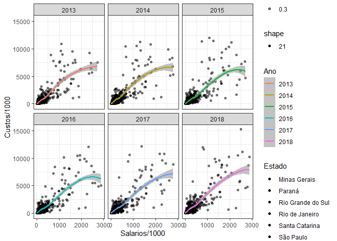
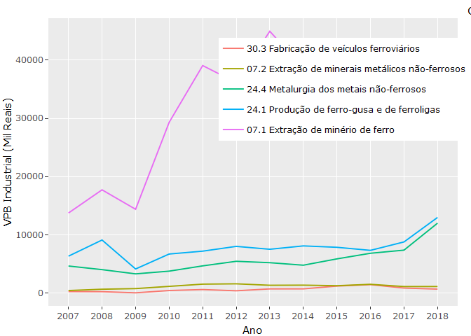

PIA SIDRA
================
Michel Rodrigo - <michel.alves@fjp.mg.gov.br> e João Paulo G. Garcia -
<joaopauloggarcia@gmail.com>
30 de junho de 2021

Importação e manipulação da tabela 1848 do SIDRA - Pesquisa Industrial
Anual - IBGE

``` r
options(warn=-1)
```

# Estrutura do script

## Limpa a memória e console

``` r
cat("\014")  
```



``` r
rm(list = ls())
```

## Configura o diretório de trabalho

Altera a pasta de trabalho para a mesma onde o script está salvo

``` r
dir <- dirname(rstudioapi::getActiveDocumentContext()$path)
setwd(dir)
```

## Carrega as bibliotecas

``` r
pacotes <- c("data.table", "forcats", "magrittr",
             "ggplot2", "plotly", "RColorBrewer")
```

Verifica se alguma das bibliotecas necessárias ainda não foi instalada

``` r
pacotes_instalados <- pacotes %in% rownames(installed.packages())
if (any(pacotes_instalados == FALSE)) {
  install.packages(pacotes[!pacotes_instalados])
}
```

carrega as bibliotecas

``` r
lapply(pacotes, library, character.only=TRUE)
```

    ## 
    ## Attaching package: 'plotly'

    ## The following object is masked from 'package:ggplot2':
    ## 
    ##     last_plot

    ## The following object is masked from 'package:stats':
    ## 
    ##     filter

    ## The following object is masked from 'package:graphics':
    ## 
    ##     layout

    ## [[1]]
    ## [1] "data.table" "stats"      "graphics"   "grDevices"  "utils"     
    ## [6] "datasets"   "methods"    "base"      
    ## 
    ## [[2]]
    ## [1] "forcats"    "data.table" "stats"      "graphics"   "grDevices" 
    ## [6] "utils"      "datasets"   "methods"    "base"      
    ## 
    ## [[3]]
    ##  [1] "magrittr"   "forcats"    "data.table" "stats"      "graphics"  
    ##  [6] "grDevices"  "utils"      "datasets"   "methods"    "base"      
    ## 
    ## [[4]]
    ##  [1] "ggplot2"    "magrittr"   "forcats"    "data.table" "stats"     
    ##  [6] "graphics"   "grDevices"  "utils"      "datasets"   "methods"   
    ## [11] "base"      
    ## 
    ## [[5]]
    ##  [1] "plotly"     "ggplot2"    "magrittr"   "forcats"    "data.table"
    ##  [6] "stats"      "graphics"   "grDevices"  "utils"      "datasets"  
    ## [11] "methods"    "base"      
    ## 
    ## [[6]]
    ##  [1] "RColorBrewer" "plotly"       "ggplot2"      "magrittr"     "forcats"     
    ##  [6] "data.table"   "stats"        "graphics"     "grDevices"    "utils"       
    ## [11] "datasets"     "methods"      "base"

## Importa os dados

Verifica se o arquivo com os dados já está salvo no diretório. Caso não
esteja, os dados serão obtidos de forma online, realizando a consulta no
site do sidra.

``` r
entrada  <- if (file.exists("Entrada/tab_1848.csv")) {
  "tab_1848.csv"
} else {
  "https://sidra.ibge.gov.br/geratabela?format=us.csv&name=tabela1848.csv&terr=NC&rank=-&query=t/1848/n1/all/n3/all/v/631,673,810,811,834,840/p/all/c12762/allxt/l/,,p%2Bt%2Bv%2Bc12762"
}
```

Importa a tabela

``` r
tab_1848 <- fread(entrada,
                  integer64 = "numeric",
                  na.strings = c('"-"','"X"'),
                  colClasses = c(list("factor" = c(1:5))),
                  col.names = c("Ano", "UF", "Estado",
                                "Var", "CNAE", "Valor"), 
                  encoding = "UTF-8")
```

## Manipulação da base de dados

### Exemplo 1

1 UF, 1 Variável e “N” CNAE’s

``` r
n_cnae <- tab_1848[UF == "31" &
                   CNAE %like% "ferro" &
                   Var %like% "produção industrial"
                   ][, Rank := frank(-Valor, na.last = "keep"), by = Ano]
```

### Exemplo 2

1 UF, todas as Variáveis (tirando pessoal ocupado) e 1 CNAE

``` r
n_var <- tab_1848[UF == "31" &
                  Var  %like% "Mil Reais" &
                  CNAE %like% "10.8"]
```

### Exemplo 3

“N” UF, 1 Variável e 1 CNAE

``` r
n_uf <- tab_1848[UF %in% c("31", "33", "35", "41") &
                 Var %like% "Pessoal" &
                 CNAE %like% "14 "]
```

### Exemplo 4

Todos os Estados, 2 Variáveis (em formato wide), 6 Anos e todas as
CNAE’s Filtra os dados e transforma para o formato wide com a função
“dcast”

``` r
wide_var <- tab_1848[UF != "1" &
                     Var %like% "Salário|Custos" &
                     Ano %in% as.factor(2013:2018)] %>%
                     dcast(Ano + Estado + CNAE ~ Var, value.var = "Valor")
```

Simplifica os nomes de colunas

``` r
colnames(wide_var)[4:5] = c("Custos", "Salarios")
```

Cria as colunas de rank

``` r
wide_var[, `:=` (Rank_C = frank(-Custos, na.last = "keep"),
                 Rank_S = frank(-Salarios, na.last = "keep")),
         by = .(Ano, Estado)]
```

## Visualização

### Gráfico de bolhas

As 10 maiores CNAE’s por Variável, Estado e Ano. Coloca as CNAE’s em
ordem crescente

``` r
n_cnae$CNAE <- fct_reorder(n_cnae$CNAE, -n_cnae$Rank)
```

Constrói o gráfico

``` r
g_bolha <-  n_cnae[Rank <= 10] %>%
  ggplot(aes(x = Ano, y = CNAE, text = paste("Rank: ", Rank))) +
  geom_point(
    aes(size = Valor, color = as.factor(Rank)),
    show.legend = F
  ) +
  scale_size(range = c(3, 12)) +
  scale_color_brewer(palette = "Paired") +
  labs(y = "Produtos da Lavoura") 
```

Visualizar o gráfico

``` r
g_bolha
```

<!-- -->

Opcionalmente, visualizar com o plotly

``` r
p <- ggplotly(g_bolha, tooltip = c("text", "y", "size")) %>% hide_guides()
```

Se desejar salvar o gráfico em um arquivo .png

``` r
export(p, file = "maiores_CNAE.png")
```

### Gráfico de caixa

1 Estado, 1 Variável, todos os Anos e todas as CNAE’s Usando os ranks
pode-se escolher a abrangência das CNAE’s

``` r
distribuicao <- n_cnae[Rank %between% c(1,5)] %>%
                      ggplot(aes(x = Ano, y = Valor/1000)) +
                      geom_jitter(aes(text = paste("CNAE: ", CNAE)),
                                  fill = "pink", alpha = 0.3, shape = 21) +
                      geom_boxplot(aes(fill = Ano), alpha = 0.6) +
                      theme_classic()
```

Visualiza o gráfico

``` r
distribuicao
```

<!-- -->

Opcionalmente, visualizar com o plotly

``` r
ggplotly(distribuicao, tooltip = c("text", "y")) %>% hide_guides()
```

### Gráfico de correlação

Usando os ranks pode-se escolher a abrangência das duas variáveis

``` r
g_corr <- wide_var[Rank_C > 20 & Rank_S > 20] %>%
                  ggplot(aes(x = Salarios/1000, y = Custos/1000)) +
                  geom_jitter(aes(fill = Estado, text = paste("CNAE: ", CNAE),
                                  shape = "21", alpha = 0.3)) +
                  geom_smooth(aes(color = Ano), alpha = 0.6) +
                  theme_bw() +
                  facet_wrap(~Ano, nrow = 2)
```

Visualiza o gráfico

``` r
g_corr
```

    ## `geom_smooth()` using method = 'loess' and formula 'y ~ x'

<!-- -->

### Série histórica

constrói o gráfico

``` r
serie_h <- n_cnae %>%
          ggplot(aes(x = Ano, y = Valor/1000)) +
          geom_line(aes(color = CNAE, group = CNAE)) +
          ylab("VPB Industrial (Mil Reais)")
```

Visualiza o gráfico

``` r
ggplotly(serie_h, tooltip = c("colors", "y", "x"))
```

<!-- -->
