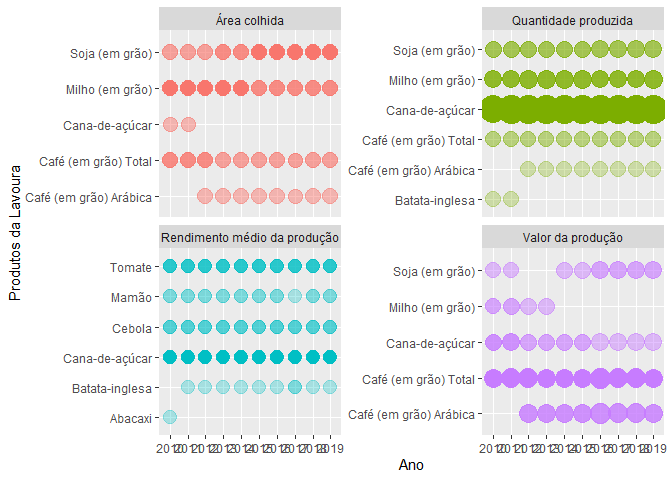
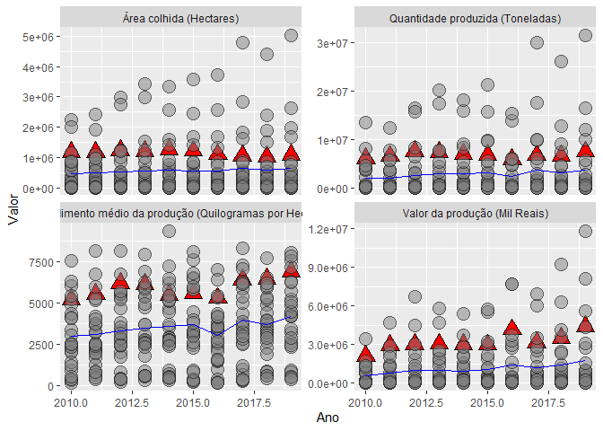
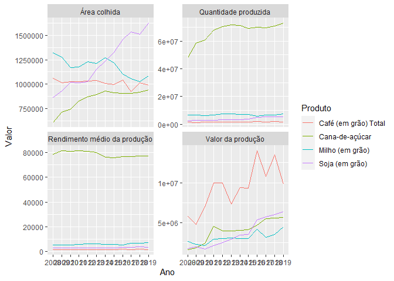
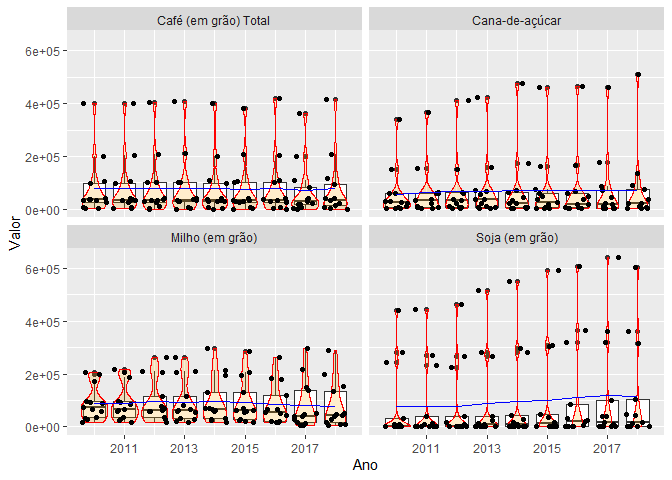
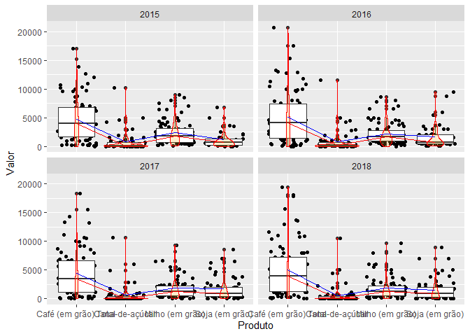

PAM SIDRA - Visualização
================
Michel Rodrigo - <michel.alves@fjp.mg.gov.br>
29 de junho de 2021

Esse script contém exemplos de visualização dos dados gerados no script
“PAM\_sidra\_importação”. Execute o referido script antes de executar
esse.

``` r
options(warn=-1)
```

# Estrutura do script

## Limpa a memória e console

``` r
cat("\014")  
```



``` r
#rm(list = ls())
```

## Configura o diretório de trabalho

Altera a pasta de trabalho para a mesma onde o script está salvo

``` r
dir <- dirname(rstudioapi::getActiveDocumentContext()$path)
setwd(dir)

load(".RData")
```

## Carrega as bibliotecas

``` r
pacotes <- c("tidyverse", "sidrar", "data.table", "openxlsx", "curl", "ggplot2", "plotly")
```

Verifica se alguma das bibliotecas necessárias ainda não foi instalada

``` r
pacotes_instalados <- pacotes %in% rownames(installed.packages())
if (any(pacotes_instalados == FALSE)) {
  install.packages(pacotes[!pacotes_instalados])
}
```

carrega as bibliotecas

``` r
lapply(pacotes, library, character.only=TRUE)
```

    ## -- Attaching packages --------------------------------------- tidyverse 1.3.1 --

    ## v ggplot2 3.3.3     v purrr   0.3.4
    ## v tibble  3.1.1     v dplyr   1.0.6
    ## v tidyr   1.1.3     v stringr 1.4.0
    ## v readr   1.4.0     v forcats 0.5.1

    ## -- Conflicts ------------------------------------------ tidyverse_conflicts() --
    ## x dplyr::filter() masks stats::filter()
    ## x dplyr::lag()    masks stats::lag()

    ## 
    ## Attaching package: 'data.table'

    ## The following objects are masked from 'package:dplyr':
    ## 
    ##     between, first, last

    ## The following object is masked from 'package:purrr':
    ## 
    ##     transpose

    ## Using libcurl 7.64.1 with Schannel

    ## 
    ## Attaching package: 'curl'

    ## The following object is masked from 'package:readr':
    ## 
    ##     parse_date

    ## 
    ## Attaching package: 'plotly'

    ## The following object is masked from 'package:ggplot2':
    ## 
    ##     last_plot

    ## The following object is masked from 'package:stats':
    ## 
    ##     filter

    ## The following object is masked from 'package:graphics':
    ## 
    ##     layout

## Geração de gráficos

### “N” Maiores de Minas

Filtra os dados. Inicialmente os dados serão manipulados, selecionando
“n” maiores

``` r
t_maiores <- MG_agr %>%
  group_by(Variável,Ano) %>%                    # poderíamos fazer outros filtros, por exemplo da Variável
  slice_max(Valor, n = 5) %>%                  # seleciona as cinco maiores linhas por Ano e Variável (que foram agrupadas)
  filter(Ano >= 2010, Produto != "Total")       # de 2010 para frente para facilitar a visualização
```

Constrói o gráfico

``` r
g_maiores <-  t_maiores %>%
  ggplot(aes(x = Ano, y = factor(Produto), text = Rank)) +
  geom_point(
    mapping = aes(size = Valor, alpha = -Rank, color = Variável),
    show.legend = F
  ) +
  facet_wrap(~Variável, nrow = 2, scales = "free_y") +
  scale_size(range = c(4.5,10)) +
  scale_alpha(range = c(0.3,1)) +
  labs(y = "Produtos da Lavoura") 
```

Visualizar o gráfico

``` r
g_maiores
```

<!-- -->

visualizar o gráfico com o plotly (opcional)

``` r
p <- plotly::ggplotly(g_maiores, tooltip = c("text", "y", "size")) %>% plotly::hide_guides()
```

Se desejar salvar o gráfico em um arquivo .png

``` r
export(p, file = "n_maiores.png")
```

### Minas x outras UF’s

Filtra os dados

``` r
t_MGxUF <-filter(UF_agr, Ano >= 2010, str_detect(Produto, "Milho"))
```

Constrói o gráfico

``` r
g_MGxUF <- t_MGxUF %>%
  ggplot(mapping = aes(x = Ano, y = Valor)) +
  geom_point(
    mapping = aes(shape = str_detect(Unidade.da.Federação, "Minas"),
                  fill = str_detect(Unidade.da.Federação, "Minas"),
                  alpha = str_detect(Unidade.da.Federação, "Minas"),
                  text = Unidade.da.Federação),
    size = 5,
    show.legend = FALSE
  ) +
  scale_shape_manual(values = c(21,24)) +
  scale_fill_manual(values = c("gray50", "red")) +
  scale_alpha_manual(values = c(0.5,1)) + 
  stat_summary(fun = mean, geom = "line", group = 'Produto', color = "blue")+
  facet_wrap(~Variável, nrow = 2, scales = "free_y")
```

Visualiza o gráfico

``` r
g_MGxUF
```

<!-- -->

Opcionalmente, visualizar com plotly

``` r
plotly::ggplotly(g_MGxUF, tooltip = c("text","y")) %>% plotly::hide_guides()
```

#### MG AGREGADO - Produto e Variável x Ano

Filtra os dados

``` r
t_MG_agr <- filter(MG_agr,
                   # str_detect(Variável, "Área"),           # descomentar para visualizar apenas uma Variável
                   Ano > 2007,
                   str_detect(Produto, "Soja|Milho|Café.*T|Cana.*aç"))
```

Constrói o gráfico

``` r
g_MG_agr <- t_MG_agr %>%                  
  ggplot(aes(x = Ano, y = Valor, group = Produto, color = Produto)) +
  geom_line()+
  facet_wrap(~Variável, nrow = 2, scales = "free_y")
```

Visualiza gráfico

``` r
g_MG_agr
```

<!-- -->

Opcionalmente, visualizar com o plotly

``` r
plotly::ggplotly(g_MG_agr, tooltip = c("y", "color")) %>% plotly::hide_guides()
```

### RegInt’s - Distribuição de Caixa

Filtra os dados

``` r
t_regints <- regint_agr %>%
  filter(
    Ano >= 2010,
    str_detect(Variável, "Área"),
    str_detect(Produto, "Milho|Café.*T|Cana.*aç|Soja"),
  )
```

Constrói o gráfico

``` r
g_regints <- t_regints %>%
  ggplot(aes(x = Ano, y = Valor)) +
  geom_boxplot(aes(group = Ano))+
  geom_violin(
    mapping = aes(group = Ano),
    fill = "orange", color = "red", alpha = 0.2
  ) +
  geom_jitter(aes(text = RegInt, group = Ano))+
  stat_summary(fun = mean, geom = "line", group = 'Ano', color = "blue")+
  facet_wrap(~Produto, nrow = 2) 
```

Visualiza o gráfico

``` r
g_regints
```

<!-- -->

Opcionalmente, visualizar com o plotly

``` r
plotly::ggplotly(g_regints, tooltip = c("y","text")) %>% plotly::hide_guides()
```

### MG DESAGREGADO - Distribuição de caixa

Filtra os dados

``` r
t_MG_mun <- MG_mun %>%
  filter(
    Ano >= 2015,
    RegInt == "Varginha",
    str_detect(Variável, "Área"),
    str_detect(Produto, "Milho|Soja|Café.*T|Cana.*aç"),
  )
```

Constrói o gráfico

``` r
g_MG_mun <- t_MG_mun %>%
  ggplot(aes(x = Produto, y = Valor)) +
  geom_jitter(aes(text = Município, group = Produto))+
  geom_boxplot(aes(group = Produto), outlier.shape = NULL)+
  geom_violin(
    mapping = aes(group = Produto),
    fill = "orange", color = "red", alpha = 0.2
  ) +
  stat_summary(fun = mean, geom = "line", group = 'Produto', color = "blue")+
  stat_summary(fun = median, geom = "line", group = 'Produto', color = "red") +
  facet_wrap(~Ano, nrow = 2)
```

Visualiza o gráfico

``` r
g_MG_mun
```

<!-- -->

Opcionalmente, visualizar com o plotly

``` r
plotly::ggplotly(g_MG_mun, tooltip = c("text","x","y"))%>%plotly::hide_guides()
```
