Retropolação - PNAD Contínua - MG
================
Autor: Marcos Damasceno

## Script para retropolação das séries temporais de ocupação e desocupação da PNAD Contínua para o estado de Minas Gerais, com base na PNAD desagregada, noutras pesquisas sobre mercado de trabalho (PME e PED) e no PIB estadual

  

Neste script é feita a retropolação ou “retroprojeção” dos dados sobre
ocupação e desocupação da Pesquisa Nacional por Amostra de Domicílios
Contínua (PNAD Contínua) trimestral, iniciada pelo Instituto Brasileiro
de Geografia e Estatística (IBGE) em 2012, para anos anteriores. A
retropolação terá como referência a antiga PNAD, pesquisa domiciliar de
periodicidade anual substituída pela PNAD Contínua e que foi conduzida
pelo mesmo IBGE até 2015. Em se tratando de duas pesquisas similares,
espera-se que uma regressão linear entre ambas no período em que
coincidiram temporalmente (entre 2012 e 2015) informe um coeficiente que
permita estimar dados (valores preditos) da PNAD Contínua para períodos
anteriores ao início de suas séries, tendo como referência os dados já
registrados pela PNAD.

Como as duas pesquisas possuem frequências (periodicidades) diferentes,
a regressão entre os dados de ocupação e desocupação por elas
registrados demanda, primeiro, que se desagregue os dados da PNAD (isto
é, que se aumente a frequência da série temporal) entre 2002 e 2015 de
anual para trimestral. Buscando fazer com que essa desagregação possa
captar as oscilações do mercado de trabalho ao longo de tal período,
serão tomadas como referência outras pesquisas que mensuram a produção e
o mercado de trabalho, a saber: a Pesquisa Mensal de Emprego - PME
(também conduzida pelo IBGE até 2016), a Pesquisa de Emprego e
Desemprego - PED (conduzida pela Fundação João Pinheiro - FJP até 2014,
para a região metropolitana de Belo Horizonte) e o Produto Interno
Bruto - PIB estadual (também calculado e publicado trimestralmente pela
FJP).

Considerando que, à exceção do PIB, nenhuma dessas pesquisas cobriu todo
o período entre 2002 e 2015 (a própria PNAD não tem dado para 2010, por
se tratar de ano de realização do Censo Demográfico), também será
necessário estendê-las temporalmente com o uso de outra regressão
linear, tomando como “denominador comum” os dados do PIB, de modo a
obter coeficientes que exprimam a relação entre os dados sobre trabalho
e os da produção estadual.

Uma vez desagregada a PNAD antiga em frequência trimestral e obtido, via
regressão linear, o coeficiente que relaciona os dados da população
ocupada e desocupada mensurados nesta pesquisa com os registrados pela
PNAD Contínua, será possível, então, gerar séries temporais desta última
para ocupação, desocupação e respectivas taxas desde 2002 até a
atualidade.

## Comandos preliminares do script

Antes de iniciar o trabalho com os dados, os comandos abaixo ajustam
alguns padrões para a exibição do código no arquivo de saída (*output*
do R Markdown), definem o diretório (pasta) onde serão lidos e gravados
os arquivos e carregam os pacotes de R que contêm as funções ques serão
utilizadas.

``` r
# Define os padrões de exibição dos chunks deste script, especificando o tamanho das imagens geradas:

  knitr::opts_chunk$set(echo = TRUE, message=FALSE, warning=FALSE, fig.width = 5, fig.height = 3, fig.align = "center")

# Limpa o console do RStudio e os objetos porventura carregados:

  rm(list = ls())
  cat("\014")

# Indica o diretório no computador que será usado para carregar e salvar arquivos, em especial as planilhas que contêm os dados usados neste script:

  setwd("C:/Users/x12695714/Desktop/Retropolação - PNAD MG")

# Indica os pacotes que serão utilizados neste script, verifica se já estão instalados e os carrega; caso contrário, faz a instalação antes de carregá-los:

  pacotes <- c("dplyr", "readxl", "tempdisagg", "ggplot2", "zoo", "rio", "formatR")

  pacotes_instalados <- pacotes %in% rownames(installed.packages())
  if (any(pacotes_instalados == FALSE)) {
    install.packages(pacotes[!pacotes_instalados])
  }

  lapply(pacotes, library, character.only = TRUE)

# Remove objetos desnecessários:

rm(pacotes, pacotes_instalados)
```

## 1) Construção das séries temporais

Primeiramente, as séries temporais da PNAD, PNAD Contínua, PME, PED e
PIB são montadas em formato de vetores numéricos. A função *read_xlsx*
importa os dados das séries temporais que estão em planilhas de Excel,
salvando-os no objeto *dados*, no formato de “data frame”. Como essas
planilhas estão em um mesmo arquivo (“Inputs - PNAD + PME + PED + PIB +
PNADc.xlsx”), a função toma como argumento não só o nome desse arquivo,
mas especifica também qual planilha deve ser lida ( *sheet* = “PNAD”,
“PED”, “PIB” etc.). Em seguida, vetores numéricos ( *tsOcupadosPNAD*,
*tsOcupadosPNADc*, *tsOcupadosPME* etc.) são criados para armazenar os
dados de cada uma das séries importadas, sendo a função *na.omit()*
usada para identificar e ignorar ou “pular” as células que eventualmente
não tenham observações e estejam em branco (valores “missing”). Esse
procedimento é feito para os dados de ocupados e desocupados – à exceção
do PIB, que tem apenas uma série com os dados da produção:

``` r
# PNAD:

  dados <- read_xlsx("Inputs - PNAD + PME + PED + PIB + PNADc.xlsx", sheet = "PNAD") 
  tsOcupadosPNAD <- na.omit(dados$OcupadosPNAD...4)
  tsDesocupadosPNAD <- na.omit(dados$`Desocupados PNAD...5`)

# PNAD Contínua:
    
  dados <- read_xlsx("Inputs - PNAD + PME + PED + PIB + PNADc.xlsx", sheet = "PNAD Contínua", skip = 3)
  dados <- dados[-41,]
  tsOcupadosPNADc <- dados$`Força de trabalho - ocupada`
  tsDesocupadosPNADc <- dados$`Força de trabalho - desocupada`

# PME:
    
  dados <- read_xlsx("Inputs - PNAD + PME + PED + PIB + PNADc.xlsx", sheet = "PME", skip = 4)
  tsOcupadosPME <- na.omit(dados$Total...11)
  tsDesocupadosPME <- na.omit(dados$Total...15)

# PED:  

  dados <- read_xlsx("Inputs - PNAD + PME + PED + PIB + PNADc.xlsx", sheet = "PED")
  tsOcupadosPED <- na.omit(dados$`Ocupados - trimestral (em mil)`[73:length(dados$`Ocupados - trimestral (em mil)`)])
  tsDesocupadosPED <- na.omit(dados$`Desocupados  -  trimestral (em mil)`[73:length(dados$`Desocupados  -  trimestral (em mil)`)])

# PIB:
   
  dados <- read_xlsx("Inputs - PNAD + PME + PED + PIB + PNADc.xlsx", sheet = "PIB", skip = 3)
  dados <- dados[-c(81, 82, 83),]
  tsPIB <- dados$...15

# Remove objetos desnecessários:
   
  rm(dados)
```

Como resultado, tem-se dois vetores (um para a série de ocupados e outro
para a de desocupados) para cada pesquisa sobre trabalho (PNAD, PNAD
Contínua, PME e PED) e um vetor para o PIB, com as seguintes extensões:

- PNAD: 13 registros anuais (2002 a 2015, com exceção do dado de 2010,
  ano de Censo Demográfico), publicados pelo IBGE;

- PNAD Contínua: 40 registros trimestrais (1º trimestre de 2012 ao 4º
  trimestre de 2021) para Minas Gerais, publicados pelo IBGE;

- PME: 55 registros trimestrais obtidos pela média simples de 165
  registros mensais (abril/2002 a dezembro/2015) para a Região
  Metropolitana de Belo Horizonte, publicados pelo IBGE;

- PED: 50 registros trimestrais obtidos de 150 registros mensais
  (março/2002 a junho/2014) para a Região Metropolitana de Belo
  Horizonte, publicados pela FJP – a publicação da pesquisa era mensal,
  mas o dado de cada mês corresponde à média móvel que abrange o mês de
  referência e os dois meses anteriores;

- PIB: 80 registros trimestrais publicados pela FJP (1º trimestre/2002
  ao 4º trimestre/2021) para Minas Gerais.

## 2) Ajuste da PNAD, PME e PED para completar o período de 2002 a 2015

Dada a necessidade de ter um mesmo número de observações na PNAD e na
PNAD Contínua para só então realizar a regressão entre as duas, uma
etapa prévia é transformar ou desagregar as séries anuais sobre ocupação
e desocupação da primeira em séries trimestrais – o que será feito
tomando as três outras séries (PME, PED e PIB) como referência.

Para tanto, é possível recorrer a técnicas estatísticas já desenvolvidas
para esses fins e já operacionalizadas em pacotes de linguagem R. Um
desses pacotes é o *tempdisagg*
(<https://cran.r-project.org/web/packages/tempdisagg/index.html>), que
permite o uso de distintos métodos de desagregação de séries temporais.
Entre eles, há os que se valem dos dados da própria série para estimar
valores intermediários entre os registros já disponíveis e outros que
tomam como referência outras séries temporais de maior frequência e
relacionadas com a série que se pretende desagregar, no intuito de
incorporar o comportamento (em nível e, sobretudo, estrutura) dessas
séries relacionadas ao longo do período analisado. Nesse segundo caso,
uma exigência comum nas técnicas de desagregação é que, além de contar
com registros que cubram um mesmo lapso temporal, a série de maior
frequência, tomada como referência para a desagregação, tenha uma
quantidade de registros que some um múltiplo exato da quantidade de
registros da série de menor frequência que se deseja desagregar. Por
isso, um primeiro passo antes de promover a desagregação é garantir que
as séries consideradas cubram um mesmo período temporal, ainda que com
frequências diferentes nos seus registros.

No caso em questão, a PNAD não tem dado anual para 2010, da mesma forma
que a PME não tem dado para os dois primeiros meses de 2002 e a PED não
avança para além de junho de 2014. Portanto, uma primeira tarefa é
interpolar valores anuais para ocupados e desocupados na PNAD em 2010,
retropolar dois valores mensais para a PME (para obter a média simples
de ocupados e desocupados no primeiro trimestre de 2002) e extrapolar
seis valores trimestrais para a PED (completando as séries de ocupados e
desocupados até o último trimestre de 2015). No intuito de obter
resultados condizentes com o cenário econômico de Minas Gerais nesses
dois períodos, optou-se por utilizar o PIB estadual como referência para
essas estimativas, obtidas por meio de regressão linear que indicou os
coeficientes que relacionam a oscilação do PIB com as das séries da
PNAD, PME e PED.

Abaixo, a função *lm()* opera as regressões entre os dados do PIB
(variável independente) e as séries de ocupados e desocupados da PME e
PED (variáveis dependentes), sempre limitando os registros de cada vetor
numérico dessas séries ao período em que as pesquisas coincidem (2º
trimestre de 2002 ao 4º trimestre de 2015, no caso da regressão da PME
sobre o PIB, e 1º trimestre de 2002 ao 2º trimestre de 2014, no caso da
regressão da PED sobre o PIB), indexando a posição desses registros
entre colchetes. O resultado da função é um objeto de classe “list” que
contém, entre seus atributos, os coeficientes $\beta_0$ e $\beta_1$
(intercepto e inclinação, respectivamente). Aplicando esses coeficientes
na equação de regressão com os registros trimetrais do PIB no primeiro
trimestre de 2002 e entre o 3º trimestre de 2014 e o 4º de 2015,
extraem-se os valores preditos para completar as séries trimestrais da
PME e da PED, respectivamente, os quais são adicionados aos vetores
numéricos de ocupados e desocupados dessas pesquisas. Ao longo dos
comandos, são exibidos os resultados estatísticos das regressões — por
meio da função *summary()* —, incluindo gráficos do tipo QQ, de
distribuição dos resíduos, bem como a plotagem das duas séries temporais
regredidas — função *plot()* —, de modo a verificar a qualidade do
ajuste de cada operação.

``` r
# Regressão para a série de ocupados da PME:

  regressao <- lm(tsOcupadosPME ~ tsPIB[2:56])
  
  summary(regressao) # Resultado estatisticamente significativo
  
  qqnorm(regressao$residuals) # Análise Q-Q dos resíduos e homocedasticidade dos dados
  
  qqline(regressao$residuals)
  
  plot(density(regressao$residuals)) # Gráfico com a distribuição dos resíduos
  
  plot(tsPIB[2:56], tsOcupadosPME)
  
# Completa a série de ocupados da PME com o novo valor gerado:
  
  tsOcupadosPME <- c(as.numeric(regressao$coefficients[1]) + as.numeric(regressao$coefficients[2]) * tsPIB[1], tsOcupadosPME)
```

    ## 
    ## Call:
    ## lm(formula = tsOcupadosPME ~ tsPIB[2:56])
    ## 
    ## Residuals:
    ##    Min     1Q Median     3Q    Max 
    ## -90.48 -32.60  -5.05  28.12 113.27 
    ## 
    ## Coefficients:
    ##             Estimate Std. Error t value Pr(>|t|)    
    ## (Intercept) 342.2681    55.7251   6.142 1.07e-07 ***
    ## tsPIB[2:56]  15.2255     0.4393  34.655  < 2e-16 ***
    ## ---
    ## Signif. codes:  0 '***' 0.001 '**' 0.01 '*' 0.05 '.' 0.1 ' ' 1
    ## 
    ## Residual standard error: 48.17 on 53 degrees of freedom
    ## Multiple R-squared:  0.9577, Adjusted R-squared:  0.9569 
    ## F-statistic:  1201 on 1 and 53 DF,  p-value: < 2.2e-16


``` r
# Regressão para a série de desocupados da PME:

  regressao <- lm(tsDesocupadosPME ~ tsPIB[2:56])
  
  summary(regressao) # Resultado estatisticamente significativo
  
  qqnorm(regressao$residuals) # Análise Q-Q dos resíduos e homocedasticidade dos dados
  
  qqline(regressao$residuals)
  
  plot(density(regressao$residuals)) # Gráfico com a distribuição dos resíduos

  plot(tsPIB[2:56], tsDesocupadosPME)

# Completa a série de desocupados da PME com o novo valor gerado:  

  tsDesocupadosPME <- c(as.numeric(regressao$coefficients[1]) + as.numeric(regressao$coefficients[2]) * tsPIB[1], tsDesocupadosPME)
```

    ## 
    ## Call:
    ## lm(formula = tsDesocupadosPME ~ tsPIB[2:56])
    ## 
    ## Residuals:
    ##     Min      1Q  Median      3Q     Max 
    ## -44.835 -11.032   1.788  13.355  40.804 
    ## 
    ## Coefficients:
    ##             Estimate Std. Error t value Pr(>|t|)    
    ## (Intercept) 524.3643    19.8958   26.36   <2e-16 ***
    ## tsPIB[2:56]  -2.8612     0.1569  -18.24   <2e-16 ***
    ## ---
    ## Signif. codes:  0 '***' 0.001 '**' 0.01 '*' 0.05 '.' 0.1 ' ' 1
    ## 
    ## Residual standard error: 17.2 on 53 degrees of freedom
    ## Multiple R-squared:  0.8626, Adjusted R-squared:   0.86 
    ## F-statistic: 332.7 on 1 and 53 DF,  p-value: < 2.2e-16


``` r
# Regressão para a série de ocupados da PED:
  
  regressao <- lm(tsOcupadosPED ~ tsPIB[1:50])
  
  summary(regressao) # Resultado estatisticamente significativo
  
  qqnorm(regressao$residuals) # Análise Q-Q dos resíduos e homocedasticidade dos dados
  
  qqline(regressao$residuals)
  
  plot(density(regressao$residuals)) # Gráfico com a distribuição dos resíduos

  plot(tsPIB[1:50], tsOcupadosPED)

# Completa a série de ocupados da PED com os novos valores gerados:  

    for(i in 1:6){
    tsOcupadosPED[50+i] <- tsPIB[50+i] * as.numeric(regressao$coefficients[2]) +
      as.numeric(regressao$coefficients[1])
  }
```

    ## 
    ## Call:
    ## lm(formula = tsOcupadosPED ~ tsPIB[1:50])
    ## 
    ## Residuals:
    ##     Min      1Q  Median      3Q     Max 
    ## -61.244 -16.915   1.772  16.911  64.232 
    ## 
    ## Coefficients:
    ##             Estimate Std. Error t value Pr(>|t|)    
    ## (Intercept) 857.9197    32.0500   26.77   <2e-16 ***
    ## tsPIB[1:50]   5.5662     0.2567   21.68   <2e-16 ***
    ## ---
    ## Signif. codes:  0 '***' 0.001 '**' 0.01 '*' 0.05 '.' 0.1 ' ' 1
    ## 
    ## Residual standard error: 27.53 on 48 degrees of freedom
    ## Multiple R-squared:  0.9073, Adjusted R-squared:  0.9054 
    ## F-statistic:   470 on 1 and 48 DF,  p-value: < 2.2e-16


``` r
# Regressão para as série de desocupados da PED: 
  
  regressao <- lm(tsDesocupadosPED ~ tsPIB[1:50])
  
  summary(regressao) # Resultado estatisticamente significativo
  
  qqnorm(regressao$residuals) # Análise Q-Q dos resíduos e homocedasticidade dos dados
  
  qqline(regressao$residuals)
  
  plot(density(regressao$residuals)) # Gráfico com a distribuição dos resíduos

  plot(tsPIB[1:50], tsDesocupadosPED)

# Completa a série de desocupados da PED com os novos valores gerados:  
  
  for(i in 1:6){
    tsDesocupadosPED[50+i] <- tsPIB[50+i] * as.numeric(regressao$coefficients[2]) +
      as.numeric(regressao$coefficients[1])
  }

# Remove objetos desnecessários:  

  rm(i, regressao)
```

    ## 
    ## Call:
    ## lm(formula = tsDesocupadosPED ~ tsPIB[1:50])
    ## 
    ## Residuals:
    ##     Min      1Q  Median      3Q     Max 
    ## -31.510 -12.020  -2.815  11.515  44.047 
    ## 
    ## Coefficients:
    ##             Estimate Std. Error t value Pr(>|t|)    
    ## (Intercept) 498.7442    20.4188   24.43   <2e-16 ***
    ## tsPIB[1:50]  -2.7976     0.1636  -17.10   <2e-16 ***
    ## ---
    ## Signif. codes:  0 '***' 0.001 '**' 0.01 '*' 0.05 '.' 0.1 ' ' 1
    ## 
    ## Residual standard error: 17.54 on 48 degrees of freedom
    ## Multiple R-squared:  0.859,  Adjusted R-squared:  0.8561 
    ## F-statistic: 292.5 on 1 and 48 DF,  p-value: < 2.2e-16


No caso da PNAD, para fazer tal regressão e obter o estimador que
permita gerar um valor para o ano de 2010, é necessário antes
compatibilizar as frequências das séries de ocupados e desocupados
(registros anuais) com a do PIB (registros trimestrais), pois a
regressão só opera com uma mesma quantidade de registros das variáveis
dependente (PNAD) e independente (PIB). Isso pode ser feito tanto
reduzindo a frequência do PIB — obtendo médias simples dos trimestres de
cada ano e formando valores anuais para os períodos de 2002 a 2009 e de
2011 a 2015 — ou aumentando a frequência da PNAD por meio de métodos de
desagregação. Abaixo, ambos os procedimentos serão realizados para
evidenciar que, optando pela segunda alternativa (aumento da frequência
das séries da PNAD), aumentam-se os graus de liberdade e extraem-se
coeficientes de regressão (intercepto e inclinação) com maior
significância estatística. Aplicando esses coeficientes na equação de
regressão com a média dos valores trimestrais do PIB em 2010, chega-se a
um valor predito para as séries de ocupados e desocupados da PNAD no
mesmo ano.

Para desagregar a PNAD anual em observações trimestrais, usa-se a função
*td()* do pacote *tempdisagg*. Nesse primeiro momento, o objetivo é
apenas interpolar valores para o ano de 2010 nas séries da PNAD e por
isso será usado o método de Denton-Cholette, que permite operar
desagregações sem utilizar nenhuma outra série ou indicador como
referência — na prática, essa desagregação opera uma simples
interpolação com os dados anuais já disponíveis, resultando em uma
suavização das curvas para as séries anuais de ocupados e desocupados.
Vale observar desde já que, qualquer que seja o método usado, a função
*td()* gera uma lista com diversos elementos, entre eles o *values*, um
vetor que armazena a série temporal desagregada. Os argumentos dessa
função incluem a série a ser desagregada (ocupados e desocupados da
PNAD, no caso), a ordem de diferenciação (no caso, 0), a frequência para
a qual se deseja desagregar (de anual para trimestral, expressa pelo
argumento *to = 4*, que informa o fator multiplicador entre as
frequências da série original a série desagregada resultante), o tipo de
conversão (no caso, a que mantenha para os valores desagregados o mesmo
o nível das séries originais, ao invés de dividí-los entre os anos e
trimestres, por exemplo — o que se garante com o argumento *conversion =
“mean”* ) e, enfim, o método escolhido para a desagregação ( *method =
denton-cholette*, no caso).

Ao longo dos comandos abaixo, são plotados os gráficos com as séries que
compõem as regressões, bem como os resultados dessas regressões, de modo
a averiguar a qualidade dos estimadores:

``` r
# Primeiro método para completar as séries da PNAD, por meio da redução da frequência da série do PIB:

  PIB <- tsPIB[-c(33:36)] # Vetor com os dados do PIB sem os registros do ano de 2010

  PIB_Anual <- 1:13 # Vetor para armazenar os dados com a média anual do PIB trimestral
  
  i2 <- 1 # Índice para loop da função "for"
  
  for (i in 1:length(PIB_Anual)) { # Obtém valores anuais do PIB pela média simples dos registros trimestrais
    PIB_Anual[i] <- mean(PIB[i2:(i2+3)])
    i2 <- i2 + 4
  }

  regressao <- lm(tsOcupadosPNAD ~ PIB_Anual) # Regressão para a série de ocupados
  
  plot(PIB_Anual, tsOcupadosPNAD)
  
  summary(regressao) # Observa-se que os coeficientes obtidos para a série de ocupados são estatisticamente significativos
  
  qqnorm(regressao$residuals) # Análise Q-Q dos resíduos e homocedasticidade dos dados
  
  qqline(regressao$residuals)
  
  plot(density(regressao$residuals)) # Gráfico com a distribuição dos resíduos
```

    ## 
    ## Call:
    ## lm(formula = tsOcupadosPNAD ~ PIB_Anual)
    ## 
    ## Residuals:
    ##     Min      1Q  Median      3Q     Max 
    ## -318.89 -288.72  -33.84  174.82  672.62 
    ## 
    ## Coefficients:
    ##             Estimate Std. Error t value Pr(>|t|)    
    ## (Intercept) 6640.266    749.520   8.859 2.44e-06 ***
    ## PIB_Anual     23.882      5.964   4.004  0.00207 ** 
    ## ---
    ## Signif. codes:  0 '***' 0.001 '**' 0.01 '*' 0.05 '.' 0.1 ' ' 1
    ## 
    ## Residual standard error: 327.8 on 11 degrees of freedom
    ## Multiple R-squared:  0.5931, Adjusted R-squared:  0.5561 
    ## F-statistic: 16.03 on 1 and 11 DF,  p-value: 0.002072


``` r
  regressao <- lm(tsDesocupadosPNAD ~ PIB_Anual) # Regressão para a série de desocupados
  
  plot(PIB_Anual, tsDesocupadosPNAD)
  
  summary(regressao) # Já o coeficiente de inclinação obtido para a série de desocupados não é estatisticamente significativo em um intervalo de confiança aceitável
```

    ## 
    ## Call:
    ## lm(formula = tsDesocupadosPNAD ~ PIB_Anual)
    ## 
    ## Residuals:
    ##     Min      1Q  Median      3Q     Max 
    ## -127.02  -36.86  -14.49   18.67  326.75 
    ## 
    ## Coefficients:
    ##             Estimate Std. Error t value Pr(>|t|)    
    ## (Intercept) 1227.768    262.536   4.677 0.000675 ***
    ## PIB_Anual     -3.502      2.089  -1.676 0.121883    
    ## ---
    ## Signif. codes:  0 '***' 0.001 '**' 0.01 '*' 0.05 '.' 0.1 ' ' 1
    ## 
    ## Residual standard error: 114.8 on 11 degrees of freedom
    ## Multiple R-squared:  0.2034, Adjusted R-squared:  0.131 
    ## F-statistic: 2.809 on 1 and 11 DF,  p-value: 0.1219


``` r
# Segundo método para completar a PNAD, aumentando a frequência das séries de ocupados e desocupados para trimestral, para fazer regressão com o PIB e obter valor para o ano de 2010:

  ocupadosPNAD_trimestral <- td(tsOcupadosPNAD ~ 0, to = 4, conversion = "mean", method ="denton-cholette")

  PIB <- tsPIB[-c(33:36, 57:80)]

  regressao <- lm(ocupadosPNAD_trimestral$values ~ PIB)

  plot(PIB, ocupadosPNAD_trimestral$values)
  
  summary(regressao) # Os coeficientes de regressão para a série de ocupados continuam estatisticamente significativos
  
  qqnorm(regressao$residuals) # Análise Q-Q dos resíduos e homocedasticidade dos dados
  
  qqline(regressao$residuals)
  
  plot(density(regressao$residuals)) # Gráfico com a distribuição dos resíduos
```

    ## 
    ## Call:
    ## lm(formula = ocupadosPNAD_trimestral$values ~ PIB)
    ## 
    ## Residuals:
    ##     Min      1Q  Median      3Q     Max 
    ## -423.20 -264.68  -74.94  230.29  781.96 
    ## 
    ## Coefficients:
    ##             Estimate Std. Error t value Pr(>|t|)    
    ## (Intercept) 6674.763    360.083  18.537  < 2e-16 ***
    ## PIB           23.605      2.865   8.239 7.12e-11 ***
    ## ---
    ## Signif. codes:  0 '***' 0.001 '**' 0.01 '*' 0.05 '.' 0.1 ' ' 1
    ## 
    ## Residual standard error: 317.8 on 50 degrees of freedom
    ## Multiple R-squared:  0.5758, Adjusted R-squared:  0.5674 
    ## F-statistic: 67.88 on 1 and 50 DF,  p-value: 7.116e-11


``` r
  tsOcupadosPNAD <- append(tsOcupadosPNAD, as.numeric(regressao$coefficients[1] + mean(tsPIB[33:36]) *
                                                        regressao$coefficients[2]), after = 8)
  
  
  desocupadosPNAD_trimestral <- td(tsDesocupadosPNAD ~ 0, to = 4, conversion = "mean", method ="denton-cholette")

  regressao <- lm(desocupadosPNAD_trimestral$values ~ PIB)

  plot(PIB, desocupadosPNAD_trimestral$values)
  
  summary(regressao) # Desta vez, com mais graus de liberdade, ambos os coeficientes para a série de desocupados são estatisticamente significativos sob um intervalo de confiança aceitável
  
  qqnorm(regressao$residuals) # Análise Q-Q dos resíduos e homocedasticidade dos dados
  
  qqline(regressao$residuals)
  
  plot(density(regressao$residuals)) # Gráfico com a distribuição dos resíduos
  
  tsDesocupadosPNAD <- append(tsDesocupadosPNAD, as.numeric(regressao$coefficients[1] + mean(tsPIB[33:36]) *
                                                        regressao$coefficients[2]), after = 8)
 
# Remove objetos desnecessários:  
  
  rm(i, i2, PIB, ocupadosPNAD_trimestral, desocupadosPNAD_trimestral, PIB_Anual, regressao)
```

    ## 
    ## Call:
    ## lm(formula = desocupadosPNAD_trimestral$values ~ PIB)
    ## 
    ## Residuals:
    ##     Min      1Q  Median      3Q     Max 
    ## -146.47  -43.50  -16.65   19.49  395.69 
    ## 
    ## Coefficients:
    ##             Estimate Std. Error t value Pr(>|t|)    
    ## (Intercept)  1232.62     126.89   9.714 4.23e-13 ***
    ## PIB            -3.54       1.01  -3.507 0.000968 ***
    ## ---
    ## Signif. codes:  0 '***' 0.001 '**' 0.01 '*' 0.05 '.' 0.1 ' ' 1
    ## 
    ## Residual standard error: 112 on 50 degrees of freedom
    ## Multiple R-squared:  0.1974, Adjusted R-squared:  0.1813 
    ## F-statistic:  12.3 on 1 and 50 DF,  p-value: 0.0009685


Ao fim, tem-se vetores para todas as séries que serão usadas nas
desagregações e na retropolação abaixo abrangendo todo o período entre
2002 e 2015, sendo 14 registros anuais da PNAD e 56 registros
trimestrais da PME, PED e PIB (este último tem 80 registros, pois segue
até 2021).

## 3) Desagregação da PNAD anual para dados trimestrais

Dispondo das séries da PNAD, da PME e da PED completas para o período
entre 2002 e 2015, a PNAD anual desse mesmo período será novamente
desagregada para a frequência trimestral, desta vez já contendo o dado
interpolado para 2010 e tomando as séries da PME, PED e PIB como
referência. A intenção desta vez é incorporar, na PNAD desagregada, os
movimentos (oscilações) na população ocupada e desocupada captados por
essas outras séries.

Novamente será utilizada a função *td()*, desta vez aplicando tanto o
método de Denton-Cholette quanto o de Chow-Lin, sendo que o primeiro
admite desagregações com ou sem indicadores de referência, ao passo que
o segundo apenas opera com algum indicador desse tipo, pois usa um
modelo de regressão entre os valores das duas séries. Para tanto, os
argumentos da função devem especificar o método selecionado ( *method =
denton-cholette* ou *method = chow-lin-maxlog*), o fator multiplicador
entre a série a ser desagregada (a PNAD) e a série de referência na
desagregação (PME e PED) — nesse caso, o argumento *to = 3*, dado que as
séries da PNAD têm uma observação para cada quatro das séries da PME e
PED —, além dos outros argumentos já mencionados anteriormente. A função
*summary()*, acionada após cada desagregação, exibe os resultados e
parâmetros estatísticos da operação.

### 3.1) Desagregações com referência na PME

As primeiras desagregações utilizam a PME como série de referência,
usando tanto o método de Denton-Cholette quanto o de Chow-Lin. Abaixo,
são geradas quatro séries da PNAD em frequência trimestral entre 2002 e
2015, duas para ocupados e duas para desocupados, cada dupla contendo os
resultados com o uso dos dois métodos de desagregação mencionados:

``` r
# Desagregação da série de ocupados pelo método de Denton-Cholette, considerando a PME como referência:

  ocupadosPNAD_DC_PME <- td(tsOcupadosPNAD ~ 0 + tsOcupadosPME, to = 3, conversion = "mean",
                            method ="denton-cholette")

  summary(ocupadosPNAD_DC_PME)
```

    ## 
    ## Call:
    ## td(formula = tsOcupadosPNAD ~ 0 + tsOcupadosPME, conversion = "mean", 
    ##     to = 3, method = "denton-cholette")
    ## 
    ## Residuals:
    ##    Min     1Q Median     3Q    Max 
    ##   6920   7153   7481   7681   8040 
    ## 
    ## No Coefficients
    ## 
    ## 'denton-cholette' disaggregation with 'average' conversion
    ## 14 low-freq. obs. converted to 56 high-freq. obs.
    ## criterion: proportional  order of differencing 'h': 1

``` r
# Desagregação da série de desocupados pelo método de Denton-Cholette, considerando a PME como referência:

  desocupadosPNAD_DC_PME <- td(tsDesocupadosPNAD ~ 0 + tsDesocupadosPME, to = 3, conversion = "mean", 
                               method = "denton-cholette")
  
  summary(desocupadosPNAD_DC_PME)
```

    ## 
    ## Call:
    ## td(formula = tsDesocupadosPNAD ~ 0 + tsDesocupadosPME, conversion = "mean", 
    ##     to = 3, method = "denton-cholette")
    ## 
    ## Residuals:
    ##    Min     1Q Median     3Q    Max 
    ##  449.8  558.1  607.3  627.2  953.8 
    ## 
    ## No Coefficients
    ## 
    ## 'denton-cholette' disaggregation with 'average' conversion
    ## 14 low-freq. obs. converted to 56 high-freq. obs.
    ## criterion: proportional  order of differencing 'h': 1

``` r
# Desagregação da série de ocupados pelo método de Chow-Lin, considerando a PME como referência:

  ocupadosPNAD_CL_PME <- td(tsOcupadosPNAD ~ 0 + tsOcupadosPME, to = 3, conversion = "mean",
                            method ="chow-lin-maxlog")

  summary(ocupadosPNAD_CL_PME) # O coeficiente é estatisticamente significativo
  
  qqnorm(ocupadosPNAD_CL_PME$residuals) # Análise Q-Q dos resíduos e homocedasticidade dos dados
  
  qqline(ocupadosPNAD_CL_PME$residuals)
  
  plot(density(ocupadosPNAD_CL_PME$residuals)) # Gráfico com a distribuição dos resíduos
```

    ## 
    ## Call:
    ## td(formula = tsOcupadosPNAD ~ 0 + tsOcupadosPME, conversion = "mean", 
    ##     to = 3, method = "chow-lin-maxlog")
    ## 
    ## Residuals:
    ##    Min     1Q Median     3Q    Max 
    ## -721.2  140.9 1109.5 1157.7 1476.5 
    ## 
    ## Coefficients:
    ##               Estimate Std. Error t value Pr(>|t|)    
    ## tsOcupadosPME   4.1007     0.3763    10.9 6.59e-08 ***
    ## ---
    ## Signif. codes:  0 '***' 0.001 '**' 0.01 '*' 0.05 '.' 0.1 ' ' 1
    ## 
    ## 'chow-lin-maxlog' disaggregation with 'average' conversion
    ## 14 low-freq. obs. converted to 56 high-freq. obs.
    ## Adjusted R-squared: -0.518   AR1-Parameter: 0.9688


No caso da série de desocupados, a desagregação pelo método de Chow-Lin
(que, como mencionado, funciona por meio de regressão) resulta em
coeficientes que não são significativos, como se pode ver abaixo. Uma
solução diante disso é transformar o modelo de desagregação de um modelo
em nível (“level”) para um modelo nível-log ou log-log, ou seja,
desagregando a série da PNAD com a série da PME transformada pelo seu
logaritmo natural (modelo “level-log”), ou transformando ambas as séries
(modelo “log-log”). Essas duas alternativas são testadas abaixo e um
gráfico de linhas é gerado ao final para comparar os resultados com os
pontos originais da série anual de desocupados da PNAD; como se vê, a
transformação do modelo, seja para “nível-log” ou para “log-log”, gera
coeficientes estatisticamente significativos, mas os resultados da
desagregação ainda se mostram consideravelmente distantes da curva
original. Diante disso, optou-se pela série desagregada pelo modelo em
“log-log”, por ter uma interpretação mais segura, já que ambas as
variáveis foram regredidas com seus valores em logaritmo:

``` r
# Desagregação da série de desocupados pelo método de Chow-Lin, considerando a PME como referência:

  desocupadosPNAD_CL_PME <- td(tsDesocupadosPNAD ~ 0 + tsDesocupadosPME, to = 3, conversion = "mean", method = "chow-lin-maxlog")

  summary(desocupadosPNAD_CL_PME) # Percebe-se que, diferentemente do que ocorre na série de ocupados, na de desocupados o coeficiente da regressão operada pelo método de Chow-Lin não é estatistiamente significativo sob um intervalo de confiança aceitável. 
```

    ## 
    ## Call:
    ## td(formula = tsDesocupadosPNAD ~ 0 + tsDesocupadosPME, conversion = "mean", 
    ##     to = 3, method = "chow-lin-maxlog")
    ## 
    ## Residuals:
    ##    Min     1Q Median     3Q    Max 
    ##  860.1  930.9 1041.2 1171.7 1244.3 
    ## 
    ## Coefficients:
    ##                  Estimate Std. Error t value Pr(>|t|)
    ## tsDesocupadosPME   -1.399      1.600  -0.874    0.398
    ## 
    ## 'chow-lin-maxlog' disaggregation with 'average' conversion
    ## 14 low-freq. obs. converted to 56 high-freq. obs.
    ## Adjusted R-squared: 0.01073  AR1-Parameter: 0.998

``` r
# Transformação do modelo para log-log:
  
  log_log <- td(log(tsDesocupadosPNAD) ~ 0 + log(tsDesocupadosPME), to = 3, conversion = "mean", method = "chow-lin-maxlog")
  
  summary(log_log) # Agora o estimador é estatisticamente significativo
  
  qqnorm(log_log$residuals) # Análise Q-Q dos resíduos e homocedasticidade dos dados
  
  qqline(log_log$residuals)
  
  plot(density(log_log$residuals)) # Gráfico com a distribuição dos resíduos
```

    ## 
    ## Call:
    ## td(formula = log(tsDesocupadosPNAD) ~ 0 + log(tsDesocupadosPME), 
    ##     conversion = "mean", to = 3, method = "chow-lin-maxlog")
    ## 
    ## Residuals:
    ##      Min       1Q   Median       3Q      Max 
    ## -0.37788 -0.21970 -0.11116  0.00805  0.77899 
    ## 
    ## Coefficients:
    ##                       Estimate Std. Error t value Pr(>|t|)    
    ## log(tsDesocupadosPME)  1.29360    0.04399   29.41 2.81e-13 ***
    ## ---
    ## Signif. codes:  0 '***' 0.001 '**' 0.01 '*' 0.05 '.' 0.1 ' ' 1
    ## 
    ## 'chow-lin-maxlog' disaggregation with 'average' conversion
    ## 14 low-freq. obs. converted to 56 high-freq. obs.
    ## Adjusted R-squared: -2.036   AR1-Parameter: 0.8988


``` r
# Transformação do modelo para log-log:
  
  level_log <- td(tsDesocupadosPNAD ~ 0 + log(tsDesocupadosPME), to = 3, conversion = "mean", method = "chow-lin-maxlog")
  
  summary(level_log) # Também nesse modelo o estimador é estatisticamente significativo
  
  qqnorm(level_log$residuals) # Análise Q-Q dos resíduos e homocedasticidade dos dados
  
  qqline(level_log$residuals)
  
  plot(density(level_log$residuals)) # Gráfico com a distribuição dos resíduos
```

    ## 
    ## Call:
    ## td(formula = tsDesocupadosPNAD ~ 0 + log(tsDesocupadosPME), conversion = "mean", 
    ##     to = 3, method = "chow-lin-maxlog")
    ## 
    ## Residuals:
    ##     Min      1Q  Median      3Q     Max 
    ## -171.37  -66.49  -15.53   18.79  331.77 
    ## 
    ## Coefficients:
    ##                       Estimate Std. Error t value Pr(>|t|)    
    ## log(tsDesocupadosPME)  155.026      9.849   15.74 7.61e-10 ***
    ## ---
    ## Signif. codes:  0 '***' 0.001 '**' 0.01 '*' 0.05 '.' 0.1 ' ' 1
    ## 
    ## 'chow-lin-maxlog' disaggregation with 'average' conversion
    ## 14 low-freq. obs. converted to 56 high-freq. obs.
    ## Adjusted R-squared: -0.1246  AR1-Parameter: 0.6817


``` r
# Gráfico para comparar os resultados dos modelos transformados:
  
  trimestre <- as.yearqtr(seq(as.Date("2002-03-01"), by="quarter", length.out = 56))
  
  PNAD_original <- array(data = NA, dim = 56)
  
  i2 <- 0
  
  for(i in 1:length(tsDesocupadosPNAD)){
      PNAD_original[i2+3] <- round(tsDesocupadosPNAD[i])
      i2 <- i2+4
  }
  
  series <- data.frame(PNAD_original, exp(log_log$values), level_log$values)
  
  ggplot(series, aes(trimestre)) +  
    geom_line(aes(y = exp(log_log$values), colour = "Desagregação PNAD-PME; modelo log-log"), size = 0.8) +
    geom_line(aes(y = level_log$values, colour = "Desagregação PNAD-PME; modelo level-log"), size = 0.8) +
    geom_point(aes(y = PNAD_original, color = "PNAD original"), size = 1) +
    xlab("Trimestre") + ylab("População desocupada (mil)") +
    scale_x_yearqtr(format = "%Y-%q", n = 14) +
    theme(axis.text.x = element_text(angle = 45, hjust = 1)) +
    scale_color_manual(values = c("grey", "green", "black")) +
    theme(legend.position="bottom") +
    theme(legend.key.size = unit(0.3, 'cm'),
    legend.title = element_text(size=7),
    legend.text = element_text(size=7),
    plot.margin = margin(l=0, r=0, unit = "cm")) +
    guides(col = guide_legend(nrow = 3))
```

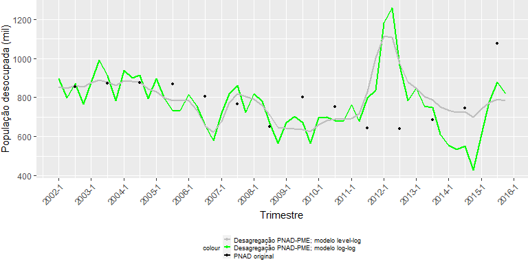

``` r
# Opção pela série desagregada com base no modelo log-log:
  
  desocupadosPNAD_CL_PME <- log_log
  
# Remove objetos desnecessários:   
  
  rm(i, i2, trimestre, series, PNAD_original, log_log, level_log)
```

### 3.2) Desagregações com referência na PED

As desagregações seguintes usam as séries da PED como referência, também
gerando quatro séries trimestrais para a PNAD entre 2002 e 2015, duas
para ocupados e duas para desocupados, novamente para os métodos de
Denton-Cholette e Chow-Lin:

``` r
# Desagregação da série de ocupados pelo método de Denton-Cholette, considerando a PED como referência:
  
  ocupadosPNAD_DC_PED <- td(tsOcupadosPNAD ~ 0 + tsOcupadosPED, to = 3, conversion = "mean",
                            method ="denton-cholette")

  summary(ocupadosPNAD_DC_PED)
```

    ## 
    ## Call:
    ## td(formula = tsOcupadosPNAD ~ 0 + tsOcupadosPED, conversion = "mean", 
    ##     to = 3, method = "denton-cholette")
    ## 
    ## Residuals:
    ##    Min     1Q Median     3Q    Max 
    ##   7297   7960   8180   8370   8720 
    ## 
    ## No Coefficients
    ## 
    ## 'denton-cholette' disaggregation with 'average' conversion
    ## 14 low-freq. obs. converted to 56 high-freq. obs.
    ## criterion: proportional  order of differencing 'h': 1

``` r
# Desagregação da série de desocupados pelo método de Denton-Cholette, considerando a PED como referência:

  desocupadosPNAD_DC_PED <- td(tsDesocupadosPNAD ~ 0 + tsDesocupadosPED, to = 3, conversion = "mean", 
                               method = "denton-cholette")

  summary(desocupadosPNAD_DC_PED)
```

    ## 
    ## Call:
    ## td(formula = tsDesocupadosPNAD ~ 0 + tsDesocupadosPED, conversion = "mean", 
    ##     to = 3, method = "denton-cholette")
    ## 
    ## Residuals:
    ##    Min     1Q Median     3Q    Max 
    ##  490.0  580.2  624.7  650.9  994.4 
    ## 
    ## No Coefficients
    ## 
    ## 'denton-cholette' disaggregation with 'average' conversion
    ## 14 low-freq. obs. converted to 56 high-freq. obs.
    ## criterion: proportional  order of differencing 'h': 1

``` r
# Desagregação da série de ocupados pelo método de Chow-Lin, considerando a PED como referência:

  ocupadosPNAD_CL_PED <- td(tsOcupadosPNAD ~ 0 + tsOcupadosPED, to = 3, conversion = "mean",
                            method ="chow-lin-maxlog")

  summary(ocupadosPNAD_CL_PED) # O coeficiente é estatisticamente significativo
  
  qqnorm(ocupadosPNAD_CL_PED$residuals) # Análise Q-Q dos resíduos e homocedasticidade dos dados
  
  qqline(ocupadosPNAD_CL_PED$residuals)
  
  plot(density(ocupadosPNAD_CL_PED$residuals)) # Gráfico com a distribuição dos resíduos
```

    ## 
    ## Call:
    ## td(formula = tsOcupadosPNAD ~ 0 + tsOcupadosPED, conversion = "mean", 
    ##     to = 3, method = "chow-lin-maxlog")
    ## 
    ## Residuals:
    ##     Min      1Q  Median      3Q     Max 
    ## -714.62  -52.98  196.16  518.18  680.24 
    ## 
    ## Coefficients:
    ##               Estimate Std. Error t value Pr(>|t|)    
    ## tsOcupadosPED   6.1903     0.1548   39.98  5.4e-15 ***
    ## ---
    ## Signif. codes:  0 '***' 0.001 '**' 0.01 '*' 0.05 '.' 0.1 ' ' 1
    ## 
    ## 'chow-lin-maxlog' disaggregation with 'average' conversion
    ## 14 low-freq. obs. converted to 56 high-freq. obs.
    ## Adjusted R-squared: -0.1106  AR1-Parameter: 0.8472


Assim como na desagregação com base na PME, a série de desocupados
desagregada pelo método de Chow-Lin também resultou em coeficiente
estatisticamente não significativo. Por isso, optou-se pela mesma
estratégia de transformar o modelo para “nível-log” e “log-log” na
tentativa de se obter um ajuste melhor, selecionando-se novamente a
desagregação baseada no último:

``` r
# Desagregação da série de desocupados pelo método de Chow-Lin, considerando a PED como referência:

  desocupadosPNAD_CL_PED <- td(tsDesocupadosPNAD ~ 0 + tsDesocupadosPED, to = 3, conversion = "mean", 
                               method = "chow-lin-maxlog")

  summary(desocupadosPNAD_CL_PED) # Novamente, para a série de desocupados, o coeficiente da regressão operada pelo método de Chow-Lin não é estatisticamente significativo em um nível de confiança aceitável.
```

    ## 
    ## Call:
    ## td(formula = tsDesocupadosPNAD ~ 0 + tsDesocupadosPED, conversion = "mean", 
    ##     to = 3, method = "chow-lin-maxlog")
    ## 
    ## Residuals:
    ##    Min     1Q Median     3Q    Max 
    ##  875.2  930.9 1068.0 1213.4 1278.4 
    ## 
    ## Coefficients:
    ##                  Estimate Std. Error t value Pr(>|t|)
    ## tsDesocupadosPED   -1.729      1.553  -1.114    0.285
    ## 
    ## 'chow-lin-maxlog' disaggregation with 'average' conversion
    ## 14 low-freq. obs. converted to 56 high-freq. obs.
    ## Adjusted R-squared: 0.04533  AR1-Parameter: 0.9981

``` r
# Transformação do modelo para log-log:
  
  log_log <- td(log(tsDesocupadosPNAD) ~ 0 + log(tsDesocupadosPED), to = 3, conversion = "mean", method = "chow-lin-maxlog")
  
  summary(log_log) # Agora o estimador é estatisticamente significativo
  
  qqnorm(log_log$residuals) # Análise Q-Q dos resíduos e homocedasticidade dos dados
  
  qqline(log_log$residuals)
  
  plot(density(log_log$residuals)) # Gráfico com a distribuição dos resíduos
```

    ## 
    ## Call:
    ## td(formula = log(tsDesocupadosPNAD) ~ 0 + log(tsDesocupadosPED), 
    ##     conversion = "mean", to = 3, method = "chow-lin-maxlog")
    ## 
    ## Residuals:
    ##     Min      1Q  Median      3Q     Max 
    ## -0.4135 -0.2444 -0.1194  0.1409  1.1952 
    ## 
    ## Coefficients:
    ##                       Estimate Std. Error t value Pr(>|t|)    
    ## log(tsDesocupadosPED)   1.3186     0.0885    14.9  1.5e-09 ***
    ## ---
    ## Signif. codes:  0 '***' 0.001 '**' 0.01 '*' 0.05 '.' 0.1 ' ' 1
    ## 
    ## 'chow-lin-maxlog' disaggregation with 'average' conversion
    ## 14 low-freq. obs. converted to 56 high-freq. obs.
    ## Adjusted R-squared: -3.805   AR1-Parameter: 0.9431


``` r
# Transformação do modelo para level-log:

  level_log <- td(tsDesocupadosPNAD ~ 0 + log(tsDesocupadosPED), to = 3, conversion = "mean", method = "chow-lin-maxlog")
  
  summary(level_log) # Também nesse modelo o estimador é estatisticamente significativo
  
  qqnorm(level_log$residuals) # Análise Q-Q dos resíduos e homocedasticidade dos dados
  
  qqline(level_log$residuals)
  
  plot(density(level_log$residuals)) # Gráfico com a distribuição dos resíduos
```

    ## 
    ## Call:
    ## td(formula = tsDesocupadosPNAD ~ 0 + log(tsDesocupadosPED), conversion = "mean", 
    ##     to = 3, method = "chow-lin-maxlog")
    ## 
    ## Residuals:
    ##     Min      1Q  Median      3Q     Max 
    ## -156.43  -58.11  -16.35    8.16  377.62 
    ## 
    ## Coefficients:
    ##                       Estimate Std. Error t value Pr(>|t|)    
    ## log(tsDesocupadosPED)   158.94      10.88   14.61 1.91e-09 ***
    ## ---
    ## Signif. codes:  0 '***' 0.001 '**' 0.01 '*' 0.05 '.' 0.1 ' ' 1
    ## 
    ## 'chow-lin-maxlog' disaggregation with 'average' conversion
    ## 14 low-freq. obs. converted to 56 high-freq. obs.
    ## Adjusted R-squared: -0.2968  AR1-Parameter: 0.6814


``` r
# Gráfico para comparar os resultados dos modelos transformados:
  
  trimestre <- as.yearqtr(seq(as.Date("2002-03-01"), by="quarter", length.out = 56))
  
  PNAD_original <- array(data = NA, dim = 56)
  
  i2 <- 0
  
  for(i in 1:length(tsDesocupadosPNAD)){
      PNAD_original[i2+3] <- round(tsDesocupadosPNAD[i])
      i2 <- i2+4
  }
  
  series <- data.frame(PNAD_original, exp(log_log$values), level_log$values)
  
  ggplot(series, aes(trimestre)) +  
    geom_line(aes(y = exp(log_log$values), colour = "Desagregação PNAD-PED; modelo log-log"), size = 0.8) +
    geom_line(aes(y = level_log$values, colour = "Desagregação PNAD-PED; modelo level-log"), size = 0.8) +
    geom_point(aes(y = PNAD_original, color = "PNAD original"), size = 1) +
    xlab("Trimestre") + ylab("População desocupada (mil)") +
    scale_x_yearqtr(format = "%Y-%q", n = 14) +
    theme(axis.text.x = element_text(angle = 45, hjust = 1)) +
    scale_color_manual(values = c("grey", "green", "black")) +
    theme(legend.position="bottom") +
    theme(legend.key.size = unit(0.3, 'cm'),
    legend.title = element_text(size=7),
    legend.text = element_text(size=7),
    plot.margin = margin(l=0, r=0, unit = "cm")) +
    guides(col = guide_legend(nrow = 3))
```

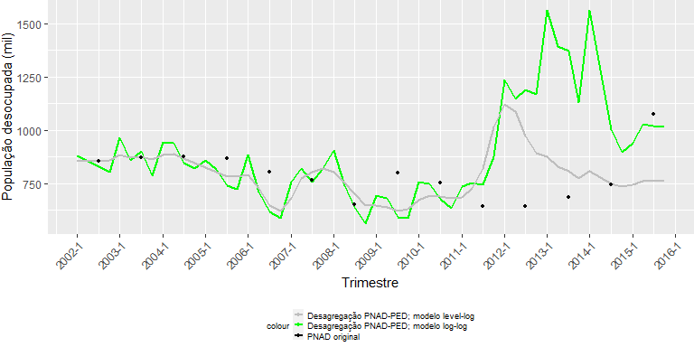

``` r
# Opção pelo modelo log-log:
  
  desocupadosPNAD_CL_PED <- log_log

# Remove objetos desnecessários:     
  
  rm(i, i2, trimestre, series, PNAD_original, log_log, level_log)
```

### 3.3) Desagregações com referência no PIB

Em seguida, a PNAD é desagregada tendo o PIB como referência, novamente
gerando quatro séries trimestrais, duas para ocupados e duas para
desocupados, pelos mesmos dois métodos de Denton-Cholette e de Chow-Lin:

``` r
# Desagregação da série de ocupados pelo método de Denton-Cholette, considerando o PIB como referência:
  
  x <- tsPIB[1:56]

  ocupadosPNAD_DC_PIB <- td(tsOcupadosPNAD ~ 0 + x, to = 3, conversion = "mean", method ="denton-cholette")

  summary(ocupadosPNAD_DC_PIB)
```

    ## 
    ## Call:
    ## td(formula = tsOcupadosPNAD ~ 0 + x, conversion = "mean", to = 3, 
    ##     method = "denton-cholette")
    ## 
    ## Residuals:
    ##    Min     1Q Median     3Q    Max 
    ##   8638   9351   9607   9849  10151 
    ## 
    ## No Coefficients
    ## 
    ## 'denton-cholette' disaggregation with 'average' conversion
    ## 14 low-freq. obs. converted to 56 high-freq. obs.
    ## criterion: proportional  order of differencing 'h': 1

``` r
# Desagregação da série de desocupados pelo método de Denton-Cholette, considerando o PIB como referência:

  desocupadosPNAD_DC_PIB <- td(tsDesocupadosPNAD ~ 0 + x, to = 3, conversion = "mean", method = "denton-cholette")

  summary(desocupadosPNAD_DC_PIB)
```

    ## 
    ## Call:
    ## td(formula = tsDesocupadosPNAD ~ 0 + x, conversion = "mean", 
    ##     to = 3, method = "denton-cholette")
    ## 
    ## Residuals:
    ##    Min     1Q Median     3Q    Max 
    ##  511.5  564.8  664.5  758.0  934.0 
    ## 
    ## No Coefficients
    ## 
    ## 'denton-cholette' disaggregation with 'average' conversion
    ## 14 low-freq. obs. converted to 56 high-freq. obs.
    ## criterion: proportional  order of differencing 'h': 1

``` r
# Desagregação da série de ocupados pelo método de Chow-Lin, considerando o PIB como referência:

  ocupadosPNAD_CL_PIB <- td(tsOcupadosPNAD ~ 0 + x, to = 3, conversion = "mean", method ="chow-lin-maxlog")

  summary(ocupadosPNAD_CL_PIB) # O coeficiente é estatisticamente significativo
  
  qqnorm(ocupadosPNAD_CL_PIB$residuals) # Análise Q-Q dos resíduos e homocedasticidade dos dados
  
  qqline(ocupadosPNAD_CL_PIB$residuals)
  
  plot(density(ocupadosPNAD_CL_PIB$residuals)) # Gráfico com a distribuição dos resíduos
```

    ## 
    ## Call:
    ## td(formula = tsOcupadosPNAD ~ 0 + x, conversion = "mean", to = 3, 
    ##     method = "chow-lin-maxlog")
    ## 
    ## Residuals:
    ##    Min     1Q Median     3Q    Max 
    ## -786.5  194.0 1174.4 1354.3 1417.0 
    ## 
    ## Coefficients:
    ##   Estimate Std. Error t value Pr(>|t|)    
    ## x   73.852      6.278   11.76 2.65e-08 ***
    ## ---
    ## Signif. codes:  0 '***' 0.001 '**' 0.01 '*' 0.05 '.' 0.1 ' ' 1
    ## 
    ## 'chow-lin-maxlog' disaggregation with 'average' conversion
    ## 14 low-freq. obs. converted to 56 high-freq. obs.
    ## Adjusted R-squared: -2.192   AR1-Parameter: 0.9405


``` r
# Desagregação da série de desocupados pelo método de Chow-Lin, considerando o PIB como referência:

  desocupadosPNAD_CL_PIB <- td(tsDesocupadosPNAD ~ 0 + x, to = 3, conversion = "mean", method = "chow-lin-maxlog")

  summary(desocupadosPNAD_CL_PIB) # O coeficiente é estatisticamente significativo
  
  qqnorm(desocupadosPNAD_CL_PIB$residuals) # Análise Q-Q dos resíduos e homocedasticidade dos dados
  
  qqline(desocupadosPNAD_CL_PIB$residuals)
  
  plot(density(desocupadosPNAD_CL_PIB$residuals)) # Gráfico com a distribuição dos resíduos
  
  
# Remove objetos desnecessários:   
  
  rm(x)
```

    ## 
    ## Call:
    ## td(formula = tsDesocupadosPNAD ~ 0 + x, conversion = "mean", 
    ##     to = 3, method = "chow-lin-maxlog")
    ## 
    ## Residuals:
    ##     Min      1Q  Median      3Q     Max 
    ## -252.82 -190.66  -39.92  114.61  172.69 
    ## 
    ## Coefficients:
    ##   Estimate Std. Error t value Pr(>|t|)    
    ## x   6.8960     0.7732   8.918 6.67e-07 ***
    ## ---
    ## Signif. codes:  0 '***' 0.001 '**' 0.01 '*' 0.05 '.' 0.1 ' ' 1
    ## 
    ## 'chow-lin-maxlog' disaggregation with 'average' conversion
    ## 14 low-freq. obs. converted to 56 high-freq. obs.
    ## Adjusted R-squared: -0.001115    AR1-Parameter: 0.8793


### 3.4) Desagregação sem série de referência:

Por fim, uma última desagregação é feita utilizando o método de
Denton-Cholette sem nenhuma outra série de referência, ou seja, apenas
com os dados da própria PNAD anual entre 2002 e 2015 — o mesmo
procedimento feito anteriormente para obter o valor anual das séries da
PNAD em 2010, mas, desta vez, para gerar séries trimestrais para todo o
período de 2002 a 2015. A intenção é que essa desagregação sirva apenas
para a comparação dos resultados gerados usando a PME e a PED como
referência:

``` r
  ocupadosPNAD_DC <- td(tsOcupadosPNAD ~ 0, to = 4, conversion = "mean", method ="denton-cholette")

  summary(ocupadosPNAD_DC)
```

    ## 
    ## Call:
    ## td(formula = tsOcupadosPNAD ~ 0, conversion = "mean", to = 4, 
    ##     method = "denton-cholette")
    ## 
    ## Residuals:
    ##    Min     1Q Median     3Q    Max 
    ##   8736   9467   9727   9984  10274 
    ## 
    ## No Coefficients
    ## 
    ## 'denton-cholette' disaggregation with 'average' conversion
    ## 14 low-freq. obs. converted to 56 high-freq. obs.
    ## criterion: proportional  order of differencing 'h': 1

``` r
  desocupadosPNAD_DC <- td(tsDesocupadosPNAD ~ 0, to = 4, conversion = "mean", method = "denton-cholette")

  summary(desocupadosPNAD_DC)
```

    ## 
    ## Call:
    ## td(formula = tsDesocupadosPNAD ~ 0, conversion = "mean", to = 4, 
    ##     method = "denton-cholette")
    ## 
    ## Residuals:
    ##    Min     1Q Median     3Q    Max 
    ##  640.1  700.4  783.0  863.4 1073.9 
    ## 
    ## No Coefficients
    ## 
    ## 'denton-cholette' disaggregation with 'average' conversion
    ## 14 low-freq. obs. converted to 56 high-freq. obs.
    ## criterion: proportional  order of differencing 'h': 1

### 3.5) Resultados das desagregações da PNAD

Feitas as desagregações da PNAD anual para a frequência trimestral,
abaixo são gerados quatro gráficos, dois contendo as séries para
ocupados e outros dois as séries para desocupados. Cada um deles contém
as três curvas geradas pela combinação entre os dados de PME, PED e PIB
e um dos métodos de desagregação (Denton-Cholette ou Chow-Lin), além da
curva gerada pela desagregação sem referência em nenhuma outra pesquisa
e os pontos que indicam os registros originais da PNAD anual. Também são
gerados outros dois gráficos, um para a série de ocupados e outro para a
de desocupados, comparando as curvas originais da PME e da PED, no
intuito de auxiliar na comparação dos resultados da desagregação da PNAD
com referência nessas pesquisas.

``` r
# Gráficos para a série de ocupados - método de Denton-Cholette:

  trimestre <- as.yearqtr(seq(as.Date("2002-03-01"), by="quarter", length.out = 56))
  
  x <- array(data = NA, dim = 56)
  
  i2 <- 0
  
  for(i in 1:length(tsOcupadosPNAD)){
      x[i2+3] <- round(tsOcupadosPNAD[i],2)
      i2 <- i2+4
  }

  PNAD <- x

  series <- data.frame(trimestre, ocupadosPNAD_DC_PED$values, ocupadosPNAD_DC_PME$values, ocupadosPNAD_DC_PIB$values, ocupadosPNAD_DC$values, PNAD)
  
  ggplot(series, aes(trimestre)) +  
    geom_line(aes(y = ocupadosPNAD_DC_PED.values, colour = "PED - Denton-Cholette"), size = 0.8) +
    geom_line(aes(y = ocupadosPNAD_DC_PME.values, colour = "PME - Denton-Cholette"), size = 0.8) +
    geom_line(aes(y = ocupadosPNAD_DC_PIB.values, colour = "PIB - Denton-Cholette"), size = 0.8) +
    geom_line(aes(y = ocupadosPNAD_DC.values, colour = "Sem série de referência"), size = 0.8) +
    geom_point(aes(y = PNAD, colour = "PNAD original"), size = 0.8) +
    xlab("Trimestre") + ylab("População ocupada (mil)") +
    scale_x_yearqtr(format = "%Y-%q", n = 14) +
    theme(axis.text.x = element_text(angle = 45, hjust = 1)) +
    scale_color_manual(values = c("darkgreen", "lightblue", "green", "black", "grey")) +
    theme(legend.position="bottom") +
    theme(legend.key.size = unit(0.3, 'cm'),
    legend.title = element_text(size=7),
    legend.text = element_text(size=7),
    plot.margin = margin(l=0, r=0, unit = "cm")) +
    guides(col = guide_legend(nrow = 5))
```


``` r
# Gráficos para a série de ocupados - método de Chow-Lin:

  series <- data.frame(trimestre, ocupadosPNAD_CL_PED$values, ocupadosPNAD_CL_PME$values,
                       ocupadosPNAD_CL_PIB$values, ocupadosPNAD_DC$values, PNAD)
  
  ggplot(series, aes(trimestre)) +  
    geom_line(aes(y = ocupadosPNAD_CL_PED.values, colour = "PED - Chow-Lin"), size = 0.8) +
    geom_line(aes(y = ocupadosPNAD_CL_PME.values, colour = "PME - Chow-Lin"), size = 0.8) +
    geom_line(aes(y = ocupadosPNAD_CL_PIB.values, colour = "PIB - Chow-Lin"), size = 0.8) +
    geom_line(aes(y = ocupadosPNAD_DC.values, colour = "Sem série de referência"), size = 0.8) +
    geom_point(aes(y = PNAD, colour = "PNAD original"), size = 0.8) +
    xlab("Trimestre") + ylab("População ocupada (mil)") +
    scale_x_yearqtr(format = "%Y-%q", n = 14) +
    theme(axis.text.x = element_text(angle = 45, hjust = 1)) +
    scale_color_manual(values = c("darkgreen", "lightblue", "green", "black", "grey")) +
    theme(legend.position="bottom") +
    theme(legend.key.size = unit(0.3, 'cm'),
    legend.title = element_text(size=7),
    legend.text = element_text(size=7),
    plot.margin = margin(l=0, r=0, unit = "cm")) +
    guides(col = guide_legend(nrow = 5))
```

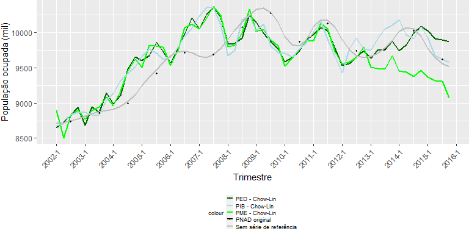

``` r
# Gráficos com as séries originais de ocupados na PED e PME, para comparação:
  
  series2 <- data.frame(trimestre, tsOcupadosPME, tsOcupadosPED)
  
  ggplot(series2, aes(trimestre)) +  
    geom_line(aes(y = tsOcupadosPME, colour = "PME"), size = 0.8) +
    geom_line(aes(y = tsOcupadosPED, colour = "PED"), size = 0.8) +
    xlab("Trimestre") + ylab("População ocupada (mil)") +
    scale_x_yearqtr(format = "%Y-%q", n = 14) +
    theme(axis.text.x = element_text(angle = 45, hjust = 1)) +
    scale_color_manual(values = c("grey", "black")) +
    theme(legend.position="bottom") +
    theme(legend.key.size = unit(0.3, 'cm'),
    legend.title = element_text(size=7),
    legend.text = element_text(size=7),
    plot.margin = margin(l=0, r=0, unit = "cm")) +
    guides(col = guide_legend(nrow = 2))
```

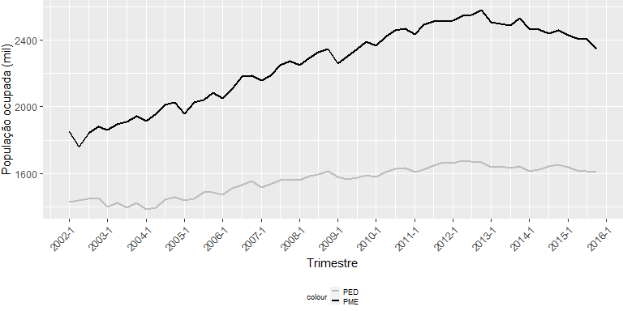

``` r
# Gráficos para a série de desocupados - método de Denton-Cholette:

  x <- array(data = NA, dim = 56)
  
  i <- 0
  i2 <- 0
  
  for(i in 1:length(tsDesocupadosPNAD)){
      x[i2+3] <- round(tsDesocupadosPNAD[i],2)
      i2 <- i2+4
  }

  PNAD <- x
  
  series <- data.frame(trimestre, desocupadosPNAD_DC_PED$values, desocupadosPNAD_DC_PME$values, desocupadosPNAD_DC_PIB$values, desocupadosPNAD_DC$values, PNAD)
  
  ggplot(series, aes(trimestre)) +  
    geom_line(aes(y = desocupadosPNAD_DC_PED.values, colour = "PED - Denton-Cholette"), size = 0.8) +
    geom_line(aes(y = desocupadosPNAD_DC_PME.values, colour = "PME - Denton-Cholette"), size = 0.8) +
    geom_line(aes(y = desocupadosPNAD_DC_PIB.values, colour = "PIB - Denton-Cholette"), size = 0.8) +
    geom_line(aes(y = desocupadosPNAD_DC.values, colour = "Sem série de referência"), size = 0.8) +
    geom_point(aes(y = PNAD, colour = "PNAD original"), size = 0.8) +
    xlab("Trimestre") + ylab("População desocupada (mil)") +
    scale_x_yearqtr(format = "%Y-%q", n = 14) +
    theme(axis.text.x = element_text(angle = 45, hjust = 1)) +
    scale_color_manual(values = c("darkgreen", "lightblue", "green", "black", "grey")) +
    theme(legend.position="bottom") +
    theme(legend.key.size = unit(0.3, 'cm'),
    legend.title = element_text(size=7),
    legend.text = element_text(size=7),
    plot.margin = margin(l=0, r=0, unit = "cm")) +
    guides(col = guide_legend(nrow = 5))
```

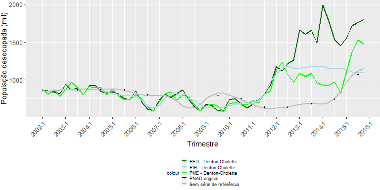

``` r
# Gráficos para a série de desocupados - método de Chow-Lin:

  series <- data.frame(trimestre, exp(desocupadosPNAD_CL_PED$values), exp(desocupadosPNAD_CL_PME$values), desocupadosPNAD_CL_PIB$values, desocupadosPNAD_DC$values, PNAD)
  
  ggplot(series, aes(trimestre)) +  
    geom_line(aes(y = exp(desocupadosPNAD_CL_PED$values), colour = "PED - Chow-Lin"), size = 0.8) +
    geom_line(aes(y = exp(desocupadosPNAD_CL_PME$values), colour = "PME - Chow-Lin"), size = 0.8) +
    geom_line(aes(y = desocupadosPNAD_CL_PIB.values, colour = "PIB - Chow-Lin"), size = 0.8) +
    geom_line(aes(y = desocupadosPNAD_DC.values, colour = "Sem série de referência"), size = 0.8) +
    geom_point(aes(y = PNAD, colour = "PNAD original"), size = 0.8) +
    xlab("Trimestre") + ylab("População desocupada (mil)") +
    scale_x_yearqtr(format = "%Y-%q", n = 14) +
    theme(axis.text.x = element_text(angle = 45, hjust = 1)) +
    scale_color_manual(values = c("darkgreen", "lightblue", "green", "black", "grey")) +
    theme(legend.position="bottom") +
    theme(legend.key.size = unit(0.3, 'cm'),
    legend.title = element_text(size=7),
    legend.text = element_text(size=7),
    plot.margin = margin(l=0, r=0, unit = "cm")) +
    guides(col = guide_legend(nrow = 5))
```


``` r
# Gráficos com as séries originais de desocupados na PED e PME, para comparação:
  
  series2 <- data.frame(trimestre, tsDesocupadosPME, tsDesocupadosPED)
  
  ggplot(series2, aes(trimestre)) +  
    geom_line(aes(y = tsDesocupadosPME, colour = "PME"), size = 0.8) +
    geom_line(aes(y = tsDesocupadosPED, colour = "PED"), size = 0.8) +
    xlab("Trimestre") + ylab("População desocupada (mil)") +
    scale_x_yearqtr(format = "%Y-%q", n = 14) +
    theme(axis.text.x = element_text(angle = 45, hjust = 1)) +
    scale_color_manual(values = c("grey", "black")) +
    theme(legend.position="bottom") +
    theme(legend.key.size = unit(0.3, 'cm'),
    legend.title = element_text(size=7),
    legend.text = element_text(size=7),
    plot.margin = margin(l=0, r=0, unit = "cm")) +
    guides(col = guide_legend(nrow = 2))
```

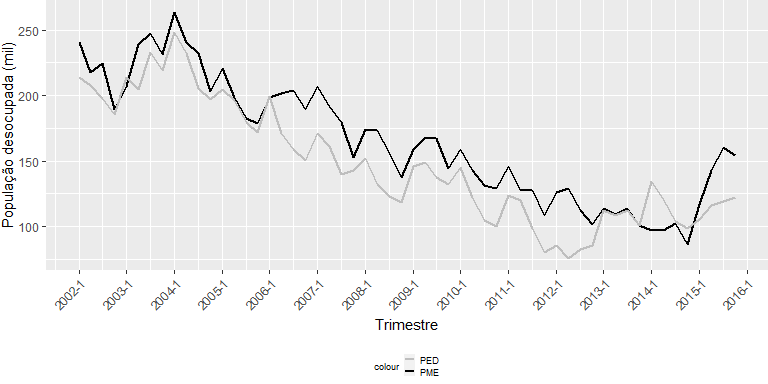

``` r
# Remove objetos desnecessários:  
  
  rm(trimestre, series, series2, i, i2, PNAD)
```

Pelos gráficos acima, pode-se fazer as seguintes observações com relação
às séries desagregadas da PNAD:

- Ocupados: em ambos os métodos de desagregação e seja qual for a série
  de referência, há um pico de ocupados entre 2006 e 2008 que não tem
  correspondência com os registros anuais da PNAD; afora essa
  divergência, as curvas desagregadas em geral acompanham nível e
  tendência da curva original, especialmente aquelas obtidas com o
  método de Chow-Lin e usando PED ou PIB como referência (ao passo que
  as desagregações obtidas com a PME antecipam a tendência de queda no
  número de ocupados que, tal como nos registros dessa pesquisa, inicia
  em 2012, enquanto na PNAD anual o total de ocupados inicia a queda
  apenas em 2014).

- Desocupados: em meados de 2011, há um aumento de nível nas séries
  desagregadas que não guarda correspondência com a PNAD original; esses
  resultados convergem com os dados da PED, que em 2012 iniciam uma
  tendência de alta — ao passo que a PME somente demonstra essa
  tendência a partir do final de 2014; assim, seja qual for o método de
  desagregação, o resultado são séries trimestrais da PNAD que elevam o
  nível dos registros já em 2011 e os melhores resultados parecem ser os
  obtidos com uso da PME, apesar da grande divergência observada em
  termos de nível e estrutura entre 2011 e 2014.

## 4) Regressão da PNAD Contínua sobre a PNAD desagregada

De posse das séries de ocupados e desocupados da PNAD desagregadas para
frequência trimestral, pode-se, enfim, extrair coeficientes que as
relacionem com as da PNAD Contínua no período em que as pesquisas
coincidiram (2012 a 2015), por meio de outra regressão linear. Aplicados
tais coeficientes na equação de regressão com os dados da PNAD entre
2002 e 2011, obtem-se valores preditos que irão compor as séries
retropoladas da PNAD Contínua.

A regressão, nesse caso, terá um ajuste específico, que é a adição do
valor 0 à variável independente (isto é, as séries de ocupados e
desocupados da PNAD) nos argumentos da função *lm()*, no intuito de
definir o intercepto da regressão como igual a zero. O sentido desse
ajuste é tomar como pressuposto que ambas as pesquisas tenham a mesma
aptidão para detectar zero ocupados quando for essa a realidade —
noutras palavras, ambas partem de uma mesma origem. A variável
dependente corresponde aos primeiros dezesseis registros da PNAD
Contínua, enquanto a independente corresponde aos últimos dezesseis
registros da PNAD anual desagregrada em trimestres, cobrindo exatamente
o período de 2012 a 2015.

A função *summary()* é novamente acionada para exibir os resultados das
regressões, que são doze, ao todo: seis para a série de ocupados e seis
para a de desocupados, combinando os dois métodos de desagregação
(Denton-Cholette e Chow-Lin) com as três séries de referência (PME, PED
e PIB) usadas nas desagregações da PNAD.

``` r
# Regressão utilizando a série de ocupados desagregada pelo método de Denton-Cholette com referência na PME:

  lm_ocupados_DC_PME <- lm(tsOcupadosPNADc[1:16] ~ 0 + ocupadosPNAD_DC_PME$values[41:56])
  
  summary(lm_ocupados_DC_PME)
```

    ## 
    ## Call:
    ## lm(formula = tsOcupadosPNADc[1:16] ~ 0 + ocupadosPNAD_DC_PME$values[41:56])
    ## 
    ## Residuals:
    ##     Min      1Q  Median      3Q     Max 
    ## -651.34 -266.48   50.85  165.85  604.91 
    ## 
    ## Coefficients:
    ##                                   Estimate Std. Error t value Pr(>|t|)    
    ## ocupadosPNAD_DC_PME$values[41:56]  1.04261    0.00892   116.9   <2e-16 ***
    ## ---
    ## Signif. codes:  0 '***' 0.001 '**' 0.01 '*' 0.05 '.' 0.1 ' ' 1
    ## 
    ## Residual standard error: 332.7 on 15 degrees of freedom
    ## Multiple R-squared:  0.9989, Adjusted R-squared:  0.9988 
    ## F-statistic: 1.366e+04 on 1 and 15 DF,  p-value: < 2.2e-16

``` r
# Regressão utilizando a série de desocupados desagregada pelo método de Denton-Cholette com referência na PME:

   
  lm_desocupados_DC_PME <- lm(tsDesocupadosPNADc[1:16] ~ 0 + desocupadosPNAD_DC_PME$values[41:56])
  
  summary(lm_desocupados_DC_PME)
```

    ## 
    ## Call:
    ## lm(formula = tsDesocupadosPNADc[1:16] ~ 0 + desocupadosPNAD_DC_PME$values[41:56])
    ## 
    ## Residuals:
    ##    Min     1Q Median     3Q    Max 
    ## -91.84 -65.21  17.59  67.07 117.72 
    ## 
    ## Coefficients:
    ##                                      Estimate Std. Error t value Pr(>|t|)    
    ## desocupadosPNAD_DC_PME$values[41:56]  0.68249    0.01681    40.6   <2e-16 ***
    ## ---
    ## Signif. codes:  0 '***' 0.001 '**' 0.01 '*' 0.05 '.' 0.1 ' ' 1
    ## 
    ## Residual standard error: 75.67 on 15 degrees of freedom
    ## Multiple R-squared:  0.991,  Adjusted R-squared:  0.9904 
    ## F-statistic:  1648 on 1 and 15 DF,  p-value: < 2.2e-16

``` r
# Regressão utilizando a série de ocupados desagregada pelo método de Chow-Lin com referência na PME:

  lm_ocupados_CL_PME <- lm(tsOcupadosPNADc[1:16] ~ 0 + ocupadosPNAD_CL_PME$values[41:56])
  
  summary(lm_ocupados_CL_PME)

  qqnorm(lm_ocupados_CL_PME$residuals) # Análise Q-Q dos resíduos e homocedasticidade dos dados
  
  qqline(lm_ocupados_CL_PME$residuals)
  
  plot(density(lm_ocupados_CL_PME$residuals)) # Gráfico com a distribuição dos resíduos
```

    ## 
    ## Call:
    ## lm(formula = tsOcupadosPNADc[1:16] ~ 0 + ocupadosPNAD_CL_PME$values[41:56])
    ## 
    ## Residuals:
    ##     Min      1Q  Median      3Q     Max 
    ## -493.44 -153.79   52.85  105.43  483.30 
    ## 
    ## Coefficients:
    ##                                   Estimate Std. Error t value Pr(>|t|)    
    ## ocupadosPNAD_CL_PME$values[41:56] 1.026800   0.006631   154.9   <2e-16 ***
    ## ---
    ## Signif. codes:  0 '***' 0.001 '**' 0.01 '*' 0.05 '.' 0.1 ' ' 1
    ## 
    ## Residual standard error: 251.2 on 15 degrees of freedom
    ## Multiple R-squared:  0.9994, Adjusted R-squared:  0.9993 
    ## F-statistic: 2.398e+04 on 1 and 15 DF,  p-value: < 2.2e-16


``` r
# Regressão utilizando a série de desocupados desagregada pelo método de Chow-Lin com referência na PME:

  lm_desocupados_CL_PME <- lm(tsDesocupadosPNADc[1:16] ~ 0 + exp(desocupadosPNAD_CL_PME$values[41:56]))
  
  summary(lm_desocupados_CL_PME)
  
  qqnorm(lm_desocupados_CL_PME$residuals) # Análise Q-Q dos resíduos e homocedasticidade dos dados
  
  qqline(lm_desocupados_CL_PME$residuals)
  
  plot(density(lm_desocupados_CL_PME$residuals)) # Gráfico com a distribuição dos resíduos
```

    ## 
    ## Call:
    ## lm(formula = tsDesocupadosPNADc[1:16] ~ 0 + exp(desocupadosPNAD_CL_PME$values[41:56]))
    ## 
    ## Residuals:
    ##     Min      1Q  Median      3Q     Max 
    ## -407.38  -39.76   86.90  228.13  310.07 
    ## 
    ## Coefficients:
    ##                                           Estimate Std. Error t value Pr(>|t|)
    ## exp(desocupadosPNAD_CL_PME$values[41:56])  0.92629    0.06908   13.41 9.35e-10
    ##                                              
    ## exp(desocupadosPNAD_CL_PME$values[41:56]) ***
    ## ---
    ## Signif. codes:  0 '***' 0.001 '**' 0.01 '*' 0.05 '.' 0.1 ' ' 1
    ## 
    ## Residual standard error: 221.1 on 15 degrees of freedom
    ## Multiple R-squared:  0.923,  Adjusted R-squared:  0.9179 
    ## F-statistic: 179.8 on 1 and 15 DF,  p-value: 9.35e-10


``` r
# Regressão utilizando a série de ocupados desagregada pelo método de Denton-Cholette com referência na PED:
  
  lm_ocupados_DC_PED <- lm(tsOcupadosPNADc[1:16] ~ 0 + ocupadosPNAD_DC_PED$values[41:56])
  
  summary(lm_ocupados_DC_PED)
```

    ## 
    ## Call:
    ## lm(formula = tsOcupadosPNADc[1:16] ~ 0 + ocupadosPNAD_DC_PED$values[41:56])
    ## 
    ## Residuals:
    ##     Min      1Q  Median      3Q     Max 
    ## -664.31 -155.01   59.25  154.46  336.70 
    ## 
    ## Coefficients:
    ##                                   Estimate Std. Error t value Pr(>|t|)    
    ## ocupadosPNAD_DC_PED$values[41:56] 1.045025   0.006631   157.6   <2e-16 ***
    ## ---
    ## Signif. codes:  0 '***' 0.001 '**' 0.01 '*' 0.05 '.' 0.1 ' ' 1
    ## 
    ## Residual standard error: 246.8 on 15 degrees of freedom
    ## Multiple R-squared:  0.9994, Adjusted R-squared:  0.9994 
    ## F-statistic: 2.484e+04 on 1 and 15 DF,  p-value: < 2.2e-16

``` r
# Regressão utilizando a série de desocupados desagregada pelo método de Denton-Cholette com referência na PED:

  lm_desocupados_DC_PED <- lm(tsDesocupadosPNADc[1:16] ~ 0 + desocupadosPNAD_DC_PED$values[41:56])
  
  summary(lm_desocupados_DC_PED)
```

    ## 
    ## Call:
    ## lm(formula = tsDesocupadosPNADc[1:16] ~ 0 + desocupadosPNAD_DC_PED$values[41:56])
    ## 
    ## Residuals:
    ##      Min       1Q   Median       3Q      Max 
    ## -223.686  -61.606   -1.025  104.791  226.509 
    ## 
    ## Coefficients:
    ##                                      Estimate Std. Error t value Pr(>|t|)    
    ## desocupadosPNAD_DC_PED$values[41:56]  0.48559    0.02094   23.19 3.65e-13 ***
    ## ---
    ## Signif. codes:  0 '***' 0.001 '**' 0.01 '*' 0.05 '.' 0.1 ' ' 1
    ## 
    ## Residual standard error: 131.2 on 15 degrees of freedom
    ## Multiple R-squared:  0.9729, Adjusted R-squared:  0.9711 
    ## F-statistic:   538 on 1 and 15 DF,  p-value: 3.651e-13

``` r
# Regressão utilizando a série de ocupados desagregada pelo método de Chow-Lin com referência na PED:

  lm_ocupados_CL_PED <- lm(tsOcupadosPNADc[1:16] ~ 0 + ocupadosPNAD_CL_PED$values[41:56])
  
  summary(lm_ocupados_CL_PED)
  
  qqnorm(lm_ocupados_CL_PED$residuals) # Análise Q-Q dos resíduos e homocedasticidade dos dados
  
  qqline(lm_ocupados_CL_PED$residuals)
  
  plot(density(lm_ocupados_CL_PED$residuals)) # Gráfico com a distribuição dos resíduos
```

    ## 
    ## Call:
    ## lm(formula = tsOcupadosPNADc[1:16] ~ 0 + ocupadosPNAD_CL_PED$values[41:56])
    ## 
    ## Residuals:
    ##     Min      1Q  Median      3Q     Max 
    ## -286.41  -68.46   19.17   90.32  205.69 
    ## 
    ## Coefficients:
    ##                                   Estimate Std. Error t value Pr(>|t|)    
    ## ocupadosPNAD_CL_PED$values[41:56] 0.992080   0.003544   279.9   <2e-16 ***
    ## ---
    ## Signif. codes:  0 '***' 0.001 '**' 0.01 '*' 0.05 '.' 0.1 ' ' 1
    ## 
    ## Residual standard error: 139 on 15 degrees of freedom
    ## Multiple R-squared:  0.9998, Adjusted R-squared:  0.9998 
    ## F-statistic: 7.836e+04 on 1 and 15 DF,  p-value: < 2.2e-16


``` r
# Regressão utilizando a série de desocupados desagregada pelo método de Chow-Lin com referência na PED:

  lm_desocupados_CL_PED <- lm(tsDesocupadosPNADc[1:16] ~ 0 + exp(desocupadosPNAD_CL_PED$values[41:56]))
  
  summary(lm_desocupados_CL_PED)
  
  qqnorm(lm_desocupados_CL_PED$residuals) # Análise Q-Q dos resíduos e homocedasticidade dos dados
  
  qqline(lm_desocupados_CL_PED$residuals)
  
  plot(density(lm_desocupados_CL_PED$residuals)) # Gráfico com a distribuição dos resíduos
```

    ## 
    ## Call:
    ## lm(formula = tsDesocupadosPNADc[1:16] ~ 0 + exp(desocupadosPNAD_CL_PED$values[41:56]))
    ## 
    ## Residuals:
    ##    Min     1Q Median     3Q    Max 
    ## -231.6 -107.5  -21.0  132.3  383.4 
    ## 
    ## Coefficients:
    ##                                           Estimate Std. Error t value Pr(>|t|)
    ## exp(desocupadosPNAD_CL_PED$values[41:56])  0.62263    0.04065   15.32 1.44e-10
    ##                                              
    ## exp(desocupadosPNAD_CL_PED$values[41:56]) ***
    ## ---
    ## Signif. codes:  0 '***' 0.001 '**' 0.01 '*' 0.05 '.' 0.1 ' ' 1
    ## 
    ## Residual standard error: 195.3 on 15 degrees of freedom
    ## Multiple R-squared:  0.9399, Adjusted R-squared:  0.9359 
    ## F-statistic: 234.6 on 1 and 15 DF,  p-value: 1.444e-10


``` r
# Regressão utilizando a série de ocupados desagregada pelo método de Denton-Cholette com referência no PIB:

  lm_ocupados_DC_PIB <- lm(tsOcupadosPNADc[1:16] ~ 0 + ocupadosPNAD_DC_PIB$values[41:56])
  
  summary(lm_ocupados_DC_PIB)
```

    ## 
    ## Call:
    ## lm(formula = tsOcupadosPNADc[1:16] ~ 0 + ocupadosPNAD_DC_PIB$values[41:56])
    ## 
    ## Residuals:
    ##     Min      1Q  Median      3Q     Max 
    ## -300.91 -211.29  -68.99   34.25  588.18 
    ## 
    ## Coefficients:
    ##                                   Estimate Std. Error t value Pr(>|t|)    
    ## ocupadosPNAD_DC_PIB$values[41:56] 1.017646   0.007511   135.5   <2e-16 ***
    ## ---
    ## Signif. codes:  0 '***' 0.001 '**' 0.01 '*' 0.05 '.' 0.1 ' ' 1
    ## 
    ## Residual standard error: 287.1 on 15 degrees of freedom
    ## Multiple R-squared:  0.9992, Adjusted R-squared:  0.9991 
    ## F-statistic: 1.836e+04 on 1 and 15 DF,  p-value: < 2.2e-16

``` r
# Regressão utilizando a série de desocupados desagregada pelo método de Denton-Cholette com referência no PIB:
    
  lm_desocupados_DC_PIB <- lm(tsDesocupadosPNADc[1:16] ~ 0 + desocupadosPNAD_DC_PIB$values[41:56])
  
  summary(lm_desocupados_DC_PIB)
```

    ## 
    ## Call:
    ## lm(formula = tsDesocupadosPNADc[1:16] ~ 0 + desocupadosPNAD_DC_PIB$values[41:56])
    ## 
    ## Residuals:
    ##     Min      1Q  Median      3Q     Max 
    ## -178.06 -107.20  -33.16   92.97  290.97 
    ## 
    ## Coefficients:
    ##                                      Estimate Std. Error t value Pr(>|t|)    
    ## desocupadosPNAD_DC_PIB$values[41:56]  0.66356    0.02859   23.21 3.61e-13 ***
    ## ---
    ## Signif. codes:  0 '***' 0.001 '**' 0.01 '*' 0.05 '.' 0.1 ' ' 1
    ## 
    ## Residual standard error: 131.1 on 15 degrees of freedom
    ## Multiple R-squared:  0.9729, Adjusted R-squared:  0.9711 
    ## F-statistic: 538.8 on 1 and 15 DF,  p-value: 3.611e-13

``` r
# Regressão utilizando a série de ocupados desagregada pelo método de Chow-Lin com referência no PIB:

  lm_ocupados_CL_PIB <- lm(tsOcupadosPNADc[1:16] ~ 0 + ocupadosPNAD_CL_PIB$values[41:56])
  
  summary(lm_ocupados_CL_PIB)
  
  qqnorm(lm_ocupados_CL_PIB$residuals) # Análise Q-Q dos resíduos e homocedasticidade dos dados
  
  qqline(lm_ocupados_CL_PIB$residuals)
  
  plot(density(lm_ocupados_CL_PIB$residuals)) # Gráfico com a distribuição dos resíduos
```

    ## 
    ## Call:
    ## lm(formula = tsOcupadosPNADc[1:16] ~ 0 + ocupadosPNAD_CL_PIB$values[41:56])
    ## 
    ## Residuals:
    ##     Min      1Q  Median      3Q     Max 
    ## -349.61 -108.96  -54.41   49.59  394.18 
    ## 
    ## Coefficients:
    ##                                   Estimate Std. Error t value Pr(>|t|)    
    ## ocupadosPNAD_CL_PIB$values[41:56] 0.986899   0.004945   199.6   <2e-16 ***
    ## ---
    ## Signif. codes:  0 '***' 0.001 '**' 0.01 '*' 0.05 '.' 0.1 ' ' 1
    ## 
    ## Residual standard error: 195 on 15 degrees of freedom
    ## Multiple R-squared:  0.9996, Adjusted R-squared:  0.9996 
    ## F-statistic: 3.982e+04 on 1 and 15 DF,  p-value: < 2.2e-16


``` r
# Regressão utilizando a série de desocupados desagregada pelo método de Chow-Lin com referência no PIB:

  lm_desocupados_CL_PIB <- lm(tsDesocupadosPNADc[1:16] ~ 0 + desocupadosPNAD_CL_PIB$values[41:56])
  
  summary(lm_desocupados_CL_PIB)
  
  qqnorm(lm_desocupados_CL_PIB$residuals) # Análise Q-Q dos resíduos e homocedasticidade dos dados
  
  qqline(lm_desocupados_CL_PIB$residuals)
  
  plot(density(lm_desocupados_CL_PIB$residuals)) # Gráfico com a distribuição dos resíduos
```

    ## 
    ## Call:
    ## lm(formula = tsDesocupadosPNADc[1:16] ~ 0 + desocupadosPNAD_CL_PIB$values[41:56])
    ## 
    ## Residuals:
    ##     Min      1Q  Median      3Q     Max 
    ## -167.78  -83.37  -22.29   56.08  330.93 
    ## 
    ## Coefficients:
    ##                                      Estimate Std. Error t value Pr(>|t|)    
    ## desocupadosPNAD_CL_PIB$values[41:56]  0.71670    0.03459   20.72 1.89e-12 ***
    ## ---
    ## Signif. codes:  0 '***' 0.001 '**' 0.01 '*' 0.05 '.' 0.1 ' ' 1
    ## 
    ## Residual standard error: 146.4 on 15 degrees of freedom
    ## Multiple R-squared:  0.9662, Adjusted R-squared:  0.964 
    ## F-statistic: 429.2 on 1 and 15 DF,  p-value: 1.892e-12


``` r
# Regressão utilizando a série de ocupados desagregada sem nenhuma série de referência:
  
  lm_ocupados_DC <- lm(tsOcupadosPNADc[1:16] ~ 0 + ocupadosPNAD_DC$values[41:56])
  
  summary(lm_ocupados_DC)
  
  qqnorm(lm_ocupados_DC$residuals) # Análise Q-Q dos resíduos e homocedasticidade dos dados
  
  qqline(lm_ocupados_DC$residuals)
  
  plot(density(lm_ocupados_DC$residuals)) # Gráfico com a distribuição dos resíduos
```

    ## 
    ## Call:
    ## lm(formula = tsOcupadosPNADc[1:16] ~ 0 + ocupadosPNAD_DC$values[41:56])
    ## 
    ## Residuals:
    ##    Min     1Q Median     3Q    Max 
    ## -514.1 -125.8   -0.9  140.1  396.2 
    ## 
    ## Coefficients:
    ##                               Estimate Std. Error t value Pr(>|t|)    
    ## ocupadosPNAD_DC$values[41:56] 0.993510   0.006194   160.4   <2e-16 ***
    ## ---
    ## Signif. codes:  0 '***' 0.001 '**' 0.01 '*' 0.05 '.' 0.1 ' ' 1
    ## 
    ## Residual standard error: 242.5 on 15 degrees of freedom
    ## Multiple R-squared:  0.9994, Adjusted R-squared:  0.9994 
    ## F-statistic: 2.572e+04 on 1 and 15 DF,  p-value: < 2.2e-16


``` r
# Regressão utilizando a série de desocupados desagregada sem nenhuma série de referência:

  lm_desocupados_DC <- lm(tsDesocupadosPNADc[1:16] ~ 0 + desocupadosPNAD_DC$values[41:56])
  
  summary(lm_desocupados_DC)
  
  qqnorm(lm_desocupados_DC$residuals) # Análise Q-Q dos resíduos e homocedasticidade dos dados
  
  qqline(lm_desocupados_DC$residuals)
  
  plot(density(lm_desocupados_DC$residuals)) # Gráfico com a distribuição dos resíduos
```

    ## 
    ## Call:
    ## lm(formula = tsDesocupadosPNADc[1:16] ~ 0 + desocupadosPNAD_DC$values[41:56])
    ## 
    ## Residuals:
    ##     Min      1Q  Median      3Q     Max 
    ## -154.03  -56.04   18.82   91.85  204.81 
    ## 
    ## Coefficients:
    ##                                  Estimate Std. Error t value Pr(>|t|)    
    ## desocupadosPNAD_DC$values[41:56]  0.94754    0.03338   28.39 1.88e-14 ***
    ## ---
    ## Signif. codes:  0 '***' 0.001 '**' 0.01 '*' 0.05 '.' 0.1 ' ' 1
    ## 
    ## Residual standard error: 107.7 on 15 degrees of freedom
    ## Multiple R-squared:  0.9817, Adjusted R-squared:  0.9805 
    ## F-statistic: 805.9 on 1 and 15 DF,  p-value: 1.878e-14


## 5) Retropolação da PNAD Contínua entre 2002 e 2011

Entre os resultados das regressões acima estão os estimadores ou
coeficientes $\beta_1$ ( *coefficients* gerados pela função *lm()* para
cada regressão), que expressam a medida da relação entre PNAD e PNAD
Contínua no período entre 2012 e 2015. Multiplicando esse coeficiente
pelos valores da PNAD desagregada em trimestres entre 2002 e 2011,
obtém-se, enfim, a série da PNAD Contínua retropolada para este período,
também em frequência trimestral.

Nos comandos abaixo, dois vetores (um para a série de ocupados e outro
para a de desocupados) são criados para armazenar os 40 valores
resultantes dessa multiplicação. Essa operação é feita doze vezes,
contemplando os resultados das regressões e desagregações temporais para
cada um dos métodos e séries de referência utilizados. Ao final, tem-se
doze séries da PNAD Contínua (seis para ocupados e seis para
desocupados) em frequência trimestral para o período entre 2002 e 2011.

Além das doze séries mencionadas, foram geradas outras duas com base na
PNAD anual desagregada sem nenhuma série de referência, de modo a
facilitar a comparação com as curvas das séries retropolodas baseadas na
desagregação com referência em PME, PED e PIB.

``` r
  # Séries retropoladas com base na PNAD desagregada com referência na PME:

  ocupadosPNADc_DC_PME <- round(lm_ocupados_DC_PME$coefficients * ocupadosPNAD_DC_PME$values[1:40])
  
  desocupadosPNADc_DC_PME <- round(lm_desocupados_DC_PME$coefficients *
                                  desocupadosPNAD_DC_PME$values[1:40])

  ocupadosPNADc_CL_PME <- round(lm_ocupados_CL_PME$coefficients * ocupadosPNAD_CL_PME$values[1:40])
  
  desocupadosPNADc_CL_PME <- round(lm_desocupados_CL_PME$coefficients *
                                  exp(desocupadosPNAD_CL_PME$values[1:40]))
  
  
  # Séries retropoladas com base na PNAD desagregada com referência na PED:
  
  ocupadosPNADc_DC_PED <- round(lm_ocupados_DC_PED$coefficients * ocupadosPNAD_DC_PED$values[1:40])
  
  desocupadosPNADc_DC_PED <- round(lm_desocupados_DC_PED$coefficients *
                                  desocupadosPNAD_DC_PED$values[1:40])

  ocupadosPNADc_CL_PED <- round(lm_ocupados_CL_PED$coefficients * ocupadosPNAD_CL_PED$values[1:40])
  
  desocupadosPNADc_CL_PED <- round(lm_desocupados_CL_PED$coefficients *
                                  exp(desocupadosPNAD_CL_PED$values[1:40]))
  

  # Séries retropoladas com base na PNAD desagregada com referência no PIB:
  
  ocupadosPNADc_DC_PIB <- round(lm_ocupados_DC_PIB$coefficients * ocupadosPNAD_DC_PIB$values[1:40])
  
  desocupadosPNADc_DC_PIB <- round(lm_desocupados_DC_PIB$coefficients *
                                  desocupadosPNAD_DC_PIB$values[1:40])

  ocupadosPNADc_CL_PIB <- round(lm_ocupados_CL_PIB$coefficients * ocupadosPNAD_CL_PIB$values[1:40])
  
  desocupadosPNADc_CL_PIB <- round(lm_desocupados_CL_PIB$coefficients *
                                  desocupadosPNAD_CL_PIB$values[1:40])
  
  
  # Séries retropoladas com base na PNAD desagregada sem referência em nenhuma outra pesquisa:
  
  ocupadosPNADc_DC <- round(lm_ocupados_DC$coefficients * ocupadosPNAD_DC$values[1:40])
  
  desocupadosPNADc_DC <- round(lm_desocupados_DC$coefficients * desocupadosPNAD_DC$values[1:40])
```

Por fim, para a série de desocupados, foi feita mais uma retropolação
com base na série da PNAD desagregada pela PME com o método de Chow-Lin
(que captou melhor o movimento e o nível dos dados originais da PNAD),
mas considerando os coeficientes obtidos pela regressão usando a PNAD
desagregada sem nenhuma série de referência, pois foi essa a
desagregação que resultou em dados mais próximos aos da PNAD Contínua
entre 2012 e 2015:

``` r
# PNAD Contínua retropolada com base na PNAD desagregada com referência na PME pelo método de Chow-Lin e coeficientes dados pela regressão da PNAD sem série indicadora:
  
  desocupados_CL_PME_PNAD_DC <- round(lm_desocupados_DC$coefficients * exp(desocupadosPNAD_CL_PME$values[1:40]))
```

## 6) Gráficos das séries retropoladas

A seguir, são gerados os gráficos para as séries de ocupados e
desocupados da PNAD Contínua, abrangendo tanto o período de realização e
publicação dos dados originais da pesquisa (2012 a 2021) quanto o
período retropolado pelo método aqui aplicado (2002 a 2011). Para fins
de comparação, a curva com os dados da PNAD original desagregada (sem
referência em nenhuma outra série) também é plotada.

``` r
# Gráficos para as séries de ocupados geradas com a PNAD desagregada com referência na PME:

  trimestre <- as.yearqtr(seq(as.Date("2002-03-01"), by="quarter", length.out = 80))

  PNADc_original <- array(data = NA, dim = 40) %>% append(tsOcupadosPNADc)
  
  PNAD_desagregada <- array(data = NA, dim = 24) %>% append(round(ocupadosPNAD_DC$values), 0)
  
  PNAD_original <- array(data = NA, dim = 80)
  
  i2 <- 0
  
  for(i in 1:length(tsOcupadosPNAD)){
      PNAD_original[i2+3] <- round(tsOcupadosPNAD[i])
      i2 <- i2+4
  }
  
  PNADc_DC_PME <- array(data = NA, dim = 40) %>% append(ocupadosPNADc_DC_PME, after = 0)
  
  PNADc_CL_PME <- array(data = NA, dim = 40) %>% append(ocupadosPNADc_CL_PME, after = 0)
  
  series <- data.frame(trimestre, PNADc_DC_PME, PNADc_CL_PME, PNADc_original, PNAD_desagregada, PNAD_original)
  
  ggplot(series, aes(trimestre)) +  
    geom_line(aes(y = PNADc_DC_PME, color = "PNADc (retropolação com PME e método de Denton-Cholette)"),
              size = 0.8) +
    geom_line(aes(y = PNADc_CL_PME, color = "PNADc (retropolação com PME e método de Chow-Lin)"),
              size = 0.8) +
    geom_line(aes(y = PNADc_original, color = "PNADc original"), size = 0.8) +
    geom_line(aes(y = PNAD_desagregada, color = "PNAD desagregada"), size = 0.8) +
    geom_point(aes(y = PNAD_original, color = "PNAD original"), size = 1) +
    xlab("Trimestre") + ylab("População ocupada (mil)") +
    scale_x_yearqtr(format = "%Y-%q", n = 20) + scale_y_continuous(breaks = seq(8000, 11000, 500)) +
    theme(axis.text.x = element_text(angle = 45, hjust = 1)) +
    scale_color_manual("Legenda:", breaks = c("PNADc (retropolação com PME e método de Denton-Cholette)",
                                              "PNADc (retropolação com PME e método de Chow-Lin)",
                                              "PNADc original", "PNAD desagregada", "PNAD original"),
                       values = c("blue", "deepskyblue", "purple", "grey", "black")) +
    theme(legend.position="bottom") +
    theme(legend.key.size = unit(0.3, 'cm'),
    legend.title = element_text(size=7),
    legend.text = element_text(size=7),
    plot.margin = margin(l=0, r=0, unit = "cm")) +
    guides(col = guide_legend(nrow = 5))
```

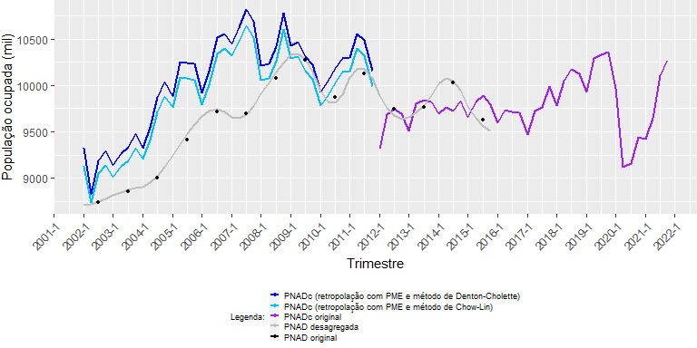

``` r
# Gráficos para as séries de ocupados geradas com a PNAD desagregada com referência na PED:

  PNADc_DC_PED <- array(data = NA, dim = 40) %>% append(ocupadosPNADc_DC_PED, after = 0)
  
  PNADc_CL_PED <- array(data = NA, dim = 40) %>% append(ocupadosPNADc_CL_PED, after = 0)
  
  series <- data.frame(trimestre, PNADc_DC_PED, PNADc_CL_PED, PNADc_original, PNAD_desagregada, PNAD_original)
  
  ggplot(series, aes(trimestre)) +  
    geom_line(aes(y = PNADc_DC_PED, color = "PNADc (retropolação com PED e método de Denton-Cholette)"),
              size = 0.8) +
    geom_line(aes(y = PNADc_CL_PED, color = "PNADc (retropolação com PED e método de Chow-Lin)"),
              size = 0.8) +
    geom_line(aes(y = PNADc_original, color = "PNADc original"), size = 0.8) +
    geom_line(aes(y = PNAD_desagregada, color = "PNAD desagregada"), size = 0.8) +
    geom_point(aes(y = PNAD_original, color = "PNAD original"), size = 1) +
    xlab("Trimestre") + ylab("População ocupada (mil)") +
    scale_x_yearqtr(format = "%Y-%q", n = 20) + scale_y_continuous(breaks = seq(8000, 11000, 500)) +
    theme(axis.text.x = element_text(angle = 45, hjust = 1)) +
    scale_color_manual("Legenda:", breaks = c("PNADc (retropolação com PED e método de Denton-Cholette)",
                                              "PNADc (retropolação com PED e método de Chow-Lin)",
                                              "PNADc original", "PNAD desagregada", "PNAD original"),
                       values = c("blue", "deepskyblue", "purple", "grey", "black")) +
    theme(legend.position="bottom") +
    theme(legend.key.size = unit(0.3, 'cm'),
    legend.title = element_text(size=7),
    legend.text = element_text(size=7),
    plot.margin = margin(l=0, r=0, unit = "cm")) +
    guides(col = guide_legend(nrow = 5))
```

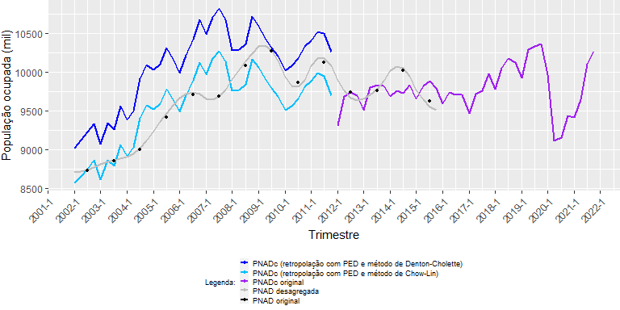

``` r
# Gráficos para as séries de ocupados geradas com a PNAD desagregada com referência no PIB:

  PNADc_DC_PIB <- array(data = NA, dim = 40) %>% append(ocupadosPNADc_DC_PIB, after = 0)
  
  PNADc_CL_PIB <- array(data = NA, dim = 40) %>% append(ocupadosPNADc_CL_PIB, after = 0)
  
  series <- data.frame(trimestre, PNADc_DC_PIB, PNADc_CL_PIB, PNADc_original, PNAD_desagregada, PNAD_original)
  
  ggplot(series, aes(trimestre)) +  
    geom_line(aes(y = PNADc_DC_PIB, color = "PNADc (retropolação com PIB e método de Denton-Cholette)"),
              size = 0.8) +
    geom_line(aes(y = PNADc_CL_PIB, color = "PNADc (retropolação com PIB e método de Chow-Lin)"),
              size = 0.8) +
    geom_line(aes(y = PNADc_original, color = "PNADc original"), size = 0.8) +
    geom_line(aes(y = PNAD_desagregada, color = "PNAD desagregada"), size = 0.8) +
    geom_point(aes(y = PNAD_original, color = "PNAD original"), size = 1) +
    xlab("Trimestre") + ylab("População ocupada (mil)") +
    scale_x_yearqtr(format = "%Y-%q", n = 20) + scale_y_continuous(breaks = seq(8000, 11000, 500)) +
    theme(axis.text.x = element_text(angle = 45, hjust = 1)) +
    scale_color_manual("Legenda:", breaks = c("PNADc (retropolação com PIB e método de Denton-Cholette)",
                                              "PNADc (retropolação com PIB e método de Chow-Lin)",
                                              "PNADc original", "PNAD desagregada", "PNAD original"),
                       values = c("blue", "deepskyblue", "purple", "grey", "black")) +
    theme(legend.position="bottom") +
    theme(legend.key.size = unit(0.3, 'cm'),
    legend.title = element_text(size=7),
    legend.text = element_text(size=7),
    plot.margin = margin(l=0, r=0, unit = "cm")) +
    guides(col = guide_legend(nrow = 5))
```

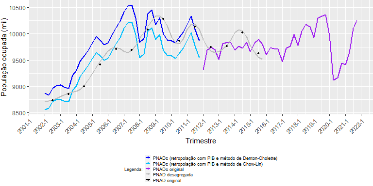

``` r
# Gráficos para as séries de ocupados geradas com a PNAD desagregada sem referência em nenhuma  pesquisa:

  PNADc_DC <- array(data = NA, dim = 40) %>% append(ocupadosPNADc_DC, after = 0)
  
  series <- data.frame(trimestre, PNADc_DC, PNADc_original, PNAD_desagregada, PNAD_original)
  
  ggplot(series, aes(trimestre)) +  
    geom_line(aes(y = PNADc_DC, color = "PNADc (retropolação sem série de referência e método de   Denton-Cholette)"),
              size = 0.8) +
    geom_line(aes(y = PNADc_original, color = "PNADc original"), size = 0.8) +
    geom_line(aes(y = PNAD_desagregada, color = "PNAD desagregada"), size = 0.8) +
    geom_point(aes(y = PNAD_original, color = "PNAD original"), size = 1) +
    xlab("Trimestre") + ylab("População ocupada (mil)") +
    scale_x_yearqtr(format = "%Y-%q", n = 20) + scale_y_continuous(breaks = seq(8000, 11000, 500)) +
    theme(axis.text.x = element_text(angle = 45, hjust = 1)) +
    scale_color_manual("Legenda:", breaks = c("PNADc (retropolação sem série de referência e método de Denton-Cholette)",
                                              "PNADc original", "PNAD desagregada", "PNAD original"),
                       values = c("deepskyblue", "purple", "grey", "black")) +
    theme(legend.position="bottom") +
    theme(legend.key.size = unit(0.3, 'cm'),
    legend.title = element_text(size=7),
    legend.text = element_text(size=7),
    plot.margin = margin(l=0, r=0, unit = "cm")) +
    guides(col = guide_legend(nrow = 4))
```


Em seguida à exibição dos gráficos, a função export() exporta os
resultados das séries de ocupados da PNAD (original e desagregada) e da
PNAD Contínua (original e retropolada) para todo o período entre 2002 a
2021:

``` r
# Exporta os resultados das séries de ocupados para planilha em formato .xlsx:

  export(data.frame(trimestre, PNADc_DC_PME, PNADc_CL_PME, PNADc_DC_PED, PNADc_CL_PED, PNADc_DC_PIB,
                    PNADc_CL_PIB, PNADc_DC, PNADc_original, PNAD_desagregada, PNAD_original),
         file = "Ocupados - PNAD e PNADc - 2002 a 2021.xlsx", overwrite = TRUE)
```

``` r
# Gráficos para as séries de desocupados geradas com a PNAD desagregada com referência na PME:

  PNADc_original <- array(data = NA, dim = 40) %>% append(tsDesocupadosPNADc)
  
  PNAD_desagregada <- array(data = NA, dim = 24) %>% append(round(desocupadosPNAD_DC$values), 0)
  
  PNAD_original <- array(data = NA, dim = 80)
  
  i2 <- 0
  
  for(i in 1:length(tsDesocupadosPNAD)){
      PNAD_original[i2+3] <- round(tsDesocupadosPNAD[i])
      i2 <- i2+4
  }
  
  PNADc_DC_PME <- array(data = NA, dim = 40) %>% append(desocupadosPNADc_DC_PME, after = 0)
  
  PNADc_CL_PME <- array(data = NA, dim = 40) %>% append(desocupadosPNADc_CL_PME, after = 0)
  
  series <- data.frame(trimestre, PNADc_DC_PME, PNADc_CL_PME, PNADc_original, PNAD_desagregada, PNAD_original)
  
  ggplot(series, aes(trimestre)) +  
    geom_line(aes(y = PNADc_DC_PME, color = "PNADc (retropolação com PME e método de Denton-Cholette)"),
              size = 0.8) +
    geom_line(aes(y = PNADc_CL_PME, color = "PNADc (retropolação com PME e método de Chow-Lin)"),
              size = 0.8) +
    geom_line(aes(y = PNADc_original, color = "PNADc original"), size = 0.8) +
    geom_line(aes(y = PNAD_desagregada, color = "PNAD desagregada"), size = 0.8) +
    geom_point(aes(y = PNAD_original, color = "PNAD original"), size = 1) +
    xlab("Trimestre") + ylab("População desocupada (mil)") +
    scale_x_yearqtr(format = "%Y-%q", n = 20) + scale_y_continuous(breaks = seq(250, 1600, 100)) +
    theme(axis.text.x = element_text(angle = 45, hjust = 1)) +
    scale_color_manual("Legenda:", breaks = c("PNADc (retropolação com PME e método de Denton-Cholette)",
                                              "PNADc (retropolação com PME e método de Chow-Lin)",
                                              "PNADc original", "PNAD desagregada", "PNAD original"),
                       values = c("blue", "deepskyblue", "purple", "grey", "black")) +
    theme(legend.position="bottom") +
    theme(legend.key.size = unit(0.3, 'cm'),
    legend.title = element_text(size=7),
    legend.text = element_text(size=7),
    plot.margin = margin(l=0, r=0, unit = "cm")) +
    guides(col = guide_legend(nrow = 5))
```


``` r
# Gráficos para as séries de desocupados geradas com a PNAD desagregada com referência na PED:

  PNADc_DC_PED <- array(data = NA, dim = 40) %>% append(desocupadosPNADc_DC_PED, after = 0)
  
  PNADc_CL_PED <- array(data = NA, dim = 40) %>% append(desocupadosPNADc_CL_PED, after = 0)
  
  series <- data.frame(trimestre, PNADc_DC_PED, PNADc_CL_PED, PNADc_original, PNAD_desagregada, PNAD_original)
  
  ggplot(series, aes(trimestre)) +  
    geom_line(aes(y = PNADc_DC_PED, color = "PNADc (retropolação com PED e método de Denton-Cholette)"),
              size = 0.8) +
    geom_line(aes(y = PNADc_CL_PED, color = "PNADc (retropolação com PED e método de Chow-Lin)"),
              size = 0.8) +
    geom_line(aes(y = PNADc_original, color = "PNADc original"), size = 0.8) +
    geom_line(aes(y = PNAD_desagregada, color = "PNAD desagregada"), size = 0.8) +
    geom_point(aes(y = PNAD_original, color = "PNAD original"), size = 1) +
    xlab("Trimestre") + ylab("População desocupada (mil)") +
    scale_x_yearqtr(format = "%Y-%q", n = 20) + scale_y_continuous(breaks = seq(250, 1600, 100)) +
    theme(axis.text.x = element_text(angle = 45, hjust = 1)) +
    scale_color_manual("Legenda:", breaks = c("PNADc (retropolação com PED e método de Denton-Cholette)",
                                              "PNADc (retropolação com PED e método de Chow-Lin)",
                                              "PNADc original", "PNAD desagregada", "PNAD original"),
                       values = c("blue", "deepskyblue", "purple", "grey", "black")) +
    theme(legend.position="bottom") +
    theme(legend.key.size = unit(0.3, 'cm'),
    legend.title = element_text(size=7),
    legend.text = element_text(size=7),
    plot.margin = margin(l=0, r=0, unit = "cm")) +
    guides(col = guide_legend(nrow = 5))
```

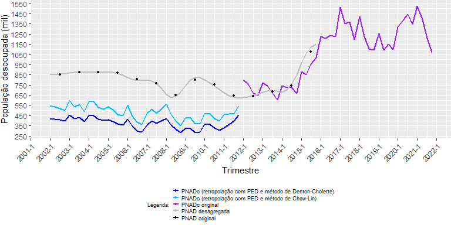

``` r
# Gráficos para as séries de desocupados geradas com a PNAD desagregada com referência no PIB:

  PNADc_DC_PIB <- array(data = NA, dim = 40) %>% append(desocupadosPNADc_DC_PIB, after = 0)
  
  PNADc_CL_PIB <- array(data = NA, dim = 40) %>% append(desocupadosPNADc_CL_PIB, after = 0)
  
  series <- data.frame(trimestre, PNADc_DC_PIB, PNADc_CL_PIB, PNADc_original, PNAD_desagregada, PNAD_original)
  
  ggplot(series, aes(trimestre)) +  
    geom_line(aes(y = PNADc_DC_PIB, color = "PNADc (retropolação com PIB e método de Denton-Cholette)"),
              size = 0.8) +
    geom_line(aes(y = PNADc_CL_PIB, color = "PNADc (retropolação com PIB e método de Chow-Lin)"),
              size = 0.8) +
    geom_line(aes(y = PNADc_original, color = "PNADc original"), size = 0.8) +
    geom_line(aes(y = PNAD_desagregada, color = "PNAD desagregada"), size = 0.8) +
    geom_point(aes(y = PNAD_original, color = "PNAD original"), size = 1) +
    xlab("Trimestre") + ylab("População desocupada (mil)") +
    scale_x_yearqtr(format = "%Y-%q", n = 20) + scale_y_continuous(breaks = seq(250, 1600, 100)) +
    theme(axis.text.x = element_text(angle = 45, hjust = 1)) +
    scale_color_manual("Legenda:", breaks = c("PNADc (retropolação com PIB e método de Denton-Cholette)",
                                              "PNADc (retropolação com PIB e método de Chow-Lin)",
                                              "PNADc original", "PNAD desagregada", "PNAD original"),
                       values = c("blue", "deepskyblue", "purple", "grey", "black")) +
    theme(legend.position="bottom") +
    theme(legend.key.size = unit(0.3, 'cm'),
    legend.title = element_text(size=7),
    legend.text = element_text(size=7),
    plot.margin = margin(l=0, r=0, unit = "cm")) +
    guides(col = guide_legend(nrow = 5))
```

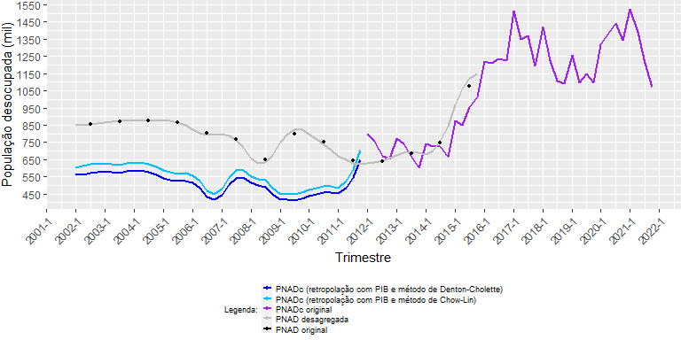

``` r
# Gráficos para as séries de desocupados geradas com a PNAD desagregada sem referência em nenhuma  pesquisa:
  
  PNADc_DC <- array(data = NA, dim = 40) %>% append(desocupadosPNADc_DC, after = 0)
  
  series <- data.frame(trimestre, PNADc_DC, PNADc_original, PNAD_desagregada, PNAD_original)
  
  ggplot(series, aes(trimestre)) +  
    geom_line(aes(y = PNADc_DC, color = "PNADc (retropolação sem série de referência e método de Denton-Cholette)"),
              size = 0.8) +
    geom_line(aes(y = PNADc_original, color = "PNADc original"), size = 0.8) +
    geom_line(aes(y = PNAD_desagregada, color = "PNAD desagregada"), size = 0.8) +
    geom_point(aes(y = PNAD_original, color = "PNAD original"), size = 1) +
    xlab("Trimestre") + ylab("População desocupada (mil)") +
    scale_x_yearqtr(format = "%Y-%q", n = 20) + scale_y_continuous(breaks = seq(250, 1600, 100)) +
    theme(axis.text.x = element_text(angle = 45, hjust = 1)) +
    scale_color_manual("Legenda:", breaks = c("PNADc (retropolação sem série de referência e método de Denton-Cholette)",
                                              "PNADc original", "PNAD desagregada", "PNAD original"),
                       values = c("deepskyblue", "purple", "grey", "black")) +
    theme(legend.position="bottom") +
    theme(legend.key.size = unit(0.3, 'cm'),
    legend.title = element_text(size=7),
    legend.text = element_text(size=7),
    plot.margin = margin(l=0, r=0, unit = "cm")) +
    guides(col = guide_legend(nrow = 4))
```


``` r
# Gráficos para as séries de desocupados geradas com a PNAD desagregada com base na PME e com retropolação usando o estimador da regressão com a sére sem referência em nenhuma pesquisa:
  
  
  PNADc_CL_PME_PNAD_DC <- array(data = NA, dim = 40) %>% append(desocupados_CL_PME_PNAD_DC, after = 0)
  
  series <- data.frame(trimestre, PNADc_CL_PME_PNAD_DC, PNADc_original, PNAD_desagregada, PNAD_original)
  
  ggplot(series, aes(trimestre)) +  
    geom_line(aes(y = PNADc_CL_PME_PNAD_DC, color = "PNADc (retropolação com base na PME e estimador da regressão sem série de referência)"),
              size = 0.8) +
    geom_line(aes(y = PNADc_original, color = "PNADc original"), size = 0.8) +
    geom_line(aes(y = PNAD_desagregada, color = "PNAD desagregada"), size = 0.8) +
    geom_point(aes(y = PNAD_original, color = "PNAD original"), size = 1) +
    xlab("Trimestre") + ylab("População desocupada (mil)") +
    scale_x_yearqtr(format = "%Y-%q", n = 20) + scale_y_continuous(breaks = seq(250, 1600, 100)) +
    theme(axis.text.x = element_text(angle = 45, hjust = 1)) +
    scale_color_manual("Legenda:", breaks = c("PNADc (retropolação com base na PME e estimador da regressão sem série de referência)",
                                              "PNADc original", "PNAD desagregada", "PNAD original"),
                       values = c("deepskyblue", "purple", "grey", "black")) +
    theme(legend.position="bottom") +
    theme(legend.key.size = unit(0.3, 'cm'),
    legend.title = element_text(size=7),
    legend.text = element_text(size=7),
    plot.margin = margin(l=0, r=0, unit = "cm")) +
    guides(col = guide_legend(nrow = 4))
```


Abaixo, a função *export()* exporta os resultados das séries de
desocupados da PNAD (original e desagregada) e da PNAD Contínua
(original e retropolada) para todo o período entre 2002 a 2021:

``` r
# Exporta os resultados das séries de desocupados para planilha em formato .xlsx:

  export(data.frame(trimestre, PNADc_DC_PME, PNADc_CL_PME, PNADc_DC_PED, PNADc_CL_PED, PNADc_DC_PIB,
                    PNADc_CL_PIB, PNADc_CL_PME_PNAD_DC, PNADc_DC, PNADc_original, PNAD_desagregada, PNAD_original), 
         file = "Desocupados - PNAD e PNADc - 2002 a 2021 - 22.06.xlsx", overwrite = TRUE)

# Remove objetos desnecessários:

  rm(i2, trimestre, PNADc_DC_PME, PNADc_CL_PME, PNADc_DC_PED, PNADc_CL_PED, PNADc_DC_PIB, PNADc_CL_PIB, PNADc_DC, PNADc_original, PNAD_desagregada, PNAD_original)
```

## 7) Taxas de desocupação

Por fim, com base nas séries retropoladas para a PNAD Contínua, são
geradas séries da taxa de desocupação entre 2002 e 2021, por meio da
divisão do número de desocupados pela soma do total de ocupados e
desocupados em cada trimestre.

Em seguida, é gerado um gráfico com tais séries, incluídos os pontos dos
registros originais da PNAD anual (2002 a 2011) e a curva original da
PNAD Contínua (2012 a 2021) para comparação dos resultados.

``` r
# Gera as taxas de desocupação para a PNAD anual (14 registros entre 2002 e 2015), PNAD Contínua trimestral original (40 registros entre 2012 e 2021) e para a PNAD Contínua trimestral retropolada com base em cada um dos exercícios de desagregação anteriores (40 registros entre 2002 e 2011):

  taxaPNAD <- round(tsDesocupadosPNAD / (tsOcupadosPNAD + tsDesocupadosPNAD) * 100, 2)
  
  taxaPNADc_real <- round(tsDesocupadosPNADc / (tsOcupadosPNADc + tsDesocupadosPNADc) * 100, 2)
  
  taxaPNADc_DC_PME <- round(desocupadosPNADc_DC_PME / (ocupadosPNADc_DC_PME + desocupadosPNADc_DC_PME) * 100, 2)
  
  taxaPNADc_CL_PME <- round(desocupadosPNADc_CL_PME / (ocupadosPNADc_CL_PME + desocupadosPNADc_CL_PME) * 100, 2)
  
  taxaPNADc_DC_PED <- round(desocupadosPNADc_DC_PED / (ocupadosPNADc_DC_PED + desocupadosPNADc_DC_PED) * 100, 2)
  
  taxaPNADc_CL_PED <- round(desocupadosPNADc_CL_PED / (ocupadosPNADc_CL_PED + desocupadosPNADc_CL_PED) * 100, 2)
  
  taxaPNADc_DC_PIB <- round(desocupadosPNADc_DC_PIB / (ocupadosPNADc_DC_PIB + desocupadosPNADc_DC_PIB) * 100, 2)
  
  taxaPNADc_CL_PIB <- round(desocupadosPNADc_CL_PIB / (ocupadosPNADc_CL_PIB + desocupadosPNADc_CL_PIB) * 100, 2)
  
  taxaPNADc_CL_PME_PNAD_DC <- round(desocupados_CL_PME_PNAD_DC / (ocupadosPNADc_CL_PED + desocupados_CL_PME_PNAD_DC) * 100, 2)
    

# Gera gráficos para as taxas de desocupação:
  
  trimestre <- as.yearqtr(seq(as.Date("2002-03-01"), by="quarter", length.out = 80))
  
  x <- array(data = NA, dim = 80)
  
  i2 <- 0
  
  for(i in 1:length(taxaPNAD)){
      x[i2+3] <- round(taxaPNAD[i],2)
      i2 <- i2+4
  }

  PNAD <- x

  PNADc <- array(data = NA, dim = 40) %>% append(taxaPNADc_real)

  PNADc_DC_PME <- array(data = NA, dim = 40) %>% append(taxaPNADc_DC_PME, after = 0)
  
  PNADc_CL_PME <- array(data = NA, dim = 40) %>% append(taxaPNADc_CL_PME, after = 0)
  
  PNADc_DC_PED <- array(data = NA, dim = 40) %>% append(taxaPNADc_DC_PED, after = 0)
  
  PNADc_CL_PED <- array(data = NA, dim = 40) %>% append(taxaPNADc_CL_PED, after = 0)
  
  PNADc_DC_PIB <- array(data = NA, dim = 40) %>% append(taxaPNADc_DC_PIB, after = 0)
  
  PNADc_CL_PIB <- array(data = NA, dim = 40) %>% append(taxaPNADc_CL_PIB, after = 0)
  
  PNADc_CL_PME_PNAD_DC <- array(data = NA, dim = 40) %>% append(taxaPNADc_CL_PME_PNAD_DC, after = 0)

  series <- data.frame(trimestre, PNAD, PNADc, PNADc_DC_PME, PNADc_CL_PME, PNADc_DC_PED, PNADc_CL_PED, PNADc_DC_PIB, PNADc_CL_PIB, PNADc_CL_PME_PNAD_DC)
  
  ggplot(series, aes(trimestre)) +  
    geom_line(aes(y = PNADc_DC_PME, color = "PNADc retropolada com referência na PME - Denton-Cholette"),
              size = 0.8) +
    geom_line(aes(y = PNADc_CL_PME, color = "PNADc retropolada com referência na PME - Chow-Lin"),
              size = 0.8) +
    geom_line(aes(y = PNADc_DC_PED, color = "PNADc retropolada com referência na PED - Denton-Cholette"),
              size = 0.8) +
    geom_line(aes(y = PNADc_CL_PED, color = "PNADc retropolada com referência na PED - Chow-Lin"),
              size = 0.8) +
    geom_line(aes(y = PNADc_DC_PIB, color = "PNADc retropolada com referência no PIB - Denton-Cholette"),
              size = 0.8) +
    geom_line(aes(y = PNADc_CL_PIB, color = "PNADc retropolada com referência no PIB - Chow-Lin"),
              size = 0.8) +
    geom_line(aes(y = PNADc_CL_PME_PNAD_DC, color = "PNADc retropolada pelas regressões com PNAD Chow-Lin/PME e PNAD sem série indicadora"),
              size = 0.8) +
    geom_line(aes(y = PNADc, color = "PNADc original"),
              size = 0.8) +
    geom_point(aes(y = PNAD, color = "PNAD original"), size = 1) +
    xlab("Trimestre") + ylab("Taxa de desocupação (%)") +
    scale_x_yearqtr(format = "%Y-%q", n = 20) + 
    scale_y_continuous(breaks = seq(0, 15, 1)) +
    scale_color_manual("Legenda:", breaks = c("PNADc retropolada com referência na PME - Denton-Cholette", "PNADc retropolada com referência na PME - Chow-Lin",
                                              "PNADc retropolada com referência na PED - Denton-Cholette", "PNADc retropolada com referência na PED - Chow-Lin",
                                              "PNADc retropolada com referência no PIB - Denton-Cholette", "PNADc retropolada com referência no PIB - Chow-Lin",
                                              "PNADc retropolada pelas regressões com PNAD Chow-Lin/PME e PNAD sem série indicadora", "PNADc original",
                                              "PNAD original"),
                       values = c("deepskyblue", "deepskyblue4", "aquamarine", "aquamarine4", "darkorchid", "darkorchid4", "chocolate1", "grey", "black")) +
    theme(axis.text.x = element_text(angle = 45, hjust = 1),
    legend.position="bottom",
    legend.key.size = unit(0.7, 'cm'),
    legend.title = element_text(size=8),
    legend.text = element_text(size=8),
    plot.margin = margin(l=0, r=0, unit = "cm")) +
    guides(col = guide_legend(nrow = 9))
```


``` r
# Exporta os resultados das séries de desocupados para planilha em formato .xlsx:
  
  export(data.frame(trimestre, PNADc_DC_PME, PNADc_CL_PME, PNADc_DC_PED, PNADc_CL_PED, PNADc_DC_PIB, PNADc_CL_PIB, PNADc_CL_PME_PNAD_DC, PNADc, PNAD),
         file = "Taxa de desocupação - PNAD e PNADc - 2002 a 2021.xlsx", overwrite = TRUE)

# Remove objetos desnecessários:

  rm(i,i2, x, trimestre, PNADc_DC_PME, PNADc_CL_PME, PNADc_DC_PED, PNADc_CL_PED, PNADc_DC_PIB, PNADc_CL_PIB, PNADc_CL_PME_PNAD_DC, PNADc, PNAD, series)
```

## 8) Conclusão

Utilizando a metodologia acima, a retropolação da PNAD Contínua que
gerou melhor resultado para a série de ocupados (ou seja, aquela cuja
curva ficou mais próxima dos dados originais da PNAD anual) foi gerada
pela aplicação dos coeficientes da regressão entre os dados da PNAD
anual desagregada pelo método de Chow-Lin com referência na PED e os
dados originais da PNAD Contínua, no período em que ambas as pesquisas
coincidiram (2012 a 2015). Como visto, tais coeficientes foram
multiplicados pelos valores gerados pela desagregação da PNAD no período
entre 2002 e 2011, obtendo-se assim a série retropolada.

Já para a série de desocupados, a retropolação com melhores resultados
foi gerada a partir da aplicação dos coeficientes da regressão entre os
dados originais da PNAD Contínua e a PNAD anual desagregada pelo método
de Chow-Lin com referência na PME, no período entre 2012 e 2015. Mas,
diferentemente da série de ocupados, para a de desocupados a série
retropolada (2002 a 2015) não foi gerada pela multiplicação de tais
coeficientes pelos valores da PNAD anual desagregada pelo mesmo método
(Chow-Lin) e com referência na mesma pesquisa (PME), mas
multiplicando-se tais coeficientes pela PNAD desagregada pelo método de
Denton-Cholette e sem nenhuma pesquisa de referência, já que por esse
último caminho a curva gerada mostrou-se mais próxima dos valores
originais da PNAD.

Combinando essas duas séries, foi então gerada a taxa de desocupação de
2002 a 2021, representada no último gráfico pela linha alaranjada.

Cabe destacar, de qualquer maneira, que a qualidade do ajuste – noutras
palavras, o quanto as séries retropoladas se aproximam dos valores
originais da PNAD anual ou do primeiro registro da PNAD Contínua, no
primeiro trimestre de 2012 – depende de uma avaliação que não é
puramente estatística. Afinal, embora as regressões acima indiquem em
alguma medida o quanto cada pesquisa tomada como referência pode
refletir as oscilações do mercado de trabalho, há diferenças
metodológicas significativas entre tais pesquisas, que podem impactar os
resultados gerados, culminando em diferenças de nível como as que foram
observadas em todas as séries retropoladas. Portanto, embora um dos
pressupostos adotados nesta análise tenha sido o de que tanto PNAD
quanto PNAD Contínua possuem a mesma aptidão para mensurar o número de
ocupados e desocupados (pressuposto expresso pelo intercepto igual a
zero na regressão entre os dados das duas pesquisas), isso pode não
corresponder com exatidão à realidade.

E para além das diferenças de nível e das incompatibilidades
metodológicas das pesquisas, os próprios métodos de desagregação, seja
sua construção conceitual ou pela forma com que foram implementados no
pacote utilizado, podem também influenciar na forma como os valores das
séries desagregadas são distribuidos. No caso do pacote *tempdisagg*
aqui utilizado, um exemplo dessas restrições é a impossibilidade de se
fixar os valores originais da série de baixa frequência, resultando em
séries desagregadas cuja curva não necessariamente passa por esses
valores, ou em séries que distribuem a variação dos registros originais
de maneira própria, gerando curvas cuja estrutura também se distancia
dos registros originais.

Por fim, também convém lembrar que o procedimento adotado – que
relaciona as pesquisas por meio de regressões sucessivas – é apenas uma
de tantas outras técnicas possíveis para se fazer uma retropolação. O
interessante é, justamente, que os resultados obtidos possam ser
comparados com aqueles gerados por outros métodos, para que se alcance,
enfim, modelos mais coerentes com a realidade do mercado de trabalho
brasileiro no período analisado.
