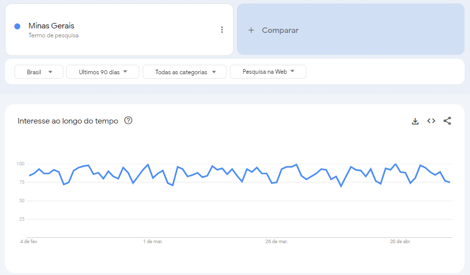

```{r setup, include=FALSE}
knitr::opts_chunk$set(echo = TRUE)
```

# Sobre Google Trends

O [Google Trends](https://trends.google.com.br/home) disponibiliza séries temporais que rastreiam o histórico de consulta de palavras em diversos países desde janeiro de 2004. Em alguns casos, as pesquisas podem ser específicas para estados ou províncias e em diferentes frequências temporais. No entanto, vale destacar que o Google Trends não fornece o volume exato das pesquisas realizadas. A medida utilizada é normalizada em uma escala de 0 a 100, em que o valor máximo (100) indica o ponto mais alto da consulta para o período de tempo selecionado pelo usuário.

O procedimento mencionado é necessário pois os dados do Google Trends representam amostras de buscas realizadas pelos usuários. Ademais, há algumas informações relevantes que devem ser destacadas a respeito desses dados:

1. os dados disponibilizados pelo aplicativo correspondem apenas aos termos mais populares, portanto, as palavras pesquisadas por um pequeno número de pessoas são excluídas.
2. para evitar a superestimação dos termos pesquisados, consultas repetidas realizadas por um mesmo usuário em um curto período de tempo são desconsideradas.
3. os apóstrofos e outros caracteres especiais são eliminados a fim de aumentar a precisão das informações apresentadas na série temporal.

Essas e outras informações estão presentes na [documentação do Google Trends](https://support.google.com/trends?sjid=14820757223693259603-SA#topic=6248052) e no [curso](https://newsinitiative.withgoogle.com/resources/lessons/google-trends-see-whats-trending-across-google-search-google-news-and-youtube/) preparado por eles. 

Os dados do Google Trends são organizados em categorias por meio de um sistema de classificação baseado em linguagem natural. Essas categorias podem incluir temas como saúde, emprego, esportes, viagens, entre outros.

Os dados podem ser usados em diversas aplicações e em distintas áreas como mostrado por [Jun, S., Yoo, H. S. and Choi, S. (2017)](http://doi.org/10.1016/j.techfore.2017.11.009). Um estudo usando séries do Google Trends relacionadas a busca de empregos pode ser visualizado em [Gonçalves (2023, Cap. 8](https://ence.ibge.gov.br/images/Teses/Tese_CaioGoncalves.pdf)

# Extração de séries

Ao acessar a ferramenta do [Google Trends](https://trends.google.com.br/home) é possível pesquisar por um termo, por exemplo, `Minas Gerais`. Uma série será produzida de acordo com os filtros presentes: recorte geográfico, frequência temporal, categoria e tipo de pesquisa. 



Além disso, o Google Trends oferece opções para compartilhamento e download dos dados em formato CSV, bem como a desagregação regional e a apresentação de assuntos e pesquisas relacionadas. Esses recursos, juntamente com outros detalhes relevantes, serão explorados a seguir, utilizando a linguagem de programação R e com o objetivo de extrair um número amplo de séries de forma automatizada.

Para realizar a extração, será utilizado o pacote [`gtrendsR`](https://cran.r-project.org/web/packages/gtrendsR/index.html) em que a principal função é a `gtrends`.

```{r biblioteca}
if (!require("gtrendsR")){
  install.packages("gtrendsR")
  library(gtrendsR)
}
```

A documentação indica os argumentos da função e detalha suas funcionalidades, sendo necessário informar pelo menos uma palavra-chave (`keyword`) a ser buscada.

```{r help}
?gtrends
```

Ao realizar uma pesquisa e inserir parâmetros, como `geo="BR"` para indicar a busca realizada no Brasil e `time="today 3-m"` para definir o período de tempo, o objeto `serie01` irá conter a série de interesse em `interest_over_time`.

```{r extracao1}
serie01 <- gtrends(keyword ="Minas Gerais",
                   geo = "BR",
                   time =  "today 3-m")
head(serie01$interest_over_time)
```

Também é possível realizar a busca com base em uma data específica, utilizando um intervalo definido no formato `AAAA-MM-DD AAAA-MM-DD` para obter informações diferentes das pré-definidas.

```{r extracao2}
serie02 <- gtrends(keyword ="currículo",
                   geo = "BR",
                   time =  "2012-01-01 2023-04-30")
head(serie02$interest_over_time)

# gráfico
plot(serie02)
```

Uma observação interessante é que a grafia das palavras, com ou sem acentuação, pode resultar em séries distintas. Veja, a seguir, o exemplo da palavra `currículo` sem acento.

```{r extracao3}
serie03 <- gtrends(keyword ="curriculo",
                   geo = "BR",
                   time =  "2012-01-01 2023-04-30")
# gráfico
plot(ts.union(ts(serie02$interest_over_time$hits,start = c(2012,1), frequency = 12),
              ts(serie03$interest_over_time$hits,start = c(2012,1), frequency = 12)),
     plot.type = "single",col = c(1,2), ylab="", xlab="Mês")
legend("bottomright", legend = c("currículo","curriculo"),col = c(1,2), bty = 'n',lty = c(1,1))
```


## Aplicando filtro geográfico

Além disso, também é possível extrair séries temporais referentes às diferentes unidades da federação, por exemplo:

```{r extracao4}
serie04 <- gtrends(keyword ="vaga de emprego",
                   geo = "BR-MG",
                   time =  "2012-01-01 2023-04-30")
# gráfico
plot(serie04)
```

Uma palavra muito buscada em um período pode gerar um outlier, conforme exemplificado anteriormente. Portanto, é necessário realizar um tratamento dessas séries para fins estatísticos.

Também é possível extrair a mesma série para diferentes locais e realizar comparações entre eles. Nesse caso, o índice é construído com base nas buscas conjuntas em todos os locais. O valor 100 é atribuído ao ponto do tempo e ao local que apresenta o maior número de buscas.

```{r extracao5}
serie05 <- gtrends(keyword ="vaga de emprego",
                   geo = c("BR-MG","BR-SP"),
                   time =  "2012-01-01 2023-04-30")
head(serie05$interest_over_time)

# gráfico
plot(serie05)
```


Uma limitação é que as comparações são restritas a um máximo de cinco locais ou cinco palavras.

## Extraindo uma categoria

Os dados também são agrupados em categorias usando um mecanismo de classificação de linguagem natural, que inclui categorias como saúde, emprego, esportes, viagens, entre outras. A lista completa dessas categorias pode ser visualizada utilizando o pacote `gtrendsR`:

```{r categoria}
data("categories")
View(categories)
```

Para realizar uma comparação, pode-se efetuar buscas com e sem a categoria `Jobs - 60` para a palavra-chave `vaga`, por exemplo:

```{r extracao6}
serie06a <- gtrends(keyword ="vaga",
                   geo = "BR-MG",
                   time =  "2012-01-01 2023-04-30",
                   category = 0)
serie06b <- gtrends(keyword ="vaga",
                   geo = "BR-MG",
                   time =  "2012-01-01 2023-04-30",
                   category = 60)
head(serie06a$interest_over_time)
head(serie06b$interest_over_time)

# gráfico
plot(ts.union(ts(serie06a$interest_over_time$hits,start = c(2012,1), frequency = 12),
              ts(serie06b$interest_over_time$hits,start = c(2012,1), frequency = 12)),
     plot.type = "single",col = c(1,2), ylab="", xlab="Mês")
legend("topleft", legend = c("sem categoria","com categoria"),col = c(1,2), bty = 'n',lty = c(1,1))
```

As próprias categorias também podem ser extraídas ao não incluir uma `keyword`:

```{r extracao7}
serie07 <- gtrends(geo = "BR-MG",
                   time =  "2012-01-01 2023-04-30",
                   category = 60)
# gráfico
plot(serie07)
```


## Comparando séries

Assim como foi possível comparar diferentes localidades, também é possível comparar diferentes palavras-chave, com a limitação de até cinco palavras.

```{r extracao8}
serie08 <- gtrends(keyword =  c("currículo","curriculo","vaga de emprego","vaga","sine"),
                   geo = "BR-MG",
                   time =  "2012-01-01 2023-04-30",
                   category = 60)
head(serie08$interest_over_time)

# gráfico
plot(serie08)
```

## Extraindo palavras relacionadas

Explorando uma outra funcionalidade, a cada extração é possível obter uma lista de 50 palavras relacionadas.

```{r extracao9}
serie09 <- gtrends(keyword =  c("currículo"),
                   geo = "BR-MG",
                   time =  "2012-01-01 2023-04-30",
                   category = 0)
serie09$related_queries$value
```

Assim, é possível ampliar um conjunto inicial de palavras expandindo o grupo com termos do mesmo contexto. No entanto, é importante avaliar cada palavra adicionada para verificar se realmente faz parte do contexto em estudo, de acordo com o objetivo pretendido.

```{r buscas_relacionadas}
palavras <- unique(c("currículo",serie09$related_queries$value)) #conjunto de palavras únicas
length(palavras)
```

# Computação paralela

Todos os exemplos anteriores foram constuídos extraindo uma ou mais séries. Porém, para extrair um conjunto maior de séries, pode-se utilizar, entre diversos caminhos:

```{r extracao10}
start_time <- Sys.time()
data01 <- sapply(palavras[1:25], function(i) gtrends(keyword =  i,
                   geo = "BR-MG",
                   time =  "2012-01-01 2023-04-30",
                   category = 60,
                   onlyInterest = TRUE)$interest_over_time$hits)
end_time <- Sys.time()
end_time - start_time
```

Uma outra alternativa é que, ao considerar atividades independentes, estas podem ser realizadas utilizando computação paralela. Um pacote que possibilita isso é o `parallel`. Para mais detalhes sobre pacotes de computação paralela no R, consulte [este link](https://cran.r-project.org/web/views/HighPerformanceComputing.html).

Um dado importante é o número de núcleos do CPU disponíveis.

```{r processamento1}
if (!require("parallel")){
  install.packages("parallel")
  library(parallel)
}

numCores<-detectCores()
numCores
```

A ideia básica é criar um conjunto de cópias do R que serão executadas em paralelo. Para isso, é preciso criar essas cópias com a função `makeCluster` e inserir em cada cópia o que é necessário para realizar a tarefa com a função `clusterEvalQ`:

```{r processamento2}
# criando clusters
cl<- makeCluster(numCores-1)

# salva imagem
save.image("partial.Rdata")

# envia dados para cada um dos cluster
clusterEvalQ(cl,{load("partial.Rdata")
  library(gtrendsR)
})
```
Repetindo a extração anterior, agora usando computação paralela:

```{r processamento3}
start_time <- Sys.time()
data02 <- parSapply(cl,palavras[1:25], function(i) gtrends(keyword =  i,
                   geo = "BR-MG",
                   time =  "2012-01-01 2023-04-30",
                   category = 60,
                   onlyInterest = TRUE)$interest_over_time$hits)
end_time <- Sys.time()
end_time - start_time
```

```{r processamento4}
# stop cluster
stopCluster(cl)
```

# Extras

## Construindo um *ranking* relativo

Uma possibilidade para construir um *ranking* de palavras é normalizar cada série com uma palavra única e relevante para o contexto em estudo. Para isso, é necessário extrair as séries em pares e calcular uma medida sintética que será utilizada para o *ranking*.

O Google Trends atribui `<1` às buscas menores que 1, mas não nulas. Portanto, as séries são extraídas como `character`. Decidiu-se considerar `0` nesses casos e usar a média dos valores dessas séries extraídas. Com base nesses procedimentos, é possível criar uma função:

```{r ranking1}
f.ranking <- function(palavra, palavra_rel, geo, time, category){
  # extrai o par de séries
  data = gtrends(keyword =  c(palavra,palavra_rel),
                   geo = geo,
                   time =  time,
                   category = category,
                   onlyInterest = TRUE)$interest_over_time$hits
  # seleciona a série apenas da palavra em estudo
  data = data[1:(length(data)/2)]
  # substitui na base os menores que 1 por zero
  data[data=="<1"]=0
  # transforma em numérico
  data = as.numeric(data)
  # computa uma médida síntese
  media = mean(data,na.rm=TRUE)
  return(media)
}
```

Cria-se novamente o cluster:

```{r ranking2}
# criando clusters
cl<- makeCluster(numCores-1)

# salva imagem
save.image("partial.Rdata")

# envia dados para cada um dos cluster
clusterEvalQ(cl,{load("partial.Rdata")
  library(gtrendsR)
})
```
E agora sim computa o *ranking*:

```{r ranking3}
ranking <- parSapply(cl,palavras, function(i) f.ranking(palavra = i,
                                                       palavra_rel = "currículo",
                                                       geo = "BR-MG",
                                                       time = "2012-01-01 2023-04-30",
                                                       category = 60))  
```


Organizando e vizualizando o *ranking*:

```{r ranking4}
# ordena
ranking <- data.frame(média = sort(ranking, decreasing = TRUE))
ranking
```


Pode-se também gerar uma núvem de palavras:

```{r nuvem, warning=FALSE}
if (!require("wordcloud")){
  install.packages("wordcloud")
  library(wordcloud)
}

set.seed(32)  #para reproduzir a mesma núvem

wordcloud(words = rownames(ranking),
          freq = ranking$média,
          scale = c(4, 1),  min.freq=0, max.words = 50,
          random.order = FALSE,
          color = 1:nrow(ranking))

```


# Referências

Gonçalves, C. C. S. (2023) Produção de indicadores do mercado de trabalho com modelos de séries temporais de pesquisas repetidas  Tese (Doutorado em População, Território e Estatísticas Públicas) – Escola Nacional de Ciências Estatística - Instituto Brasileiro de Geografia e Estatística, Rio de Janeiro. URL: [link](https://ence.ibge.gov.br/images/Teses/Tese_CaioGoncalves.pdf)

Google (2022) Google Trends lessons. URL: [link]( https://newsinitiative.withgoogle.com/training/lessons?tool=Google%20Trends&image=trends)

Jun, S., Yoo, H. S. and Choi, S. (2017) Ten years of research change using Google Trends: From the perspective of big data utilizations and applications. Technological Forecasting and Social Change. URL:[link]( http://doi.org/10.1016/j.techfore.2017.11.009)

Massicotte, P. (2021) gtrendsr: Perform and display Google Trends queries. URL: [link](https://cran.r-project.org/web/packages/gtrendsR/index.html)

R Core Team (2022) Package parallel. URL: [link](https://stat.ethz.ch/R-manual/R-devel/library/parallel/doc/parallel.pdf)
